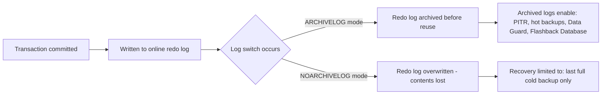

# Why ARCHIVELOG Mode Matters: Impact, Trade-offs, and When to Use It

## Purpose of This Document

This is a decision-support companion to [enable-disable-archivelog-mode.md](enable-disable-archivelog-mode.md). That guide covers *how* to switch modes; this one covers *why it matters*, what is actually gained or lost in each mode, and which environments should — or should not — run with `ARCHIVELOG` enabled.

## What ARCHIVELOG Mode Actually Controls

Every Oracle database writes changes to online redo log files before committing them to datafiles. Those redo log files are reused in a circular fashion (log switches). The only question `ARCHIVELOG` mode answers is:

> **When a redo log file is about to be overwritten, does Oracle save a copy of it first (as an archived redo log), or does it just let the data go?**

That single decision has a much larger downstream effect than it sounds, because archived redo logs are the mechanism that makes almost every serious recovery and availability feature possible.

## Why Enabling ARCHIVELOG Is Important

| Capability | Requires ARCHIVELOG? | What You Lose Without It |
|---|---|---|
| Point-in-time recovery (restore to a specific SCN/timestamp) | Yes | Can only restore to the exact moment of the last backup — nothing in between |
| Online/hot backups (RMAN backup while database stays open) | Yes | Must take the database offline (cold backup) to guarantee a consistent copy |
| Data Guard / standby databases | Yes | Cannot ship redo to a standby — no replication-based DR is possible |
| Flashback Database | Yes | Cannot rewind the database to a prior point without a full restore |
| Media recovery after a single datafile loss | Yes | Losing one datafile can mean restoring the *entire* database from the last cold backup |
| Minimal data loss on disk/storage failure | Yes | Data loss window = time since the last full backup, which could be a full day or more |

In short: **ARCHIVELOG mode is what separates "we can recover to the last few seconds before a failure" from "we can only recover to the last backup we happened to take."** For any database where data loss has a real business, financial, or compliance cost, this is not an optional feature — it is the foundation that RMAN, Data Guard, and Flashback are built on top of.

## What Happens If ARCHIVELOG Is Disabled (NOARCHIVELOG Mode)

Running in `NOARCHIVELOG` is not inherently wrong — it is a valid, deliberate choice for the right environment — but it comes with hard limitations that must be accepted going in:

- **Recovery is only possible from a consistent, whole-database cold backup.** There is no way to recover forward from that backup using redo — the backup itself is the recovery point, nothing more recent is retrievable.
- **No online backups.** Any full backup requires the database to be shut down (or at minimum read-only), which means scheduled downtime for every backup cycle.
- **Data Guard, Flashback Database, and RMAN incremental-forever strategies are unavailable.** These all fundamentally depend on a continuous stream of archived redo.
- **A single lost or corrupted datafile can force a full database restore**, since there is no redo to replay forward from an old datafile backup to the point of failure.

## Where ARCHIVELOG Should — and Should Not — Be Used

| Environment | Recommended Mode | Reasoning |
|---|---|---|
| Production (any system with real, current business data) | `ARCHIVELOG` | Data loss tolerance is typically near-zero; online backups and PITR are operational requirements, not luxuries |
| Standby / Data Guard targets | `ARCHIVELOG` (mandatory) | Redo shipping to a standby is impossible without it |
| Staging / pre-production (mirrors production data closely) | `ARCHIVELOG` | Usually needs realistic backup/recovery testing and may briefly hold production-like data |
| QA / UAT with refreshable, non-critical data | `NOARCHIVELOG` (acceptable) | Data can typically be regenerated or refreshed from a source; downtime for cold backups is easier to schedule |
| Development / sandbox databases | `NOARCHIVELOG` (typical) | Data is disposable; simplicity and lower storage overhead outweigh recovery guarantees |
| One-off data migration / ETL scratch databases | `NOARCHIVELOG` | Short-lived, source data usually still exists elsewhere; archived redo would just be discarded overhead |

The general rule: **if losing everything since the last backup is an acceptable business outcome, `NOARCHIVELOG` is a legitimate choice. If it is not, `ARCHIVELOG` is not optional.**

## Advantages and Disadvantages

### ARCHIVELOG Mode

**Advantages**
- Enables point-in-time recovery down to the last committed transaction (or a specific SCN/timestamp)
- Supports online (hot) backups — no downtime required for backup operations
- Required foundation for Data Guard, standby databases, and Flashback Database
- Minimizes data loss window from "since last backup" to "since last archived log," which can be minutes instead of hours or days
- Enables incremental backup strategies (RMAN) that reduce backup time and storage compared to repeated full backups

**Disadvantages**
- Additional disk space required for archived redo logs (and a Fast Recovery Area, if used)
- Slightly higher I/O overhead from the archiving process itself, especially on write-heavy workloads with frequent log switches
- Requires active monitoring — if the archive destination fills up, the database can hang until space is freed
- Adds operational complexity: someone must own the backup/retention strategy, or archived logs simply accumulate indefinitely
- Enabling/disabling requires a brief outage (MOUNT state), so it cannot be toggled without planning

### NOARCHIVELOG Mode

**Advantages**
- Simpler to operate — no archive destination, no space monitoring, no risk of the database hanging due to a full archive area
- Slightly reduced I/O overhead with no archiving step on log switch
- Lower storage consumption — no accumulation of archived redo logs
- Adequate and low-maintenance for disposable or easily-reproducible data

**Disadvantages**
- Recovery is only possible to the point of the last full backup — nothing more recent is recoverable
- No online backups — every backup requires downtime
- No Data Guard, no Flashback Database, no RMAN incremental-forever strategy
- A single corrupted or lost datafile can force restoring the entire database
- Unsuitable for any environment where recent data loss has real consequences

## Summary Comparison

| Aspect | ARCHIVELOG | NOARCHIVELOG |
|---|---|---|
| Data loss exposure | Minutes (since last archived log) | Hours to days (since last full backup) |
| Backup while database is open | Supported | Not supported |
| Data Guard / standby support | Supported | Not supported |
| Flashback Database | Supported | Not supported |
| Storage overhead | Higher (archived logs + FRA) | Lower |
| Operational complexity | Higher (monitoring required) | Lower |
| Best suited for | Production, standby, staging | Dev, QA/UAT with disposable data, short-lived migration DBs |

## Practical Recommendation

Default to `ARCHIVELOG` for any environment that matters — treat `NOARCHIVELOG` as the deliberate exception, not the default, and only choose it when the data is genuinely disposable or reproducible from another source. When in doubt about which mode a given environment should use, the deciding question is simple: **if this database failed right now, is losing everything since the last backup acceptable?** If the answer is no, it needs `ARCHIVELOG`.

For the operational steps to switch between modes, see [enable-disable-archivelog-mode.md](enable-disable-archivelog-mode.md).
