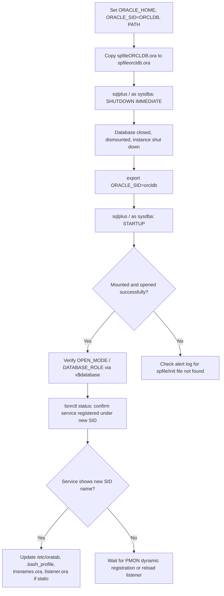

# Changing the Oracle SID on an Already-Running Database

## Environment

- Oracle Database 11g Release 2 (11.2.0.1.0), 64-bit
- Oracle Linux 6
- Original SID: `ORCLDB` (renamed to lowercase `orcldb`)
- Server hostname: `dbserver01`
- Oracle Home: `/u01/app/oracle/product/11g/dbhome_1`
- Connected as `oracle` OS user via `sqlplus / as sysdba`

## Objective

Change the `ORACLE_SID` used to connect to and manage an existing, already-running database — in this case only a case change (`ORCLDB` → `orcldb`) — without rebuilding the database.

## Important Clarification

This procedure changes **only the SID used at the OS/session level to identify and connect to the instance** (the value of `ORACLE_SID`, matched against the SPFILE/PFILE naming convention `spfile<SID>.ora` / `init<SID>.ora` in `$ORACLE_HOME/dbs`). It does **not**:

- Change `DB_NAME` or `DB_UNIQUE_NAME` inside the database itself.
- Change the internal `DBID`.
- Rename the database at the control file / redo log / datafile level.

Oracle resolves which instance to attach to by matching the shell's `ORACLE_SID` against a parameter file named `spfile<SID>.ora` (or `init<SID>.ora`) in `$ORACLE_HOME/dbs`. Because `INSTANCE_NAME` (and by default `SERVICE_NAMES`) inside the SPFILE was itself already set based on the original SID value, simply copying the SPFILE to a new filename and shutting down/starting up under the new `ORACLE_SID` is enough to make Oracle instantiate under the new name — as shown in this session, where the listener automatically began advertising the service as `orcldb` after restart. If you need a true full database rename (different `DB_NAME`, not just instance identity), use the `DBNEWID` (`nid`) utility instead — see the note at the end of this document.

## Troubleshooting / Procedure Flow



## Steps Performed

### Step 1 — Set environment variables to the current (old) SID

```bash
export ORACLE_HOME=/u01/app/oracle/product/11g/dbhome_1
export ORACLE_SID=ORCLDB
export PATH=$ORACLE_HOME/bin:$PATH
```

### Step 2 — Copy the SPFILE to the new SID's expected filename

```bash
cp $ORACLE_HOME/dbs/spfileORCLDB.ora $ORACLE_HOME/dbs/spfileorcldb.ora
```

This creates the parameter file that Oracle will look for once `ORACLE_SID` is changed to `orcldb`. The original `spfileORCLDB.ora` is left in place as a backup/rollback point.

### Step 3 — Shut down the instance cleanly under the old SID

```bash
sqlplus / as sysdba <<'EOF'
SHUTDOWN IMMEDIATE;
EXIT;
EOF
```

Output confirmed a clean shutdown:

```
SQL> Database closed.
Database dismounted.
ORACLE instance shut down.
```

A clean `SHUTDOWN IMMEDIATE` (rather than `ABORT`) is important here — it guarantees no pending IPC/lock cleanup is needed before the next startup (see [ora-01102-cannot-mount-exclusive-mode.md](ora-01102-cannot-mount-exclusive-mode.md) for what happens when that cleanup is skipped).

### Step 4 — Switch ORACLE_SID to the new value and start up

```bash
export ORACLE_SID=orcldb

sqlplus / as sysdba <<'EOF'
STARTUP;
SELECT open_mode, database_role FROM v$database;
EXIT;
EOF
```

Result:

```
ORACLE instance started.

Total System Global Area  217157632 bytes
Fixed Size                  2211928 bytes
Variable Size             159387560 bytes
Database Buffers           50331648 bytes
Redo Buffers                5226496 bytes
Database mounted.
Database opened.

OPEN_MODE            DATABASE_ROLE
-------------------- ----------------
READ WRITE           PRIMARY
```

The instance started, mounted, and opened successfully under the new SID, confirming `READ WRITE` / `PRIMARY` status was preserved.

### Step 5 — Verify listener registration under the new SID

```bash
lsnrctl status
```

Relevant output:

```
Services Summary...
Service "orcldb" has 1 instance(s).
  Instance "orcldb", status READY, has 1 handler(s) for this service...
```

The listener picked up the new instance name automatically via dynamic service registration (PMON), confirming the rename took effect end-to-end without needing a listener restart.

## Post-Change Cleanup Checklist

The database itself is functional at this point, but several OS-level and configuration references to the **old** SID typically still need to be updated for consistency and to avoid confusion or tooling failures later:

1. **`/etc/oratab`** — update the entry from `ORCLDB:/u01/app/oracle/product/11g/dbhome_1:Y` to `orcldb:/u01/app/oracle/product/11g/dbhome_1:Y` (Oracle Linux SID entries are case-sensitive; leaving both can cause `dbstart`/`dbshut` scripts to reference a stale value).
2. **Shell profile / login scripts** (`~/.bash_profile`, `~/.bashrc`, or any `oraenv`-based scripts) — update any hardcoded `ORACLE_SID=ORCLDB` so future logins default to the correct SID.
3. **Password file** — if a password file exists (`orapwORCLDB`), copy/rename it to match: `cp $ORACLE_HOME/dbs/orapwORCLDB $ORACLE_HOME/dbs/orapworcldb`. Without this, remote SYSDBA connections using password-file authentication may fail to find credentials under the new SID.
4. **`listener.ora`** — only relevant if static service registration (`SID_LIST_LISTENER`) was configured; update the `SID_NAME` entry to match. Dynamic registration (as observed in this session) does not require this.
5. **`tnsnames.ora`** on this server and any client machines — update the `SID=` or `SERVICE_NAME=` value in relevant connect descriptors.
6. **Monitoring/backup tooling** (RMAN catalog connection strings, cron jobs, Enterprise Manager/Grid Control targets, third-party monitoring agents) — anything referencing the old SID string needs to be updated to avoid silent monitoring gaps.
7. **Remove or archive the old SPFILE** (`spfileORCLDB.ora`) only after confirming the new SID has been stable through at least one full restart cycle — keep it temporarily as a rollback option.
8. **Confirm `INSTANCE_NAME` and `SERVICE_NAMES` parameters** explicitly, rather than relying on defaults, if client connect strings depend on a specific service name:

   ```sql
   SHOW PARAMETER instance_name
   SHOW PARAMETER service_names
   ```

   If either still reflects the old naming and application connect strings depend on it, set them explicitly with `ALTER SYSTEM SET service_names='orcldb' SCOPE=BOTH;`.

## When This Approach Is Not Enough: True Database Rename

The steps above rename the **instance identity**, not the **database itself**. If the actual goal is to change `DB_NAME` (e.g. because two databases need genuinely distinct identities for Data Guard, duplication, or avoiding `DBID`/name collisions), use the `DBNEWID` utility (`nid`) instead:

```bash
nid TARGET=sys/<password>@orcldb DBNAME=newdbname
```

This requires the database to be mounted (not open), updates the `DB_NAME` embedded in the control file and datafile headers, and typically requires recreating the control file's reference in `init.ora`/`spfile` (`db_name` parameter) plus a follow-up restart with `RESETLOGS` in some scenarios. This is a materially more invasive operation than the SID/instance-name rename performed in this document and should be planned and tested in a non-production environment first.

## Summary

| Aspect | Changed? | Notes |
|---|---|---|
| `ORACLE_SID` (OS-level connect identity) | Yes | Achieved via SPFILE copy + `export ORACLE_SID` + restart |
| Listener service registration | Yes (automatic) | PMON dynamic registration picked up the new name immediately |
| `INSTANCE_NAME` / `SERVICE_NAMES` (if defaulted from SID) | Yes (implicitly) | Verify explicitly with `SHOW PARAMETER` if connect strings depend on exact values |
| `DB_NAME` / `DBID` / database identity | No | Requires `DBNEWID` (`nid`) utility — a separate, more invasive procedure |
| `/etc/oratab`, password file, `tnsnames.ora`, monitoring tools | Not automatically | Must be updated manually per the cleanup checklist above |
