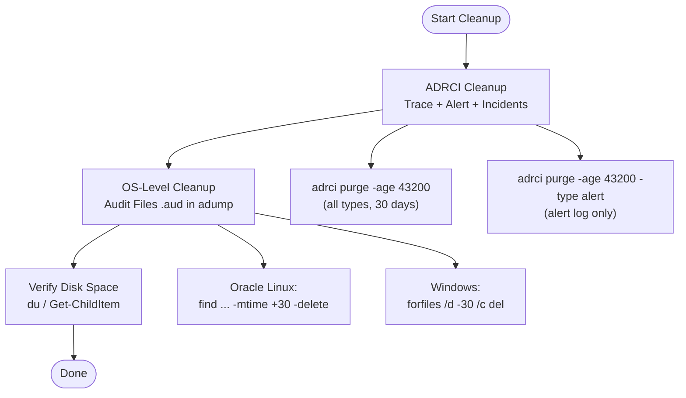

# Cleaning Up Oracle Diagnostic Files (Audit, Trace, and Alert)

Oracle Database continuously generates diagnostic files — audit records, trace files, and alert log entries — as part of its normal operation. Over time these files accumulate and can consume significant disk space. Without regular cleanup, the `$ORACLE_BASE/diag` and `$ORACLE_BASE/admin` directories may fill the filesystem and cause database errors or prevent startup.

This guide covers structured cleanup using **ADRCI** (Automatic Diagnostic Repository Command Interpreter) and OS-level file commands — for both **Oracle Linux** and **Windows Server** — across Oracle Database versions **11g through 26 AI**.

---

## What Are These Files?

| File Type | Default Location | Description |
|-----------|-----------------|-------------|
| Alert Log | `$ORACLE_BASE/diag/rdbms/<db>/<sid>/alert/` | Chronological record of database events, errors, and startup/shutdown history |
| Trace Files (`.trc`) | `$ORACLE_BASE/diag/rdbms/<db>/<sid>/trace/` | Process-level diagnostic dumps — generated by background and user processes |
| Incident Files | `$ORACLE_BASE/diag/rdbms/<db>/<sid>/incident/` | Critical error dumps (e.g., ORA-00600, ORA-07445) — one subdirectory per incident |
| Audit Files (`.aud`) | `$ORACLE_BASE/admin/<sid>/adump/` | OS-level audit trail records when `AUDIT_TRAIL = 'OS'` is set |
| Core Dump (`.cdmp`) | `$ORACLE_BASE/diag/rdbms/<db>/<sid>/cdump/` | OS core dumps captured by Oracle |

> **Note:** Audit files in `adump` are **not** managed by ADRCI. They must be cleaned up separately using OS commands or a custom script.

---

## Cleanup Strategy Overview



---

## Part 1 — Cleanup Using ADRCI

ADRCI is Oracle's built-in command-line tool for managing the Automatic Diagnostic Repository (ADR). It is available in all Oracle versions 11g and later.

### Understanding the `-age` Parameter

The `-age` value is specified in **minutes**.

| Retention Period | `-age` Value |
|-----------------|-------------|
| 7 days | `10080` |
| 14 days | `20160` |
| 30 days | `43200` |
| 60 days | `86400` |
| 90 days | `129600` |

### 1.1 — Oracle Linux

#### Purge All Diagnostic Content (Trace, Alert, Incidents, CDump)

```bash
adrci exec="set home diag/rdbms/orcl/ORCL; purge -age 43200"
```

#### Purge Alert Log Entries Only

```bash
adrci exec="set home diag/rdbms/orcl/ORCL; purge -age 43200 -type alert"
```

#### Purge Trace Files Only

```bash
adrci exec="set home diag/rdbms/orcl/ORCL; purge -age 43200 -type trace"
```

#### Purge Incident Files Only

```bash
adrci exec="set home diag/rdbms/orcl/ORCL; purge -age 43200 -type incident"
```

#### List All Available ADR Homes First

```bash
adrci exec="show homes"
```

Sample output:

```
ADR Homes:
diag/rdbms/orcl/ORCL
diag/tnslsnr/dbserver01/listener
```

#### Run ADRCI Interactively

```bash
adrci

adrci> show homes
adrci> set home diag/rdbms/orcl/ORCL
adrci> show control
adrci> purge -age 43200
adrci> exit
```

### 1.2 — Windows Server

Open **Command Prompt** or **PowerShell** as Administrator:

#### Purge All Diagnostic Content

```cmd
adrci exec="set home diag/rdbms/orcl/ORCL; purge -age 43200"
```

#### Purge Alert Log Entries Only

```cmd
adrci exec="set home diag/rdbms/orcl/ORCL; purge -age 43200 -type alert"
```

#### Purge Trace Files Only

```cmd
adrci exec="set home diag/rdbms/orcl/ORCL; purge -age 43200 -type trace"
```

#### List All ADR Homes

```cmd
adrci exec="show homes"
```

> **Note:** On Windows, the `diag/rdbms/orcl/ORCL` path in ADRCI uses forward slashes regardless of the OS. Do not use backslashes inside ADRCI arguments.

---

## Part 2 — Cleanup Audit Files (`.aud`)

Audit files in the `adump` directory are **not managed by ADRCI**. They must be cleaned separately using OS-level commands.

### 2.1 — Oracle Linux

Delete `.aud` files older than 30 days:

```bash
find $ORACLE_BASE/admin/ORCL/adump -name "*.aud" -mtime +30 -delete
```

Dry run first (preview without deleting):

```bash
find $ORACLE_BASE/admin/ORCL/adump -name "*.aud" -mtime +30 -ls
```

Count files to be deleted:

```bash
find $ORACLE_BASE/admin/ORCL/adump -name "*.aud" -mtime +30 | wc -l
```

Check disk usage before and after:

```bash
du -sh $ORACLE_BASE/admin/ORCL/adump
```

### 2.2 — Windows Server

#### Using Command Prompt (`forfiles`)

```cmd
forfiles /p "C:\app\oracle\admin\ORCL\adump" /m "*.aud" /d -30 /c "cmd /c del @path"
```

Dry run (list only):

```cmd
forfiles /p "C:\app\oracle\admin\ORCL\adump" /m "*.aud" /d -30 /c "cmd /c echo @path"
```

#### Using PowerShell

```powershell
$auditPath = "C:\app\oracle\admin\ORCL\adump"
$cutoffDate = (Get-Date).AddDays(-30)

# Preview
Get-ChildItem -Path $auditPath -Filter "*.aud" |
    Where-Object { $_.LastWriteTime -lt $cutoffDate } |
    Select-Object Name, LastWriteTime, Length

# Delete
Get-ChildItem -Path $auditPath -Filter "*.aud" |
    Where-Object { $_.LastWriteTime -lt $cutoffDate } |
    Remove-Item -Force
```

Check folder size with PowerShell:

```powershell
$folder = "C:\app\oracle\admin\ORCL\adump"
$size = (Get-ChildItem $folder -Recurse | Measure-Object -Property Length -Sum).Sum
Write-Host ("Folder size: {0:N2} MB" -f ($size / 1MB))
```

---

## Part 3 — Combined Cleanup Script

### 3.1 — Oracle Linux Shell Script

```bash
#!/bin/bash
# cleanup_oracle_diag.sh
# Purge Oracle diagnostic files: ADR content + OS audit files

ORACLE_SID=ORCL
ORACLE_BASE=/u01/app/oracle
AUDIT_DIR=$ORACLE_BASE/admin/$ORACLE_SID/adump
ADR_HOME="diag/rdbms/$(echo $ORACLE_SID | tr '[:upper:]' '[:lower:]')/$ORACLE_SID"
RETENTION_DAYS=30
RETENTION_MINUTES=$((RETENTION_DAYS * 24 * 60))
LOG_DIR=/u01/app/oracle/cleanup_logs
LOG_FILE=$LOG_DIR/cleanup_$(date '+%Y%m%d_%H%M%S').log

mkdir -p $LOG_DIR

echo "=== Oracle Diagnostic Cleanup ===" | tee -a $LOG_FILE
echo "Date     : $(date)" | tee -a $LOG_FILE
echo "SID      : $ORACLE_SID" | tee -a $LOG_FILE
echo "Retention: $RETENTION_DAYS days ($RETENTION_MINUTES minutes)" | tee -a $LOG_FILE
echo "" | tee -a $LOG_FILE

# Step 1: ADRCI purge (trace, alert, incidents)
echo "[1] Running ADRCI purge..." | tee -a $LOG_FILE
adrci exec="set home $ADR_HOME; purge -age $RETENTION_MINUTES" >> $LOG_FILE 2>&1
if [ $? -eq 0 ]; then
    echo "    ADRCI purge completed." | tee -a $LOG_FILE
else
    echo "    WARNING: ADRCI purge returned non-zero exit code." | tee -a $LOG_FILE
fi

# Step 2: Delete old audit files
echo "[2] Cleaning audit files in $AUDIT_DIR..." | tee -a $LOG_FILE
AUDIT_COUNT=$(find $AUDIT_DIR -name "*.aud" -mtime +$RETENTION_DAYS 2>/dev/null | wc -l)
echo "    Files to delete: $AUDIT_COUNT" | tee -a $LOG_FILE
find $AUDIT_DIR -name "*.aud" -mtime +$RETENTION_DAYS -delete 2>> $LOG_FILE
echo "    Audit cleanup completed." | tee -a $LOG_FILE

# Step 3: Disk usage report
echo "[3] Disk usage after cleanup:" | tee -a $LOG_FILE
df -h $ORACLE_BASE | tee -a $LOG_FILE

echo "" | tee -a $LOG_FILE
echo "=== Cleanup Finished ===" | tee -a $LOG_FILE
```

Make the script executable:

```bash
chmod +x /u01/app/oracle/scripts/cleanup_oracle_diag.sh
```

### 3.2 — Windows Batch Script

```cmd
@echo off
REM cleanup_oracle_diag.bat
REM Purge Oracle diagnostic files: ADR content + OS audit files

set ORACLE_SID=ORCL
set ORACLE_BASE=C:\app\oracle
set AUDIT_DIR=%ORACLE_BASE%\admin\%ORACLE_SID%\adump
set ADR_HOME=diag/rdbms/orcl/%ORACLE_SID%
set RETENTION_DAYS=30
set RETENTION_MINUTES=43200
set LOG_DIR=%ORACLE_BASE%\cleanup_logs

if not exist "%LOG_DIR%" mkdir "%LOG_DIR%"

set LOG_FILE=%LOG_DIR%\cleanup_%DATE:~10,4%%DATE:~4,2%%DATE:~7,2%.log

echo === Oracle Diagnostic Cleanup === >> "%LOG_FILE%"
echo Date     : %DATE% %TIME% >> "%LOG_FILE%"
echo SID      : %ORACLE_SID% >> "%LOG_FILE%"
echo Retention: %RETENTION_DAYS% days >> "%LOG_FILE%"
echo. >> "%LOG_FILE%"

REM Step 1: ADRCI purge (trace, alert, incidents)
echo [1] Running ADRCI purge... >> "%LOG_FILE%"
adrci exec="set home %ADR_HOME%; purge -age %RETENTION_MINUTES%" >> "%LOG_FILE%" 2>&1
if %ERRORLEVEL% EQU 0 (
    echo     ADRCI purge completed. >> "%LOG_FILE%"
) else (
    echo     WARNING: ADRCI returned non-zero exit code. >> "%LOG_FILE%"
)

REM Step 2: Delete old audit files using forfiles
echo [2] Cleaning audit files... >> "%LOG_FILE%"
forfiles /p "%AUDIT_DIR%" /m "*.aud" /d -%RETENTION_DAYS% /c "cmd /c del @path" >> "%LOG_FILE%" 2>&1
echo     Audit cleanup completed. >> "%LOG_FILE%"

echo. >> "%LOG_FILE%"
echo === Cleanup Finished === >> "%LOG_FILE%"

echo Cleanup complete. Log: %LOG_FILE%
```

### 3.3 — Windows PowerShell Script

```powershell
# cleanup_oracle_diag.ps1
# Purge Oracle diagnostic files: ADR content + OS audit files

$OracleSid     = "ORCL"
$OracleBase    = "C:\app\oracle"
$AuditDir      = "$OracleBase\admin\$OracleSid\adump"
$AdrHome       = "diag/rdbms/orcl/$OracleSid"
$RetentionDays = 30
$RetentionMin  = $RetentionDays * 24 * 60
$LogDir        = "$OracleBase\cleanup_logs"
$Timestamp     = Get-Date -Format "yyyyMMdd_HHmmss"
$LogFile       = "$LogDir\cleanup_$Timestamp.log"

if (-not (Test-Path $LogDir)) { New-Item -ItemType Directory -Path $LogDir | Out-Null }

function Log($msg) {
    $line = "$(Get-Date -Format 'yyyy-MM-dd HH:mm:ss') $msg"
    $line | Tee-Object -FilePath $LogFile -Append
}

Log "=== Oracle Diagnostic Cleanup ==="
Log "SID      : $OracleSid"
Log "Retention: $RetentionDays days ($RetentionMin minutes)"

# Step 1: ADRCI purge
Log "[1] Running ADRCI purge..."
$adrciOut = & adrci exec="set home $AdrHome; purge -age $RetentionMin" 2>&1
$adrciOut | Out-File -FilePath $LogFile -Append
if ($LASTEXITCODE -eq 0) { Log "    ADRCI purge completed." }
else { Log "    WARNING: ADRCI returned exit code $LASTEXITCODE." }

# Step 2: Delete old audit files
Log "[2] Cleaning audit files in $AuditDir..."
$cutoff = (Get-Date).AddDays(-$RetentionDays)
$files  = Get-ChildItem -Path $AuditDir -Filter "*.aud" -ErrorAction SilentlyContinue |
          Where-Object { $_.LastWriteTime -lt $cutoff }
Log "    Files to delete: $($files.Count)"
$files | Remove-Item -Force -ErrorAction SilentlyContinue
Log "    Audit cleanup completed."

# Step 3: Disk usage report
Log "[3] Disk usage:"
Get-PSDrive -Name ($OracleBase.Substring(0,1)) |
    Select-Object Name,
        @{N="Used(GB)";E={[math]::Round($_.Used/1GB,2)}},
        @{N="Free(GB)";E={[math]::Round($_.Free/1GB,2)}} |
    Format-Table | Out-String | ForEach-Object { Log $_ }

Log "=== Cleanup Finished ==="
```

---

## Part 4 — Scheduling Automated Cleanup

### 4.1 — Oracle Linux (cron)

Edit the oracle user's crontab:

```bash
crontab -e
```

Run cleanup every Sunday at 01:00 AM:

```cron
0 1 * * 0 /u01/app/oracle/scripts/cleanup_oracle_diag.sh >> /u01/app/oracle/cleanup_logs/cron.log 2>&1
```

Run cleanup on the 1st of every month at 02:00 AM:

```cron
0 2 1 * * /u01/app/oracle/scripts/cleanup_oracle_diag.sh >> /u01/app/oracle/cleanup_logs/cron.log 2>&1
```

Verify crontab:

```bash
crontab -l
```

### 4.2 — Windows Server (Task Scheduler)

Create a scheduled task via Command Prompt (run as Administrator):

```cmd
schtasks /create ^
  /tn "Oracle Diagnostic Cleanup" ^
  /tr "powershell -NonInteractive -File C:\app\oracle\scripts\cleanup_oracle_diag.ps1" ^
  /sc WEEKLY ^
  /d SUN ^
  /st 01:00 ^
  /ru SYSTEM ^
  /f
```

Verify the task:

```cmd
schtasks /query /tn "Oracle Diagnostic Cleanup" /fo LIST
```

Run the task immediately for testing:

```cmd
schtasks /run /tn "Oracle Diagnostic Cleanup"
```

---

## Part 5 — Verification

### Check ADR Content Size Before and After

#### Oracle Linux

```bash
# Show size of entire ADR base directory
du -sh $ORACLE_BASE/diag/rdbms/orcl/ORCL/

# Breakdown by type
du -sh $ORACLE_BASE/diag/rdbms/orcl/ORCL/trace/
du -sh $ORACLE_BASE/diag/rdbms/orcl/ORCL/alert/
du -sh $ORACLE_BASE/diag/rdbms/orcl/ORCL/incident/
du -sh $ORACLE_BASE/admin/ORCL/adump/
```

#### Windows (PowerShell)

```powershell
$paths = @(
    "C:\app\oracle\diag\rdbms\orcl\ORCL\trace",
    "C:\app\oracle\diag\rdbms\orcl\ORCL\alert",
    "C:\app\oracle\diag\rdbms\orcl\ORCL\incident",
    "C:\app\oracle\admin\ORCL\adump"
)

foreach ($p in $paths) {
    $size = (Get-ChildItem $p -Recurse -ErrorAction SilentlyContinue |
             Measure-Object -Property Length -Sum).Sum
    Write-Host ("{0,-60} {1,8:N2} MB" -f $p, ($size / 1MB))
}
```

### Check ADRCI Purge Policy

```bash
adrci exec="set home diag/rdbms/orcl/ORCL; show control"
```

Sample output:

```
ADR Home Path  : /u01/app/oracle/diag/rdbms/orcl/ORCL
...
SHORTP_POLICY  : 720         (minutes — short-lived files, e.g. trace)
LONGP_POLICY   : 8760        (minutes — long-lived files, e.g. incidents)
```

> `SHORTP_POLICY` controls automatic background cleanup by Oracle (in minutes). Manual `purge -age` overrides this for on-demand cleanup.

### Modify ADRCI Default Retention Policies

```bash
adrci exec="set home diag/rdbms/orcl/ORCL; set control (shortp_policy = 43200)"
adrci exec="set home diag/rdbms/orcl/ORCL; set control (longp_policy = 129600)"
```

---

## Part 6 — Purge Types Reference

| `-type` Value | Files Purged | Notes |
|--------------|-------------|-------|
| *(omitted)* | All types | Purges trace, alert, incident, cdump, HM reports |
| `ALERT` | Alert log entries | Clears alert log content only |
| `TRACE` | `.trc` and `.trm` files | Background and user process traces |
| `INCIDENT` | Incident subdirectories | Critical error dumps — purge with caution |
| `CDUMP` | Core dump files | OS-level core dumps captured by Oracle |
| `HM` | Health Monitor findings | Health check reports |

---

## Version Compatibility

| Feature | 11g | 12c | 18c | 19c | 21c | 23ai–26 AI |
|---------|-----|-----|-----|-----|-----|-----------|
| `adrci purge -age` | Yes | Yes | Yes | Yes | Yes | Yes |
| `adrci purge -type alert` | Yes | Yes | Yes | Yes | Yes | Yes |
| `adrci purge -type incident` | Yes | Yes | Yes | Yes | Yes | Yes |
| `adrci show homes` | Yes | Yes | Yes | Yes | Yes | Yes |
| `adrci set control (shortp_policy)` | Yes | Yes | Yes | Yes | Yes | Yes |
| `find ... -delete` (Linux) | Yes | Yes | Yes | Yes | Yes | Yes |
| `forfiles /d` (Windows) | Yes | Yes | Yes | Yes | Yes | Yes |
| ADR in `$ORACLE_BASE/diag/` | Yes | Yes | Yes | Yes | Yes | Yes |
| OS audit in `adump/` (`AUDIT_TRAIL=OS`) | Yes | Yes | Yes | Yes | Yes | Yes |
| DB audit in `AUD$` (unified audit 12c+) | No | Yes | Yes | Yes | Yes | Yes |

> **Oracle 12c+ Unified Auditing:** If `AUDIT_TRAIL = DB` or unified auditing is enabled, audit records are stored in the `AUDSYS.AUD$UNIFIED` table — not in `.aud` files. Use `DBMS_AUDIT_MGMT.CLEAN_AUDIT_TRAIL` to clean those records.

---

## Unified Audit Cleanup (Oracle 12c and Later)

If your database uses unified auditing, use the built-in `DBMS_AUDIT_MGMT` package to clean audit trail data stored in the database.

```sql
-- Set cleanup interval (delete records older than 30 days)
BEGIN
    DBMS_AUDIT_MGMT.SET_LAST_ARCHIVE_TIMESTAMP(
        audit_trail_type     => DBMS_AUDIT_MGMT.AUDIT_TRAIL_UNIFIED,
        last_archive_time    => SYSTIMESTAMP - INTERVAL '30' DAY
    );
END;
/

-- Run immediate cleanup
BEGIN
    DBMS_AUDIT_MGMT.CLEAN_AUDIT_TRAIL(
        audit_trail_type     => DBMS_AUDIT_MGMT.AUDIT_TRAIL_UNIFIED,
        use_last_arch_timestamp => TRUE
    );
END;
/
```

Check current audit trail size:

```sql
SELECT COUNT(*), MIN(event_timestamp), MAX(event_timestamp)
FROM   unified_audit_trail;
```

---

## Troubleshooting

| Issue | Likely Cause | Resolution |
|-------|-------------|------------|
| `adrci: command not found` (Linux) | `ORACLE_HOME/bin` not in `PATH` | Run `export PATH=$ORACLE_HOME/bin:$PATH` before calling adrci |
| `adrci` is not recognized (Windows) | `ORACLE_HOME\bin` not in system `PATH` | Add `%ORACLE_HOME%\bin` to the system environment variable `PATH` |
| `DIA-48447: error encountered while purging` | ADR home path incorrect | Run `adrci exec="show homes"` and use the exact path shown |
| `forfiles` error — no files found | No `.aud` files match the criteria | Normal if audit directory is empty or all files are recent |
| `find: Permission denied` | Oracle user does not own some adump files | Run as `root` or check `adump` ownership: `chown -R oracle:oinstall adump/` |
| Audit directory does not exist | `AUDIT_TRAIL` is not set to `OS` | Check: `SHOW PARAMETER audit_trail` |
| ADRCI purge appears to do nothing | Files are within the retention window | Check actual file timestamps with `ls -lth` (Linux) or `dir /O-D` (Windows) |
| Disk still full after purge | Incident files not included in type filter | Run `adrci purge -age <min>` without `-type` to purge all |

---

## Prevention and Best Practices

| Practice | Why It Helps |
|----------|-------------|
| Schedule weekly cleanup via cron/Task Scheduler | Prevents disk exhaustion without manual intervention |
| Set `SHORTP_POLICY` to match your retention requirement | Oracle auto-purges trace files in background using this value |
| Monitor `$ORACLE_BASE` disk usage with a cron alert | Catch growth trends before they cause problems |
| Use `AUDIT_TRAIL = DB` or unified auditing instead of `OS` | Database-stored audit records are easier to query, archive, and manage at scale |
| Call `DBMS_AUDIT_MGMT.INIT_CLEANUP` after enabling unified auditing | Initializes the audit management framework for scheduled purges |
| Separate `$ORACLE_BASE/diag` onto its own filesystem | Prevents diagnostic file growth from impacting database datafiles |
| Review incident files before purging | Incident files may contain evidence of critical errors — archive them before deletion if needed |
