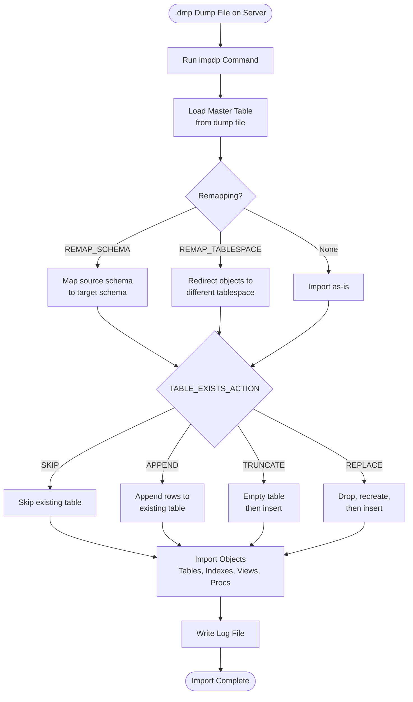

# Oracle Data Pump Import (impdp) — Restore Guide

Oracle Data Pump Import (`impdp`) is a server-side utility for importing database objects and data from a binary dump file generated by `expdp`. It supports full database, schema, tablespace, and table-level imports, with flexible remapping options. This guide covers directory setup, all available parameters, version-specific features (12c, 19c, 21c), usage examples, and troubleshooting.

---

## Import Process Overview



---

## Table of Contents

1. [Directory Setup](#1-directory-setup)
2. [Import Modes](#2-import-modes)
3. [All Import Parameters](#3-all-import-parameters)
4. [Version-Specific Features](#4-version-specific-features)
5. [Usage Examples](#5-usage-examples)
6. [Monitoring a Running Job](#6-monitoring-a-running-job)
7. [Troubleshooting](#7-troubleshooting)

---

## 1. Directory Setup

The dump file must reside on the **Oracle server**, not on the client machine. An Oracle DIRECTORY object must point to the location of the dump file.

### 1.1 Place the Dump File on the Server

**Windows — copy dump file to the directory:**
```cmd
copy \\server\share\export.dmp C:\oracle\datapump\
```

**Linux — copy dump file to the directory:**
```bash
cp /mnt/backup/export.dmp /oracle/datapump/
chown oracle:oinstall /oracle/datapump/export.dmp
```

### 1.2 Create the Oracle Directory Object (if not already created)

Connect as `SYS AS SYSDBA`:

**Windows:**
```sql
CREATE OR REPLACE DIRECTORY DATAPUMP_DIR AS 'C:\oracle\datapump';
```

**Linux:**
```sql
CREATE OR REPLACE DIRECTORY DATAPUMP_DIR AS '/oracle/datapump';
```

### 1.3 Grant Privileges to the User

```sql
GRANT READ, WRITE ON DIRECTORY DATAPUMP_DIR TO system;
```

### 1.4 Verify the Directory

```sql
SELECT directory_name, directory_path
FROM dba_directories
WHERE directory_name = 'DATAPUMP_DIR';
```

**Example output:**
```
DIRECTORY_NAME     DIRECTORY_PATH
------------------ ----------------------
DATAPUMP_DIR       /oracle/datapump
```

---

## 2. Import Modes

| Mode | Parameter | Description |
|---|---|---|
| Full Database | `FULL=Y` | Imports the entire dump file |
| Schema | `SCHEMAS=schema1,schema2` | Imports one or more schemas |
| Tablespace | `TABLESPACES=tbs1,tbs2` | Imports all objects in specified tablespaces |
| Table | `TABLES=schema.table1` | Imports specific tables |
| Transportable Tablespace | `TRANSPORT_DATAFILES` | Imports using transportable method |
| Network Import | `NETWORK_LINK` | Imports directly from another database (no dump file) |

---

## 3. All Import Parameters

### 3.1 Connection & Authentication

| Parameter | Description | Example |
|---|---|---|
| `USERID` | Connection string | `USERID=system/password` |
| `ATTACH` | Attach to an existing import job | `ATTACH=job_name` |
| `NETWORK_LINK` | Import directly from a remote database | `NETWORK_LINK=remote_db_link` |

### 3.2 Input Files

| Parameter | Description | Example |
|---|---|---|
| `DIRECTORY` | Oracle directory object for dump/log files | `DIRECTORY=DATAPUMP_DIR` |
| `DUMPFILE` | Name of the dump file(s) | `DUMPFILE=export.dmp` |
| `LOGFILE` | Name of the log file | `LOGFILE=import.log` |
| `NOLOGFILE` | Suppress log file creation | `NOLOGFILE=Y` |
| `SQLFILE` | Generate DDL SQL script only (no actual import) | `SQLFILE=ddl_only.sql` |

### 3.3 Scope & Content

| Parameter | Description | Example |
|---|---|---|
| `FULL` | Full database import | `FULL=Y` |
| `SCHEMAS` | Schema-level import | `SCHEMAS=HR,SCOTT` |
| `TABLES` | Table-level import | `TABLES=HR.EMPLOYEES` |
| `TABLESPACES` | Tablespace-level import | `TABLESPACES=USERS` |
| `CONTENT` | What to import: `ALL`, `DATA_ONLY`, `METADATA_ONLY` | `CONTENT=DATA_ONLY` |
| `QUERY` | Filter rows during import | `QUERY=HR.EMPLOYEES:"WHERE dept_id=10"` |

### 3.4 Remapping

| Parameter | Description | Example |
|---|---|---|
| `REMAP_SCHEMA` | Import objects from one schema into another | `REMAP_SCHEMA=HR:HR_NEW` |
| `REMAP_TABLESPACE` | Redirect objects to a different tablespace | `REMAP_TABLESPACE=USERS:DATA_TBS` |
| `REMAP_TABLE` | Rename a table during import | `REMAP_TABLE=HR.EMPLOYEES:HR.EMP_OLD` |
| `REMAP_DATAFILE` | Redirect datafile paths (transportable) | `REMAP_DATAFILE='/old/path/data.dbf':'/new/path/data.dbf'` |

### 3.5 Table Handling

| Parameter | Values | Description |
|---|---|---|
| `TABLE_EXISTS_ACTION` | `SKIP` | Skip the table if it already exists (default) |
| | `APPEND` | Insert rows into the existing table |
| | `TRUNCATE` | Truncate the table before inserting rows |
| | `REPLACE` | Drop and recreate the table, then insert rows |

### 3.6 Filtering Objects

| Parameter | Description | Example |
|---|---|---|
| `INCLUDE` | Import only specific object types | `INCLUDE=TABLE,INDEX` |
| `EXCLUDE` | Exclude specific object types | `EXCLUDE=STATISTICS,GRANT` |

**Example — import only tables and indexes:**
```bash
INCLUDE=TABLE,INDEX
```

**Example — exclude specific tables:**
```bash
EXCLUDE=TABLE:"IN ('LOG_TABLE','TEMP_TABLE')"
```

### 3.7 Performance

| Parameter | Description | Example |
|---|---|---|
| `PARALLEL` | Number of parallel worker processes | `PARALLEL=4` |
| `SKIP_UNUSABLE_INDEXES` | Skip indexes in unusable state | `SKIP_UNUSABLE_INDEXES=Y` |
| `DATA_OPTIONS` | Control data loading behavior | `DATA_OPTIONS=SKIP_CONSTRAINT_ERRORS` |
| `DISABLE_ARCHIVE_LOGGING` | Reduce redo generation (19c+, Enterprise Edition) | `DISABLE_ARCHIVE_LOGGING=Y` |

### 3.8 Encryption

| Parameter | Description | Example |
|---|---|---|
| `ENCRYPTION_PASSWORD` | Password to decrypt an encrypted dump file | `ENCRYPTION_PASSWORD=MySecurePass123` |

### 3.9 Transform Options

Controls how objects are created during import.

| Transform | Description | Example |
|---|---|---|
| `SEGMENT_ATTRIBUTES` | Include/exclude storage and tablespace attributes | `TRANSFORM=SEGMENT_ATTRIBUTES:N` |
| `STORAGE` | Include/exclude storage clauses | `TRANSFORM=STORAGE:N` |
| `OID` | Regenerate OIDs for object tables | `TRANSFORM=OID:N` |
| `PCTSPACE` | Reduce storage allocation by a percentage | `TRANSFORM=PCTSPACE:50` |
| `DISABLE_ARCHIVE_LOGGING` | Disable logging for tables and indexes during import | `TRANSFORM=DISABLE_ARCHIVE_LOGGING:Y` |

**Example:**
```bash
TRANSFORM=SEGMENT_ATTRIBUTES:N:TABLE
TRANSFORM=STORAGE:N
```

### 3.10 Job Control

| Parameter | Description | Example |
|---|---|---|
| `JOB_NAME` | Assign a name to the import job | `JOB_NAME=FULL_IMPORT_20250505` |
| `STATUS` | Interval (seconds) to display job status | `STATUS=30` |
| `VERSION` | Target version for object compatibility | `VERSION=12.2` |
| `CLUSTER` | Use RAC cluster resources | `CLUSTER=Y` |

### 3.11 Partition Options (12c+)

| Parameter | Values | Description |
|---|---|---|
| `PARTITION_OPTIONS` | `NONE` | Import as-is (default) |
| | `DEPARTITION` | Convert partitioned table to individual non-partitioned tables |
| | `MERGE` | Merge all partitions into a single non-partitioned table |

### 3.12 Transportable Tablespace Import

| Parameter | Description | Example |
|---|---|---|
| `TRANSPORT_DATAFILES` | List of datafiles to import | `TRANSPORT_DATAFILES='/oracle/data/users01.dbf'` |
| `TRANSPORT_FULL_CHECK` | Check for dependencies | `TRANSPORT_FULL_CHECK=Y` |

---

## 4. Version-Specific Features

### 4.1 Oracle 12c

| Feature | Parameter | Description |
|---|---|---|
| Import into PDB | Connect to PDB service | Import dump into a specific PDB |
| Partition Options | `PARTITION_OPTIONS=MERGE` | Merge partitions into one table |
| Views as Tables | `VIEWS_AS_TABLES` | Import a view as a table |
| Full Transportable Export/Import | `FULL=Y TRANSPORTABLE=ALWAYS VERSION=12` | Move entire database between platforms |

**12c — Import into PDB:**
```bash
impdp system/password@ORCLPDB1 \
SCHEMAS=HR \
DIRECTORY=DATAPUMP_DIR \
DUMPFILE=hr_export.dmp \
LOGFILE=hr_import.log \
REMAP_SCHEMA=HR:HR_NEW
```

### 4.2 Oracle 19c

| Feature | Parameter | Description |
|---|---|---|
| Checksum Verification | Automatic | RMAN verifies checksum if dump was exported with `CHECKSUM=SHA256` |
| Disable Archive Logging | `DISABLE_ARCHIVE_LOGGING=Y` | Reduces redo log generation, speeds up large imports |
| Transform Disable Archive Logging | `TRANSFORM=DISABLE_ARCHIVE_LOGGING:Y` | Applied per object |

**19c — High-performance import with logging disabled:**
```bash
impdp system/password \
SCHEMAS=HR \
DIRECTORY=DATAPUMP_DIR \
DUMPFILE=hr_19c.dmp \
LOGFILE=hr_19c_import.log \
PARALLEL=4 \
DISABLE_ARCHIVE_LOGGING=Y \
TABLE_EXISTS_ACTION=REPLACE
```

### 4.3 Oracle 21c

| Feature | Description |
|---|---|
| Blockchain Table Import | Supports importing blockchain tables (append-only; historical data preserved) |
| Mandatory Column Import | Handles tables with mandatory columns correctly |
| Improved Error Reporting | More detailed error messages in log and alert log |

**21c — Full import with parallel:**
```bash
impdp system/password \
FULL=Y \
DIRECTORY=DATAPUMP_DIR \
DUMPFILE=full_21c_%U.dmp \
LOGFILE=full_21c_import.log \
PARALLEL=8 \
TABLE_EXISTS_ACTION=REPLACE \
JOB_NAME=FULL_IMPORT_21C
```

---

## 5. Usage Examples

### 5.1 Full Database Import

```bash
impdp system/password \
FULL=Y \
DIRECTORY=DATAPUMP_DIR \
DUMPFILE=full_db_%U.dmp \
LOGFILE=full_import.log \
PARALLEL=4 \
JOB_NAME=FULL_IMPORT
```

**Example output:**
```
Import: Release 19.0.0.0.0 - Production on Mon May 5 10:00:00 2025

Copyright (c) 1982, 2019, Oracle and/or its affiliates. All rights reserved.

Connected to: Oracle Database 19c Enterprise Edition Release 19.0.0.0.0

Master table "SYSTEM"."FULL_IMPORT" successfully loaded/unloaded
Starting "SYSTEM"."FULL_IMPORT":  system/******** FULL=Y ...
Processing object type DATABASE_EXPORT/SCHEMA/TABLE/TABLE
Processing object type DATABASE_EXPORT/SCHEMA/TABLE/TABLE_DATA
. . imported "HR"."EMPLOYEES"                          1.2 MB   107 rows
. . imported "HR"."DEPARTMENTS"                        22 KB    27 rows
. . imported "SCOTT"."EMP"                             8 KB     14 rows
Processing object type DATABASE_EXPORT/SCHEMA/TABLE/INDEX/INDEX
Processing object type DATABASE_EXPORT/SCHEMA/TABLE/CONSTRAINT/CONSTRAINT
Processing object type DATABASE_EXPORT/SCHEMA/VIEW/VIEW
Processing object type DATABASE_EXPORT/SCHEMA/PROCEDURE/PROCEDURE
Job "SYSTEM"."FULL_IMPORT" successfully completed at Mon May 5 10:15:22 2025 elapsed 0 00:15:22
```

---

### 5.2 Schema Import with Remap

Import schema `HR` from dump and place it into a new schema `HR_UAT`, remapping tablespace at the same time.

```bash
impdp system/password \
SCHEMAS=HR \
DIRECTORY=DATAPUMP_DIR \
DUMPFILE=schema_hr.dmp \
LOGFILE=schema_hr_import.log \
REMAP_SCHEMA=HR:HR_UAT \
REMAP_TABLESPACE=USERS:UAT_TBS \
TABLE_EXISTS_ACTION=REPLACE
```

**Example output:**
```
Processing object type SCHEMA_EXPORT/TABLE/TABLE
Processing object type SCHEMA_EXPORT/TABLE/TABLE_DATA
. . imported "HR_UAT"."EMPLOYEES"                      1.2 MB   107 rows
. . imported "HR_UAT"."DEPARTMENTS"                    22 KB    27 rows
Processing object type SCHEMA_EXPORT/TABLE/INDEX/INDEX
Processing object type SCHEMA_EXPORT/TABLE/CONSTRAINT/CONSTRAINT
Job "SYSTEM"."SYS_IMPORT_SCHEMA_01" successfully completed ...
```

---

### 5.3 Table Import with APPEND

Import specific tables and append rows to existing data.

```bash
impdp system/password \
TABLES=HR.EMPLOYEES,HR.DEPARTMENTS \
DIRECTORY=DATAPUMP_DIR \
DUMPFILE=schema_hr.dmp \
LOGFILE=table_import.log \
TABLE_EXISTS_ACTION=APPEND
```

---

### 5.4 Import Metadata Only (No Data)

Useful for recreating table structures, views, procedures, and indexes without loading data.

```bash
impdp system/password \
SCHEMAS=HR \
CONTENT=METADATA_ONLY \
DIRECTORY=DATAPUMP_DIR \
DUMPFILE=hr_export.dmp \
LOGFILE=hr_metadata_import.log
```

---

### 5.5 Generate DDL Script Only (No Import)

Generate a SQL script from the dump file without actually importing anything. Useful for reviewing or modifying DDL before applying.

```bash
impdp system/password \
SCHEMAS=HR \
DIRECTORY=DATAPUMP_DIR \
DUMPFILE=hr_export.dmp \
SQLFILE=hr_ddl.sql \
NOLOGFILE=Y
```

**Result:** A file `hr_ddl.sql` is created in `DATAPUMP_DIR` containing all DDL statements.

---

### 5.6 Cross-Schema Table Remap

```bash
impdp system/password \
TABLES=HR.EMPLOYEES \
REMAP_TABLE=HR.EMPLOYEES:BACKUP.EMPLOYEES_BKP \
REMAP_SCHEMA=HR:BACKUP \
DIRECTORY=DATAPUMP_DIR \
DUMPFILE=hr_export.dmp \
LOGFILE=remap_import.log \
TABLE_EXISTS_ACTION=REPLACE
```

---

### 5.7 Network Import (No Dump File Required)

Import directly from a remote database via a database link — no dump file needed.

```sql
-- Create DB link first (if not already created)
CREATE DATABASE LINK remote_db
CONNECT TO system IDENTIFIED BY password
USING 'REMOTE_TNS_ALIAS';
```

```bash
impdp system/password \
SCHEMAS=HR \
NETWORK_LINK=remote_db \
DIRECTORY=DATAPUMP_DIR \
LOGFILE=network_import.log \
REMAP_SCHEMA=HR:HR_LOCAL
```

---

### 5.8 Import with Exclude (Skip Grants and Statistics)

```bash
impdp system/password \
SCHEMAS=HR \
DIRECTORY=DATAPUMP_DIR \
DUMPFILE=hr_export.dmp \
LOGFILE=hr_import.log \
EXCLUDE=STATISTICS,GRANT,OBJECT_GRANT
```

---

### 5.9 Encrypted Dump File Import

```bash
impdp system/password \
SCHEMAS=HR \
DIRECTORY=DATAPUMP_DIR \
DUMPFILE=hr_encrypted.dmp \
LOGFILE=hr_encrypted_import.log \
ENCRYPTION_PASSWORD=MySecurePass123
```

---

### 5.10 Transportable Tablespace Import

```bash
impdp system/password \
DIRECTORY=DATAPUMP_DIR \
DUMPFILE=tts_export.dmp \
LOGFILE=tts_import.log \
TRANSPORT_DATAFILES='/oracle/data/users01.dbf','/oracle/data/users02.dbf'
```

---

## 6. Monitoring a Running Job

### 6.1 Attach to a Running Job

```bash
impdp system/password ATTACH=FULL_IMPORT
```

**Interactive commands inside the job monitor:**
```
Import> STATUS          -- show current progress
Import> PARALLEL=8      -- increase parallel workers on-the-fly
Import> KILL_JOB        -- terminate the job permanently
Import> STOP_JOB        -- suspend the job (can be resumed)
Import> START_JOB       -- resume a suspended job
Import> CONTINUE_CLIENT -- continue displaying status
```

### 6.2 Check Active Jobs from SQL

```sql
SELECT job_name, operation, job_mode, state, degree
FROM dba_datapump_jobs
WHERE state IN ('EXECUTING','NOT RUNNING');
```

**Example output:**
```
JOB_NAME              OPERATION  JOB_MODE  STATE      DEGREE
--------------------- ---------- --------- ---------- ------
FULL_IMPORT           IMPORT     FULL      EXECUTING  4
```

### 6.3 Check Worker Progress

```sql
SELECT sid, serial#, sofar, totalwork,
       ROUND(sofar/totalwork*100,2) pct_done,
       message
FROM v$session_longops
WHERE opname LIKE 'IMPORT%'
AND totalwork > 0
ORDER BY pct_done DESC;
```

---

## Version Compatibility

Core `impdp` parameters (`FULL`, `SCHEMAS`, `TABLES`, `DIRECTORY`, `DUMPFILE`, `REMAP_SCHEMA`, `REMAP_TABLESPACE`, `TABLE_EXISTS_ACTION`) have been available since Oracle 10g/11g.

| Feature | 11g | 12c | 18c | 19c | 21c | 23ai–26 AI |
|---------|-----|-----|-----|-----|-----|-----------|
| Core import parameters (FULL, SCHEMAS, TABLES, REMAP_SCHEMA) | Yes | Yes | Yes | Yes | Yes | Yes |
| Import into PDB (Multitenant) | No | Yes | Yes | Yes | Yes | Yes |
| `PARTITION_OPTIONS` (NONE/DEPARTITION/MERGE) | No | Yes | Yes | Yes | Yes | Yes |
| `VIEWS_AS_TABLES` | No | Yes | Yes | Yes | Yes | Yes |
| Full Transportable Export/Import | No | Yes | Yes | Yes | Yes | Yes |
| `DISABLE_ARCHIVE_LOGGING` / `TRANSFORM=DISABLE_ARCHIVE_LOGGING` | No | No | No | Yes | Yes | Yes |
| Checksum verification (SHA256 dump) | No | No | No | Yes | Yes | Yes |
| Blockchain table import | No | No | No | No | Yes | Yes |
| Mandatory column import | No | No | No | No | Yes | Yes |

> **Summary:** This guide's basic usage works on Oracle 11g and above. `PARTITION_OPTIONS` and PDB-targeted import require 12c+; performance features like `DISABLE_ARCHIVE_LOGGING` require 19c+.

### Script Differences by Version

**Oracle 11g — schema import (no PDB, no PARTITION_OPTIONS, no DISABLE_ARCHIVE_LOGGING):**
```bash
impdp system/password \
SCHEMAS=HR \
DIRECTORY=DATAPUMP_DIR \
DUMPFILE=hr_export.dmp \
LOGFILE=hr_import.log \
REMAP_SCHEMA=HR:HR_NEW \
TABLE_EXISTS_ACTION=REPLACE
```
> On 11g there are no PDBs, so `USERID` connects directly to the single-tenant instance — no `@pdb_service` suffix.

**Oracle 12c and above — import into a specific PDB, with partition merge:**
```bash
impdp system/password@ORCLPDB1 \
SCHEMAS=HR \
DIRECTORY=DATAPUMP_DIR \
DUMPFILE=hr_export.dmp \
LOGFILE=hr_import.log \
REMAP_SCHEMA=HR:HR_NEW \
PARTITION_OPTIONS=MERGE
```
> `@ORCLPDB1` (PDB service connection) and `PARTITION_OPTIONS` are only valid from Oracle 12c onward. Running this against 11g fails because neither PDBs nor `PARTITION_OPTIONS` exist there.

**Oracle 19c and above — same import, with performance parameter added:**
```bash
impdp system/password \
SCHEMAS=HR \
DIRECTORY=DATAPUMP_DIR \
DUMPFILE=hr_19c.dmp \
LOGFILE=hr_19c_import.log \
PARALLEL=4 \
DISABLE_ARCHIVE_LOGGING=Y \
TABLE_EXISTS_ACTION=REPLACE
```
> `DISABLE_ARCHIVE_LOGGING=Y` (and the equivalent `TRANSFORM=DISABLE_ARCHIVE_LOGGING:Y`) only exist from Oracle 19c onward. On 11g/12c/18c, remove this parameter — it is not recognized and the job will fail with `ORA-39001`.

---

## 7. Troubleshooting

### Error: ORA-39002 / ORA-39070: Unable to open the log file

**Cause:** Directory object missing or path does not exist on the server.

**Solution:**
```sql
SELECT directory_name, directory_path FROM dba_directories WHERE directory_name = 'DATAPUMP_DIR';
CREATE OR REPLACE DIRECTORY DATAPUMP_DIR AS '/oracle/datapump';
GRANT READ, WRITE ON DIRECTORY DATAPUMP_DIR TO system;
```

---

### Error: ORA-39083: Object type TABLE failed to create with error ORA-00959: tablespace does not exist

**Cause:** The target database does not have the same tablespace as the source.

**Solution:**
```bash
# Remap to an existing tablespace
REMAP_TABLESPACE=OLD_TBS:NEW_TBS
```

Or create the missing tablespace first:
```sql
CREATE TABLESPACE OLD_TBS DATAFILE '/oracle/data/old_tbs01.dbf' SIZE 500M AUTOEXTEND ON;
```

---

### Error: ORA-31684: Object type USER already exists

**Cause:** The schema user already exists in the target database.

**Solution:**
```bash
# Skip user creation (import objects only)
EXCLUDE=USER
```

---

### Error: ORA-39151: Table exists. All dependent metadata will be skipped due to TABLE_EXISTS_ACTION of SKIP

**Cause:** Default `TABLE_EXISTS_ACTION=SKIP` skips existing tables including their indexes and constraints.

**Solution:** Use a different action:
```bash
TABLE_EXISTS_ACTION=REPLACE    # drop and recreate
TABLE_EXISTS_ACTION=APPEND     # keep table, add rows
TABLE_EXISTS_ACTION=TRUNCATE   # empty table, then insert
```

---

### Error: ORA-39126: Worker unexpected fatal error

**Cause:** A specific object failed to import (corrupted, unsupported, or incompatible).

**Solution:**
```bash
# Skip the problematic object
EXCLUDE=TABLE:"IN ('PROBLEM_TABLE')"
```

Check the log file for the exact object:
```bash
grep -i "ORA-" /oracle/datapump/import.log
```

---

### Error: ORA-01950: no privileges on tablespace

**Cause:** The target user has no quota on the tablespace.

**Solution:**
```sql
ALTER USER hr QUOTA UNLIMITED ON users;
-- or
ALTER USER hr QUOTA 500M ON users;
```

---

### Error: ORA-39181: Only partial global metadata can be exported

**Cause:** Importing a full dump into a PDB but the dump contains CDB-level objects.

**Solution:**
```bash
# Limit import to schema level
SCHEMAS=HR
```

Or exclude CDB-only objects:
```bash
EXCLUDE=DATABASE_EXPORT/SYSTEM_PROCOBJACT
```

---

### Error: ORA-12899: value too large for column

**Cause:** Character set mismatch between source and target (e.g., AL32UTF8 vs WE8MSWIN1252).

**Solution:**
```sql
-- Check target DB character set
SELECT value FROM nls_database_parameters WHERE parameter='NLS_CHARACTERSET';
```

Use `TRANSFORM=SEGMENT_ATTRIBUTES:N` to ignore storage attributes, or convert the character set on the target database.

---

### Import Runs Slowly

**Tips to improve performance:**

1. Increase parallel workers:
```bash
PARALLEL=4
```

2. Disable archive logging (19c+, Enterprise Edition):
```bash
DISABLE_ARCHIVE_LOGGING=Y
```
Or using TRANSFORM:
```bash
TRANSFORM=DISABLE_ARCHIVE_LOGGING:Y
```

3. Skip index creation during import, rebuild after:
```bash
EXCLUDE=INDEX
```
Then rebuild indexes after import:
```sql
EXEC DBMS_STATS.GATHER_SCHEMA_STATS('HR');
```

4. Use `TABLE_EXISTS_ACTION=TRUNCATE` instead of `REPLACE` to avoid drop/recreate overhead.

5. Increase `db_files` and `open_cursors` if importing many tables in parallel.

---

### Orphaned Data Pump Jobs (Job Stuck or Failed)

If an import job fails or is killed abnormally, it may leave orphaned entries in the catalog.

**Clean up orphaned jobs:**
```sql
-- Find orphaned jobs
SELECT owner_name, job_name, state
FROM dba_datapump_jobs
WHERE state = 'NOT RUNNING';

-- Drop the master table to clean up
DROP TABLE system.FULL_IMPORT;

-- If the job still appears, stop it first
BEGIN
  DBMS_DATAPUMP.STOP_JOB(
    handle    => DBMS_DATAPUMP.OPEN('IMPORT','FULL','SYSTEM','FULL_IMPORT'),
    immediate => 1
  );
END;
/
```

---

### Check Import Log for Errors

Always review the log file after import:

```bash
# Linux
grep -i "ORA-\|error\|warning\|skipped" /oracle/datapump/import.log

# Windows
findstr /I "ORA- error warning skipped" C:\oracle\datapump\import.log
```
