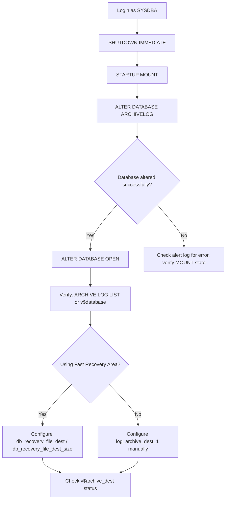
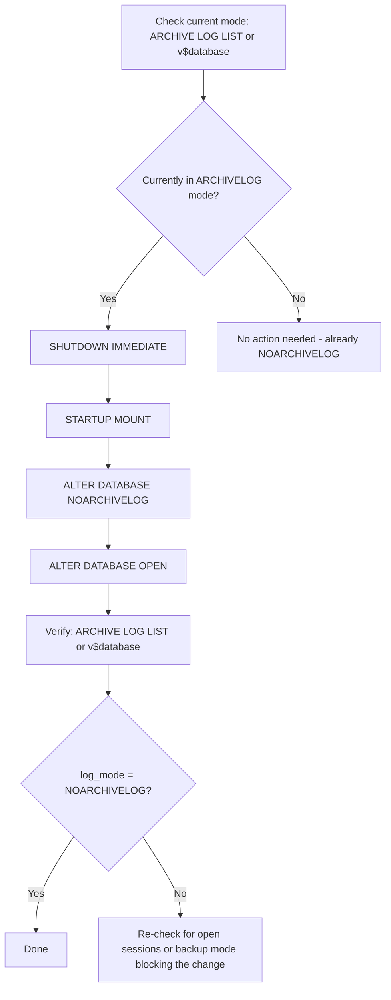

# Enabling and Disabling ARCHIVELOG Mode in Oracle Database

## Environment

- Oracle Database 8i and above — the syntax and procedure below are identical across every version
- Applies to single-instance databases on all versions; on multitenant architectures (12c+), the setting applies at the CDB (root container) level
- Connected as `oracle` OS user via `sqlplus / as sysdba`

## Overview

`ARCHIVELOG` mode determines whether Oracle preserves filled online redo log files (as archived redo logs) before they are overwritten. It is required for:

- Online (hot) backups with RMAN
- Point-in-time recovery
- Data Guard / standby database configurations
- Flashback Database

Switching between `ARCHIVELOG` and `NOARCHIVELOG` mode is a **structural change to the control file** and can only be performed while the database is **MOUNTED, not OPEN**. This is the single most important constraint to remember for both procedures below.

| Mode | Description | Typical Use Case |
|---|---|---|
| `ARCHIVELOG` | Filled redo logs are archived before reuse | Production databases requiring point-in-time recovery, hot backups, Data Guard |
| `NOARCHIVELOG` | Filled redo logs are overwritten without archiving | Development/test databases, or databases where only cold backups are used |

## Prerequisites

- SYSDBA privileges
- Sufficient downtime window — the database must be shut down and restarted in `MOUNT` state, which is a brief outage for applications
- If enabling `ARCHIVELOG`, confirm where archived logs will be written: either an explicit `log_archive_dest_1` destination or a Fast Recovery Area (FRA) via `db_recovery_file_dest`
- Enough disk space at the archive destination — an undersized destination will eventually cause the database to hang once it fills up (see Troubleshooting section)

## Part 1 — Enabling ARCHIVELOG Mode

### Procedure Flow



### Steps

**Step 1 — Login as SYSDBA**

```sql
sqlplus / as sysdba
```

**Step 2 — Shut down the database**

```sql
SHUTDOWN IMMEDIATE;
```

**Step 3 — Start up in MOUNT mode**

```sql
STARTUP MOUNT;
```

The database must be mounted (control file read, datafiles identified) but **not open** — `ALTER DATABASE ARCHIVELOG` modifies the control file and is rejected if the database is open.

**Step 4 — Enable ARCHIVELOG mode**

```sql
ALTER DATABASE ARCHIVELOG;
```

Expected output on success:

```
Database altered.
```

**Step 5 — Open the database**

```sql
ALTER DATABASE OPEN;
```

**Step 6 — Verify**

```sql
ARCHIVE LOG LIST;
```

or

```sql
SELECT log_mode FROM v$database;
```

Expected result:

```
Database log mode              Archive Mode
Automatic archival             Enabled
```

### Configuring the Archive Destination (Fast Recovery Area)

If archived redo logs should be written to a Fast Recovery Area (FRA) rather than a manually specified destination, confirm and configure it:

```sql
SHOW PARAMETER db_recovery_file_dest;
SHOW PARAMETER db_recovery_file_dest_size;
```

If not yet configured:

```sql
ALTER SYSTEM SET db_recovery_file_dest='/u01/app/oracle/fast_recovery_area' SCOPE=BOTH;
ALTER SYSTEM SET db_recovery_file_dest_size=200G SCOPE=BOTH;
```

Then check the active archive destinations:

```sql
SELECT dest_name,
       destination,
       status,
       error
FROM v$archive_dest
WHERE status <> 'INACTIVE';
```

| Column | Meaning |
|---|---|
| `DEST_NAME` | Logical name of the archive destination (e.g. `LOG_ARCHIVE_DEST_1`) |
| `DESTINATION` | Physical path or FRA location where archived logs are written |
| `STATUS` | Current state of the destination (`VALID`, `ERROR`, `INACTIVE`, etc.) |
| `ERROR` | Error detail if the destination is not `VALID` |

## Part 2 — Disabling ARCHIVELOG Mode (Switching to NOARCHIVELOG)

Disabling `ARCHIVELOG` mode follows the same MOUNT-state constraint: the change cannot be made while the database is `OPEN`.

### Procedure Flow



### Steps

**Step 1 — Check the current database mode**

```sql
ARCHIVE LOG LIST;
```

or

```sql
SELECT log_mode FROM v$database;
```

**Step 2 — Shut down the database**

```sql
SHUTDOWN IMMEDIATE;
```

**Step 3 — Start up in MOUNT mode**

```sql
STARTUP MOUNT;
```

**Step 4 — Disable ARCHIVELOG mode**

```sql
ALTER DATABASE NOARCHIVELOG;
```

**Step 5 — Open the database**

```sql
ALTER DATABASE OPEN;
```

**Step 6 — Verify**

```sql
ARCHIVE LOG LIST;
```

Expected result:

```
Database log mode              No Archive Mode
Automatic archival             Disabled
```

## Quick Reference

| Action | Required State | Command | Verification |
|---|---|---|---|
| Enable ARCHIVELOG | MOUNT (not OPEN) | `ALTER DATABASE ARCHIVELOG;` | `log_mode = ARCHIVELOG` |
| Disable ARCHIVELOG | MOUNT (not OPEN) | `ALTER DATABASE NOARCHIVELOG;` | `log_mode = NOARCHIVELOG` |
| Check current mode | Any (MOUNT or OPEN) | `ARCHIVE LOG LIST;` or `SELECT log_mode FROM v$database;` | — |

## Important Considerations

1. **This is a control-file-level change, not a session-level or instance-level parameter.** Once altered, the mode persists across restarts until explicitly changed again — it is not reset by `SHUTDOWN`/`STARTUP`.

2. **Application downtime is required.** Because the database must pass through `MOUNT` state (implying a shutdown and restart), plan this during a maintenance window. On a busy production system, coordinate with application owners beforehand.

3. **Before enabling ARCHIVELOG on a production database**, ensure:
   - The archive destination (FRA or manual `log_archive_dest_n`) has enough free space and is on separate, adequately performing storage from the datafiles.
   - A backup strategy (RMAN scheduled backups) is in place to actually make use of archived logs — enabling ARCHIVELOG without backing up archive logs just consumes disk space without providing recoverability benefit.
   - Monitoring/alerting is configured for the archive destination filling up. If the destination fills completely, the database will hang (unable to allocate new redo log space) until space is freed or the destination is expanded — this is a common production incident.

4. **Before disabling ARCHIVELOG**, confirm:
   - No Data Guard standby, Flashback Database, or RMAN backup strategy depends on continuous archiving — disabling ARCHIVELOG breaks the recovery chain and typically requires a fresh full backup once re-enabled.
   - This change is intentional and understood by the team; it is unusual to disable ARCHIVELOG on a database that previously had it enabled for a reason.

5. **CDB/PDB note (multitenant architectures, 12c and later only):** `ALTER DATABASE ARCHIVELOG` / `NOARCHIVELOG` operates at the CDB (root container) level — archiving mode is not configurable independently per-PDB. All PDBs within a CDB share the same archive log mode as the CDB itself. This does not apply to pre-12c releases, which have no CDB/PDB concept.

6. **Verify space usage periodically** after enabling ARCHIVELOG, especially during the first backup cycle:

   ```sql
   SELECT * FROM v$flash_recovery_area_usage;
   ```

   or, on newer releases:

   ```sql
   SELECT * FROM v$recovery_area_usage;
   ```

   This helps confirm the FRA is sized appropriately and that old archived logs are being purged as expected by the configured backup/retention policy (e.g. via RMAN `DELETE ARCHIVELOG` after successful backup).

## Version Compatibility

This procedure has one of the longest unbroken compatibility spans of any command in Oracle — the `ALTER DATABASE ARCHIVELOG`/`NOARCHIVELOG` syntax and the MOUNT-state requirement have not changed since Oracle 8i.

| Version | Supported? | Notes |
|---|---|---|
| 8i / 9i | Yes | Same `ALTER DATABASE ARCHIVELOG`/`NOARCHIVELOG` syntax and MOUNT-state requirement; no CDB/PDB concept yet |
| 10g | Yes | Same procedure; Flash Recovery Area (FRA) introduced in 10g, `v$flash_recovery_area_usage` available for space checks |
| 11g | Yes | Same procedure; no CDB/PDB — archiving mode applies to the single database instance directly |
| 12c | Yes | Multitenant architecture introduced; archiving mode applies at the CDB (root container) level — cannot be set per-PDB |
| 18c – 19c | Yes | Same procedure and CDB-level behavior as 12c |
| 21c – 23ai | Yes | Same procedure; `v$recovery_area_usage` is the preferred view over the older `v$flash_recovery_area_usage` |
| 26 AI | Yes | Same procedure and syntax; no changes observed to the ARCHIVELOG mode commands themselves |

**Summary: fully supported on Oracle 8i through 26 AI, with no script differences** — the only version-dependent details are (a) the Fast/Flash Recovery Area feature itself, which requires 10g+, and (b) the CDB-level scope of the setting, which only applies once multitenant architecture is used (12c+).
