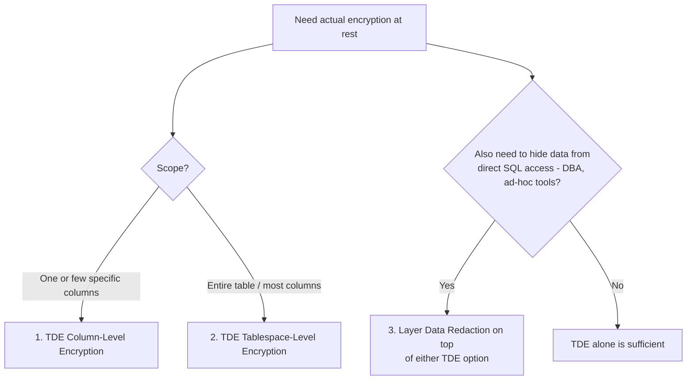

# Choosing an Encryption Approach for Sensitive Columns/Tables — Decision Guide (Oracle 19c)

## Environment

- Oracle Database 19c Enterprise Edition
- OLTP workload (frequent INSERT/UPDATE/DELETE, latency-sensitive, high transaction volume)
- Constraint: **all changes must stay on the database side only** — zero application code changes
- Requirement: a way for the application to keep working exactly as it does today, while sensitive columns (e.g., `salary`, `bank_account`) are protected — ideally through actual **encryption**, scoped to as little as one column or as much as a whole table

This is a **decision/reference document** — it does not repeat installation or step-by-step commands. For hands-on implementation, see the two companion guides in this repository:

- [tde-employee-payroll-implementation.md](tde-employee-payroll-implementation.md) — keystore setup, master key, `CREATE TABLE ... ENCRYPT`, verification
- [data-redaction-payroll-no-app-changes.md](data-redaction-payroll-no-app-changes.md) — `DBMS_REDACT` policy setup, optional Database Vault realm

## Requirements Recap (why these 3 were shortlisted)

Based on the constraints discussed:

1. No application code changes, ever — configuration/DB-only
2. Scope can be as small as a single column, or as large as an entire table
3. OLTP performance matters — write-heavy workload, so overhead on INSERT/UPDATE/DELETE is the most sensitive metric
4. Actual **encryption** is the primary goal (not just access restriction) — though hiding data from direct database queries was also raised as a related need in this conversation

## Top 3 Recommendations

### 1. TDE Column-Level Encryption — best fit for "just 1 (or a few) columns"

Encrypts only the specific columns named with `ENCRYPT USING 'AES256'` (e.g., `salary`, `bank_account`), leaving the rest of the table's columns and any other tables in the same tablespace untouched.

- **Why it's #1 for your stated need**: directly matches "encrypt data, could be just 1 column" — nothing broader is touched, nothing else in the tablespace is affected, and no query rewriting or application change is needed.
- **OLTP performance**: overhead is scoped to the encrypted columns only — every read/write that touches `salary`/`bank_account` pays the AES cost, but columns like `employee_name`/`position` in the same row are untouched. This is the **lightest-weight TDE option** for OLTP when only a minority of columns are sensitive.
- **Best when**: only a small, known set of columns are sensitive, and the rest of the table (or database) has no such requirement.

### 2. TDE Tablespace-Level Encryption — best fit for "the whole table"

Encrypts every block in a tablespace, so every table (and every column) stored there is automatically protected without listing individual columns.

- **Why it's #2**: matches "encrypt the whole table" more cleanly than repeating `ENCRYPT USING 'AES256'` on every column — new columns added later are automatically covered without remembering to add the clause again.
- **OLTP performance**: overhead applies to **all** I/O against that tablespace, even non-sensitive columns — generally a bit more total overhead than column-level encryption if only a few columns actually need protection, but simpler to manage and audit (nothing can be "forgotten").
- **Best when**: most or all columns in the table are sensitive, or you want a "protect everything here, no exceptions" posture without column-by-column bookkeeping. A common pattern: create a dedicated encrypted tablespace (e.g., `PAYROLL_DATA_ENC`) and place `employee_payroll` there.

### 3. Data Redaction layered on top of either TDE option — closes the gap TDE cannot

Neither TDE option (column or tablespace) hides data from a live SQL query — TDE only protects data **at rest**. Anyone with `SELECT` privilege still sees plaintext once the row is queried, because TDE decrypts transparently for any authorized session. If "hidden from anyone querying the database directly, visible only to the application" also matters (as discussed earlier in this conversation), **Data Redaction is not a replacement for TDE — it is a required third layer**, not really a competing alternative.

- **Why it's included as a recommendation rather than a separate top-3 slot**: it answers a different question than "how do I encrypt this column/table" — it answers "who is allowed to see the decrypted result." Both TDE options above leave this gap; Data Redaction is the piece that closes it, still with zero application changes (policy keyed to the application's dedicated DB account).
- **OLTP performance**: near-zero impact on writes (INSERT/UPDATE/DELETE are untouched by redaction policies) — only SELECT pays a small evaluation cost. This makes it cheap to add on top of either TDE choice without compounding OLTP overhead significantly.

## Full Comparison Matrix (including alternatives discussed earlier, for context)

| Option | Is it real encryption? | Scope granularity | OLTP write overhead | OLTP read overhead | Hides data from DBA/ad-hoc SQL? | License requirement |
|---|---|---|---|---|---|---|
| **TDE — Column-level** | Yes (AES-256) | Per-column | Small (only encrypted columns) | Small (only encrypted columns) | No | Advanced Security Option |
| **TDE — Tablespace-level** | Yes (AES-256) | Whole tablespace (all tables/columns in it) | Small–medium (every block in the tablespace) | Small–medium (every block in the tablespace) | No | Advanced Security Option |
| **Data Redaction** | No (display-layer masking only) | Per-column, per-policy expression | None | Small (SELECT only) | Yes (unless grantee holds `EXEMPT REDACTION POLICY`) | Advanced Security Option |
| VPD / Row-Level Security | No | Per-row and/or per-column visibility | None | Small–medium (predicate rewrite) | Partially (row/column visibility, not true hiding of privilege) | Included in Enterprise Edition |
| Oracle Label Security | No | Per-row, label-based | None | Small–medium | Partially (label clearance based) | Separately licensed option |
| Database Vault Realm | No (access control, not encryption) | Object-level (table, schema) | None | None (privilege check, not data transform) | Yes, even blocks SYSDBA | Separately licensed/enabled option |
| View + revoke base table access | No | Per-column (via view definition) | None | Near-zero | Yes (column absent from view entirely) | None — built into every edition |
| Column-level `GRANT`/`REVOKE` | No | Per-column | None | Near-zero | Yes (query errors instead of masking) | None — built into every edition |

## OLTP Performance Ranking (write-heavy workload, lightest to heaviest)

1. **View + revoke / column-level GRANT** — effectively no measurable overhead (pure privilege check or query rewrite)
2. **Data Redaction** — no write-path cost at all; tiny read-path cost only on SELECT
3. **TDE Column-level** — write and read overhead, but confined to the encrypted columns only
4. **TDE Tablespace-level** — write and read overhead across every block in the tablespace, including non-sensitive columns
5. **VPD / Oracle Label Security** — predicate/label evaluation adds read-path cost; can be more expensive than Data Redaction if the policy function is complex

> Actual numbers vary by hardware (AES-NI availability), row size, and how much of the table's I/O touches the protected columns/tablespace — always validate with AWR/Statspack on a staging environment reflecting real transaction volume before committing to production. See "Benchmarking Note" below.

## What You Get vs. What You Don't — By Recommendation

| Recommendation | Protects data on stolen disk/backup? | Hides data from a DBA running `SELECT`? | Protects data in Data Pump export files? | Needs app changes? |
|---|---|---|---|---|
| TDE Column-level (alone) | Yes | No | Yes (export of encrypted column stays encrypted at rest in the dump file's underlying storage, though the logical values dumped are still the real data an authorized exporter can read) | No |
| TDE Tablespace-level (alone) | Yes | No | Yes (same caveat as above) | No |
| TDE + Data Redaction (layered) | Yes (via TDE) | Yes (via Redaction, for non-exempt sessions) | Only the at-rest portion (via TDE) — redaction does not apply to exported values by default | No |

This table is the main reason Data Redaction is presented as recommendation #3 rather than a TDE alternative: **no single option in this list fully replaces another** — each closes a different gap.

## Other Things Worth Knowing (beyond install/config/implementation)

1. **Encryption and masking are answers to different audit/compliance questions.** Auditors asking "is data encrypted at rest?" want TDE. Auditors or internal policy asking "who besides the application can see raw payroll data?" want Data Redaction (or stronger, Database Vault). Know which question you're actually being asked before picking a tool — many teams implement TDE alone and are surprised it doesn't satisfy a "least privilege / need-to-know" audit finding.

2. **TDE key management is an ongoing responsibility, not a one-time task.** The keystore and master key must be backed up, and the master key should be periodically rotated (`ADMINISTER KEY MANAGEMENT SET KEY ... WITH BACKUP`) as part of a key-rotation policy — treat this the same way you'd treat certificate or credential rotation, with an owner and a schedule, not a "set once and forget."

3. **Encrypted columns interact with indexing.** A B-tree index on a TDE-encrypted column still works for equality lookups (`WHERE employee_id = 1001`-style access via a non-encrypted key is unaffected), but range scans or functional indexes directly on an encrypted column are less efficient because encrypted values don't preserve sort order. Design queries against encrypted columns to avoid range predicates where possible, or keep the encrypted column out of ranges used by application queries.

4. **Data Redaction does not change what's stored — a forensic/backup-level compromise still exposes real data.** If your threat model includes "attacker gets a copy of the backup or datafile," only TDE (or OS/storage-level encryption) addresses that; Data Redaction is irrelevant to that scenario since it only intercepts live query results.

5. **`EXEMPT REDACTION POLICY` and `SELECT ANY TABLE` are both silent bypasses if left ungoverned.** Periodically audit who holds these privileges — a Data Redaction rollout is only as strong as knowing exactly who is exempt from it.

6. **Combining TDE + Data Redaction does not double the OLTP overhead in the way it might sound.** TDE overhead is on the I/O/storage path; Data Redaction overhead is on the SQL result-set path for SELECT only. They apply at different layers and don't stack multiplicatively — but still benchmark the combination together, not each in isolation, since real workloads mix reads and writes.

7. **Neither TDE nor Data Redaction protects data in application memory, logs, or error messages.** If the application logs query results, writes them to a cache, or includes sensitive values in exception/error text, that's outside the database's control entirely — worth a quick check even though it's outside the scope of "database-side only" changes.

8. **Licensing check before committing to a design.** Both TDE and Data Redaction require the **Advanced Security Option** on top of Enterprise Edition — confirm this is licensed in your environment before building a production plan around them. The zero-cost alternatives (views, column-level GRANT/REVOKE) are worth keeping in mind as a fallback if ASO licensing turns out not to be available.

9. **None of these options protect against a compromised or overly-privileged application account itself.** Since every recommendation here routes trust through the application's dedicated DB account (`APP_PAYROLL`-style), that account's credential becomes the de facto master key for who can see real data — protect and rotate it like any other production secret.

## Benchmarking Note (before committing to production)

Before finalizing a choice for an OLTP system:

1. Build a staging environment with realistic transaction volume (this repository's [generate-dummy-data.md](generate-dummy-data.md) can seed large sample datasets).
2. Capture an AWR/Statspack baseline with no encryption/redaction applied.
3. Apply TDE column-level only, re-run the same workload, compare AWR reports (`DB CPU`, `db file sequential read`, `log file sync` wait events are the ones most likely to shift).
4. Repeat for TDE tablespace-level, and again with Data Redaction layered on top.
5. Compare against the actual SLA/latency budget for the OLTP system — a measured 5% CPU increase means very different things for a system with headroom vs. one already CPU-bound.

## Final Recommendation Summary

| Your situation | Recommended choice |
|---|---|
| Only 1–2 specific columns need protection (e.g., `salary`, `bank_account`) | **TDE Column-Level Encryption** |
| Most/all columns in the table are sensitive, or the table will grow more sensitive columns over time | **TDE Tablespace-Level Encryption** |
| Either of the above, plus a requirement that direct database queries (DBA, ad-hoc tools) must not see real values | **Add Data Redaction on top** (and Database Vault if even SYSDBA must be blocked) |
| OLTP performance headroom is very tight and encryption-at-rest is not a hard compliance requirement | Consider the zero-overhead fallback (View + column-level `GRANT`/`REVOKE`) instead of encryption, understanding it blocks/denies rather than encrypts or masks |

For your stated need in this conversation — database-only changes, protecting as little as a single column, OLTP-sensitive — **TDE Column-Level Encryption is the primary recommendation**, with Data Redaction as the natural next layer once "hidden from direct database access" is also a requirement.

## Version Compatibility

| Feature | Minimum Version | Notes |
|---|---|---|
| TDE Column-level encryption | 10g R2 | `ADMINISTER KEY MANAGEMENT` syntax requires 11g R2+; see [tde-employee-payroll-implementation.md](tde-employee-payroll-implementation.md) |
| TDE Tablespace-level encryption | 11g R1 | Same keystore/master-key infrastructure as column-level; encrypted at `CREATE TABLESPACE ... ENCRYPTION` |
| Data Redaction | 11.2.0.1 | See [data-redaction-payroll-no-app-changes.md](data-redaction-payroll-no-app-changes.md) |
| Database Vault | 9i R2 (modernized in later releases) | Optional third layer for blocking DBA-level access |
| VPD | 8i | Long-standing feature, included in Enterprise Edition |
| View + column-level GRANT/REVOKE | All versions | Core SQL feature, no licensing dependency |

**Summary: all recommendations in this guide are available on Oracle 19c Enterprise Edition and remain valid through 26 AI**, with Advanced Security Option licensing being the only gating factor for TDE and Data Redaction specifically.
