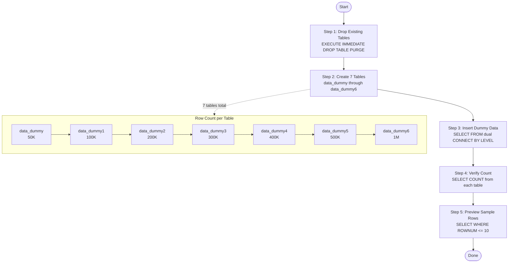
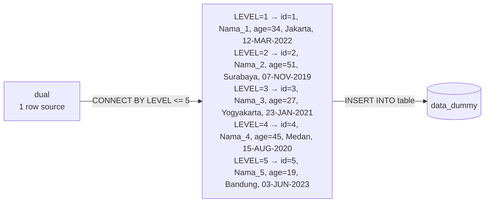

# Generating Dummy Data in Oracle Database

When testing database performance, query optimization, or data migration scenarios, it is often necessary to populate tables with large volumes of realistic-looking data. Oracle Database provides built-in tools — particularly `DBMS_RANDOM` and the hierarchical `CONNECT BY LEVEL` clause — that allow you to generate thousands or even millions of rows of dummy data in a single SQL statement, without writing complex PL/SQL loops.

This guide demonstrates how to create a simple table structure and populate it with varying row counts (from 50,000 up to 1,000,000 rows) using pure SQL. The approach is fast, repeatable, and works entirely in SQL*Plus, SQL Developer, or SQLcl.

---

## Prerequisites

- Access to Oracle Database with a user that has `CREATE TABLE` and `INSERT` privileges.
- The `DBMS_RANDOM` package must be accessible (granted by default to all users in Oracle 10g+).
- Tools: SQL\*Plus, SQL Developer, or SQLcl.

---

## Process Overview



---

## Table Structure

All dummy tables in this guide share the same structure:

| Column | Data Type | Description |
|--------|-----------|-------------|
| `id` | `NUMBER` | Unique sequential identifier (Primary Key) |
| `nama` | `VARCHAR2(100)` | Simulated name, e.g. `Nama_1`, `Nama_2` |
| `umur` | `NUMBER(2)` | Random age between 18 and 60 |
| `kota` | `VARCHAR2(50)` | City name, cycled from a fixed list |
| `tanggal_daftar` | `DATE` | Random registration date within the last 10 years |

---

## Summary: Tables and Row Counts

| Table | Row Count |
|-------|-----------|
| `data_dummy` | 50,000 |
| `data_dummy1` | 100,000 |
| `data_dummy2` | 200,000 |
| `data_dummy3` | 300,000 |
| `data_dummy4` | 400,000 |
| `data_dummy5` | 500,000 |
| `data_dummy6` | 1,000,000 |

---

## Step 1 — Drop Existing Tables

Before creating the tables, safely drop them if they already exist. The `EXCEPTION WHEN OTHERS THEN NULL` block suppresses errors if a table does not yet exist.

```sql
BEGIN
  EXECUTE IMMEDIATE 'DROP TABLE data_dummy  PURGE';
  EXECUTE IMMEDIATE 'DROP TABLE data_dummy1 PURGE';
  EXECUTE IMMEDIATE 'DROP TABLE data_dummy2 PURGE';
  EXECUTE IMMEDIATE 'DROP TABLE data_dummy3 PURGE';
  EXECUTE IMMEDIATE 'DROP TABLE data_dummy4 PURGE';
  EXECUTE IMMEDIATE 'DROP TABLE data_dummy5 PURGE';
  EXECUTE IMMEDIATE 'DROP TABLE data_dummy6 PURGE';
EXCEPTION
  WHEN OTHERS THEN NULL;
END;
/
```

**Notes:**

- `PURGE` removes the table permanently, bypassing the Oracle Recycle Bin. This avoids name conflicts with previously dropped tables.
- The `EXCEPTION WHEN OTHERS THEN NULL` block is intentional here — it suppresses `ORA-00942: table or view does not exist` when the table has not been created yet.

---

## Step 2 — Create Tables

Create all 7 tables using the same structure. Each table is created independently so row counts can be tested in isolation.

```sql
CREATE TABLE data_dummy  (id NUMBER PRIMARY KEY, nama VARCHAR2(100), umur NUMBER(2), kota VARCHAR2(50), tanggal_daftar DATE);
CREATE TABLE data_dummy1 (id NUMBER PRIMARY KEY, nama VARCHAR2(100), umur NUMBER(2), kota VARCHAR2(50), tanggal_daftar DATE);
CREATE TABLE data_dummy2 (id NUMBER PRIMARY KEY, nama VARCHAR2(100), umur NUMBER(2), kota VARCHAR2(50), tanggal_daftar DATE);
CREATE TABLE data_dummy3 (id NUMBER PRIMARY KEY, nama VARCHAR2(100), umur NUMBER(2), kota VARCHAR2(50), tanggal_daftar DATE);
CREATE TABLE data_dummy4 (id NUMBER PRIMARY KEY, nama VARCHAR2(100), umur NUMBER(2), kota VARCHAR2(50), tanggal_daftar DATE);
CREATE TABLE data_dummy5 (id NUMBER PRIMARY KEY, nama VARCHAR2(100), umur NUMBER(2), kota VARCHAR2(50), tanggal_daftar DATE);
CREATE TABLE data_dummy6 (id NUMBER PRIMARY KEY, nama VARCHAR2(100), umur NUMBER(2), kota VARCHAR2(50), tanggal_daftar DATE);
```

---

## Step 3 — Insert Dummy Data

Each `INSERT` uses a `SELECT ... FROM dual CONNECT BY LEVEL <= n` pattern to generate `n` rows in a single statement. Adjust the `CONNECT BY LEVEL` limit to control row count.

### data_dummy — 50,000 rows

```sql
INSERT INTO data_dummy (id, nama, umur, kota, tanggal_daftar)
SELECT
    LEVEL AS id,
    'Nama_' || LEVEL AS nama,
    TRUNC(DBMS_RANDOM.VALUE(18, 60)) AS umur,
    CASE MOD(LEVEL, 5)
        WHEN 0 THEN 'Bandung'
        WHEN 1 THEN 'Jakarta'
        WHEN 2 THEN 'Surabaya'
        WHEN 3 THEN 'Yogyakarta'
        ELSE 'Medan'
    END AS kota,
    TRUNC(SYSDATE - DBMS_RANDOM.VALUE(0, 3650)) AS tanggal_daftar
FROM dual
CONNECT BY LEVEL <= 50000;
COMMIT;
```

### data_dummy1 — 100,000 rows

```sql
INSERT INTO data_dummy1 (id, nama, umur, kota, tanggal_daftar)
SELECT
    LEVEL,
    'Nama_' || LEVEL,
    TRUNC(DBMS_RANDOM.VALUE(18, 60)),
    CASE MOD(LEVEL, 5)
        WHEN 0 THEN 'Bandung'
        WHEN 1 THEN 'Jakarta'
        WHEN 2 THEN 'Surabaya'
        WHEN 3 THEN 'Yogyakarta'
        ELSE 'Medan'
    END,
    TRUNC(SYSDATE - DBMS_RANDOM.VALUE(0, 3650))
FROM dual
CONNECT BY LEVEL <= 100000;
COMMIT;
```

### data_dummy2 — 200,000 rows

```sql
INSERT INTO data_dummy2 (id, nama, umur, kota, tanggal_daftar)
SELECT LEVEL, 'Nama_' || LEVEL, TRUNC(DBMS_RANDOM.VALUE(18, 60)),
    CASE MOD(LEVEL,5) WHEN 0 THEN 'Bandung' WHEN 1 THEN 'Jakarta'
    WHEN 2 THEN 'Surabaya' WHEN 3 THEN 'Yogyakarta' ELSE 'Medan' END,
    TRUNC(SYSDATE - DBMS_RANDOM.VALUE(0, 3650))
FROM dual CONNECT BY LEVEL <= 200000;
COMMIT;
```

### data_dummy3 — 300,000 rows

```sql
INSERT INTO data_dummy3 (id, nama, umur, kota, tanggal_daftar)
SELECT LEVEL, 'Nama_' || LEVEL, TRUNC(DBMS_RANDOM.VALUE(18, 60)),
    CASE MOD(LEVEL,5) WHEN 0 THEN 'Bandung' WHEN 1 THEN 'Jakarta'
    WHEN 2 THEN 'Surabaya' WHEN 3 THEN 'Yogyakarta' ELSE 'Medan' END,
    TRUNC(SYSDATE - DBMS_RANDOM.VALUE(0, 3650))
FROM dual CONNECT BY LEVEL <= 300000;
COMMIT;
```

### data_dummy4 — 400,000 rows

```sql
INSERT INTO data_dummy4 (id, nama, umur, kota, tanggal_daftar)
SELECT LEVEL, 'Nama_' || LEVEL, TRUNC(DBMS_RANDOM.VALUE(18, 60)),
    CASE MOD(LEVEL,5) WHEN 0 THEN 'Bandung' WHEN 1 THEN 'Jakarta'
    WHEN 2 THEN 'Surabaya' WHEN 3 THEN 'Yogyakarta' ELSE 'Medan' END,
    TRUNC(SYSDATE - DBMS_RANDOM.VALUE(0, 3650))
FROM dual CONNECT BY LEVEL <= 400000;
COMMIT;
```

### data_dummy5 — 500,000 rows

```sql
INSERT INTO data_dummy5 (id, nama, umur, kota, tanggal_daftar)
SELECT LEVEL, 'Nama_' || LEVEL, TRUNC(DBMS_RANDOM.VALUE(18, 60)),
    CASE MOD(LEVEL,5) WHEN 0 THEN 'Bandung' WHEN 1 THEN 'Jakarta'
    WHEN 2 THEN 'Surabaya' WHEN 3 THEN 'Yogyakarta' ELSE 'Medan' END,
    TRUNC(SYSDATE - DBMS_RANDOM.VALUE(0, 3650))
FROM dual CONNECT BY LEVEL <= 500000;
COMMIT;
```

### data_dummy6 — 1,000,000 rows

```sql
INSERT INTO data_dummy6 (id, nama, umur, kota, tanggal_daftar)
SELECT LEVEL, 'Nama_' || LEVEL, TRUNC(DBMS_RANDOM.VALUE(18, 60)),
    CASE MOD(LEVEL,5) WHEN 0 THEN 'Bandung' WHEN 1 THEN 'Jakarta'
    WHEN 2 THEN 'Surabaya' WHEN 3 THEN 'Yogyakarta' ELSE 'Medan' END,
    TRUNC(SYSDATE - DBMS_RANDOM.VALUE(0, 3650))
FROM dual CONNECT BY LEVEL <= 1000000;
COMMIT;
```

> **Note:** For very large inserts (500K–1M rows), consider increasing the undo tablespace size beforehand or splitting the insert into batches to avoid `ORA-30036: unable to extend segment in undo tablespace`.

---

## Step 4 — Verify Record Count

After inserting, confirm the row count for each table:

```sql
SELECT COUNT(*) AS total_data FROM data_dummy;
SELECT COUNT(*) AS total_data FROM data_dummy1;
SELECT COUNT(*) AS total_data FROM data_dummy2;
SELECT COUNT(*) AS total_data FROM data_dummy3;
SELECT COUNT(*) AS total_data FROM data_dummy4;
SELECT COUNT(*) AS total_data FROM data_dummy5;
SELECT COUNT(*) AS total_data FROM data_dummy6;
```

Or check all tables in a single query:

```sql
SELECT table_name, num_rows
FROM   user_tables
WHERE  table_name LIKE 'DATA_DUMMY%'
ORDER  BY table_name;
```

> **Note:** `num_rows` in `user_tables` reflects the last statistics gather. If it shows `NULL` or stale values, run `ANALYZE TABLE data_dummy COMPUTE STATISTICS;` or use `DBMS_STATS.GATHER_TABLE_STATS` first.

---

## Step 5 — Preview Sample Data

View the first 10 rows from each table to verify the data looks correct:

```sql
SELECT * FROM data_dummy  WHERE ROWNUM <= 10;
SELECT * FROM data_dummy1 WHERE ROWNUM <= 10;
SELECT * FROM data_dummy2 WHERE ROWNUM <= 10;
SELECT * FROM data_dummy3 WHERE ROWNUM <= 10;
SELECT * FROM data_dummy4 WHERE ROWNUM <= 10;
SELECT * FROM data_dummy5 WHERE ROWNUM <= 10;
SELECT * FROM data_dummy6 WHERE ROWNUM <= 10;
```

**Expected sample output (`data_dummy`):**

```
        ID NAMA               UMUR KOTA            TANGGAL_DAFTAR
---------- ------------------ ---- --------------- ---------------
         1 Nama_1               34 Jakarta         12-MAR-2022
         2 Nama_2               51 Surabaya        07-NOV-2019
         3 Nama_3               27 Yogyakarta      23-JAN-2021
         4 Nama_4               45 Medan           15-AUG-2020
         5 Nama_5               19 Bandung         03-JUN-2023
```

---

## Key Techniques Explained

### `CONNECT BY LEVEL <= n`

Generates exactly `n` rows from `dual` using Oracle's hierarchical query mechanism. This eliminates the need for a PL/SQL loop or an external data source.

```sql
SELECT LEVEL FROM dual CONNECT BY LEVEL <= 5;
-- Returns: 1, 2, 3, 4, 5
```



### `DBMS_RANDOM.VALUE(low, high)`

Returns a random `NUMBER` between `low` (inclusive) and `high` (exclusive). Wrap with `TRUNC()` to get an integer.

```sql
TRUNC(DBMS_RANDOM.VALUE(18, 60))  -- Random integer: 18 to 59
```

### `CASE MOD(LEVEL, n)`

Cycles through a fixed list of values by using the modulo of the current row number. With 5 city options and `MOD(LEVEL, 5)`, cities repeat in a predictable rotation.

```sql
CASE MOD(LEVEL, 5)
    WHEN 0 THEN 'Bandung'
    WHEN 1 THEN 'Jakarta'
    WHEN 2 THEN 'Surabaya'
    WHEN 3 THEN 'Yogyakarta'
    ELSE        'Medan'
END
```

### `TRUNC(SYSDATE - DBMS_RANDOM.VALUE(0, 3650))`

Generates a random date within the last 10 years (3,650 days). `TRUNC()` strips the time component to return a date-only value.

---

## Complete Script

```sql
-- Cleanup
BEGIN
  EXECUTE IMMEDIATE 'DROP TABLE data_dummy  PURGE';
  EXECUTE IMMEDIATE 'DROP TABLE data_dummy1 PURGE';
  EXECUTE IMMEDIATE 'DROP TABLE data_dummy2 PURGE';
  EXECUTE IMMEDIATE 'DROP TABLE data_dummy3 PURGE';
  EXECUTE IMMEDIATE 'DROP TABLE data_dummy4 PURGE';
  EXECUTE IMMEDIATE 'DROP TABLE data_dummy5 PURGE';
  EXECUTE IMMEDIATE 'DROP TABLE data_dummy6 PURGE';
EXCEPTION
  WHEN OTHERS THEN NULL;
END;
/

-- Create tables
CREATE TABLE data_dummy  (id NUMBER PRIMARY KEY, nama VARCHAR2(100), umur NUMBER(2), kota VARCHAR2(50), tanggal_daftar DATE);
CREATE TABLE data_dummy1 (id NUMBER PRIMARY KEY, nama VARCHAR2(100), umur NUMBER(2), kota VARCHAR2(50), tanggal_daftar DATE);
CREATE TABLE data_dummy2 (id NUMBER PRIMARY KEY, nama VARCHAR2(100), umur NUMBER(2), kota VARCHAR2(50), tanggal_daftar DATE);
CREATE TABLE data_dummy3 (id NUMBER PRIMARY KEY, nama VARCHAR2(100), umur NUMBER(2), kota VARCHAR2(50), tanggal_daftar DATE);
CREATE TABLE data_dummy4 (id NUMBER PRIMARY KEY, nama VARCHAR2(100), umur NUMBER(2), kota VARCHAR2(50), tanggal_daftar DATE);
CREATE TABLE data_dummy5 (id NUMBER PRIMARY KEY, nama VARCHAR2(100), umur NUMBER(2), kota VARCHAR2(50), tanggal_daftar DATE);
CREATE TABLE data_dummy6 (id NUMBER PRIMARY KEY, nama VARCHAR2(100), umur NUMBER(2), kota VARCHAR2(50), tanggal_daftar DATE);

-- Insert data
INSERT INTO data_dummy (id,nama,umur,kota,tanggal_daftar)
SELECT LEVEL,'Nama_'||LEVEL,TRUNC(DBMS_RANDOM.VALUE(18,60)),
    CASE MOD(LEVEL,5) WHEN 0 THEN 'Bandung' WHEN 1 THEN 'Jakarta' WHEN 2 THEN 'Surabaya' WHEN 3 THEN 'Yogyakarta' ELSE 'Medan' END,
    TRUNC(SYSDATE-DBMS_RANDOM.VALUE(0,3650)) FROM dual CONNECT BY LEVEL<=50000;
COMMIT;

INSERT INTO data_dummy1 (id,nama,umur,kota,tanggal_daftar)
SELECT LEVEL,'Nama_'||LEVEL,TRUNC(DBMS_RANDOM.VALUE(18,60)),
    CASE MOD(LEVEL,5) WHEN 0 THEN 'Bandung' WHEN 1 THEN 'Jakarta' WHEN 2 THEN 'Surabaya' WHEN 3 THEN 'Yogyakarta' ELSE 'Medan' END,
    TRUNC(SYSDATE-DBMS_RANDOM.VALUE(0,3650)) FROM dual CONNECT BY LEVEL<=100000;
COMMIT;

INSERT INTO data_dummy2 (id,nama,umur,kota,tanggal_daftar)
SELECT LEVEL,'Nama_'||LEVEL,TRUNC(DBMS_RANDOM.VALUE(18,60)),
    CASE MOD(LEVEL,5) WHEN 0 THEN 'Bandung' WHEN 1 THEN 'Jakarta' WHEN 2 THEN 'Surabaya' WHEN 3 THEN 'Yogyakarta' ELSE 'Medan' END,
    TRUNC(SYSDATE-DBMS_RANDOM.VALUE(0,3650)) FROM dual CONNECT BY LEVEL<=200000;
COMMIT;

INSERT INTO data_dummy3 (id,nama,umur,kota,tanggal_daftar)
SELECT LEVEL,'Nama_'||LEVEL,TRUNC(DBMS_RANDOM.VALUE(18,60)),
    CASE MOD(LEVEL,5) WHEN 0 THEN 'Bandung' WHEN 1 THEN 'Jakarta' WHEN 2 THEN 'Surabaya' WHEN 3 THEN 'Yogyakarta' ELSE 'Medan' END,
    TRUNC(SYSDATE-DBMS_RANDOM.VALUE(0,3650)) FROM dual CONNECT BY LEVEL<=300000;
COMMIT;

INSERT INTO data_dummy4 (id,nama,umur,kota,tanggal_daftar)
SELECT LEVEL,'Nama_'||LEVEL,TRUNC(DBMS_RANDOM.VALUE(18,60)),
    CASE MOD(LEVEL,5) WHEN 0 THEN 'Bandung' WHEN 1 THEN 'Jakarta' WHEN 2 THEN 'Surabaya' WHEN 3 THEN 'Yogyakarta' ELSE 'Medan' END,
    TRUNC(SYSDATE-DBMS_RANDOM.VALUE(0,3650)) FROM dual CONNECT BY LEVEL<=400000;
COMMIT;

INSERT INTO data_dummy5 (id,nama,umur,kota,tanggal_daftar)
SELECT LEVEL,'Nama_'||LEVEL,TRUNC(DBMS_RANDOM.VALUE(18,60)),
    CASE MOD(LEVEL,5) WHEN 0 THEN 'Bandung' WHEN 1 THEN 'Jakarta' WHEN 2 THEN 'Surabaya' WHEN 3 THEN 'Yogyakarta' ELSE 'Medan' END,
    TRUNC(SYSDATE-DBMS_RANDOM.VALUE(0,3650)) FROM dual CONNECT BY LEVEL<=500000;
COMMIT;

INSERT INTO data_dummy6 (id,nama,umur,kota,tanggal_daftar)
SELECT LEVEL,'Nama_'||LEVEL,TRUNC(DBMS_RANDOM.VALUE(18,60)),
    CASE MOD(LEVEL,5) WHEN 0 THEN 'Bandung' WHEN 1 THEN 'Jakarta' WHEN 2 THEN 'Surabaya' WHEN 3 THEN 'Yogyakarta' ELSE 'Medan' END,
    TRUNC(SYSDATE-DBMS_RANDOM.VALUE(0,3650)) FROM dual CONNECT BY LEVEL<=1000000;
COMMIT;

-- Verify
SELECT COUNT(*) AS total_data FROM data_dummy;
SELECT COUNT(*) AS total_data FROM data_dummy1;
SELECT COUNT(*) AS total_data FROM data_dummy2;
SELECT COUNT(*) AS total_data FROM data_dummy3;
SELECT COUNT(*) AS total_data FROM data_dummy4;
SELECT COUNT(*) AS total_data FROM data_dummy5;
SELECT COUNT(*) AS total_data FROM data_dummy6;

-- Preview
SELECT * FROM data_dummy  WHERE ROWNUM <= 10;
SELECT * FROM data_dummy1 WHERE ROWNUM <= 10;
SELECT * FROM data_dummy2 WHERE ROWNUM <= 10;
SELECT * FROM data_dummy3 WHERE ROWNUM <= 10;
SELECT * FROM data_dummy4 WHERE ROWNUM <= 10;
SELECT * FROM data_dummy5 WHERE ROWNUM <= 10;
SELECT * FROM data_dummy6 WHERE ROWNUM <= 10;
```
