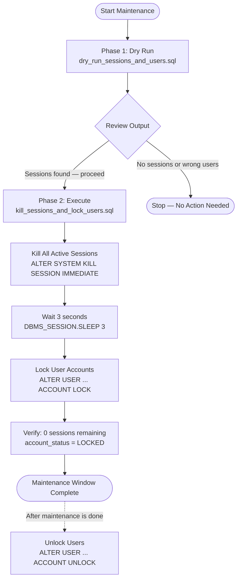
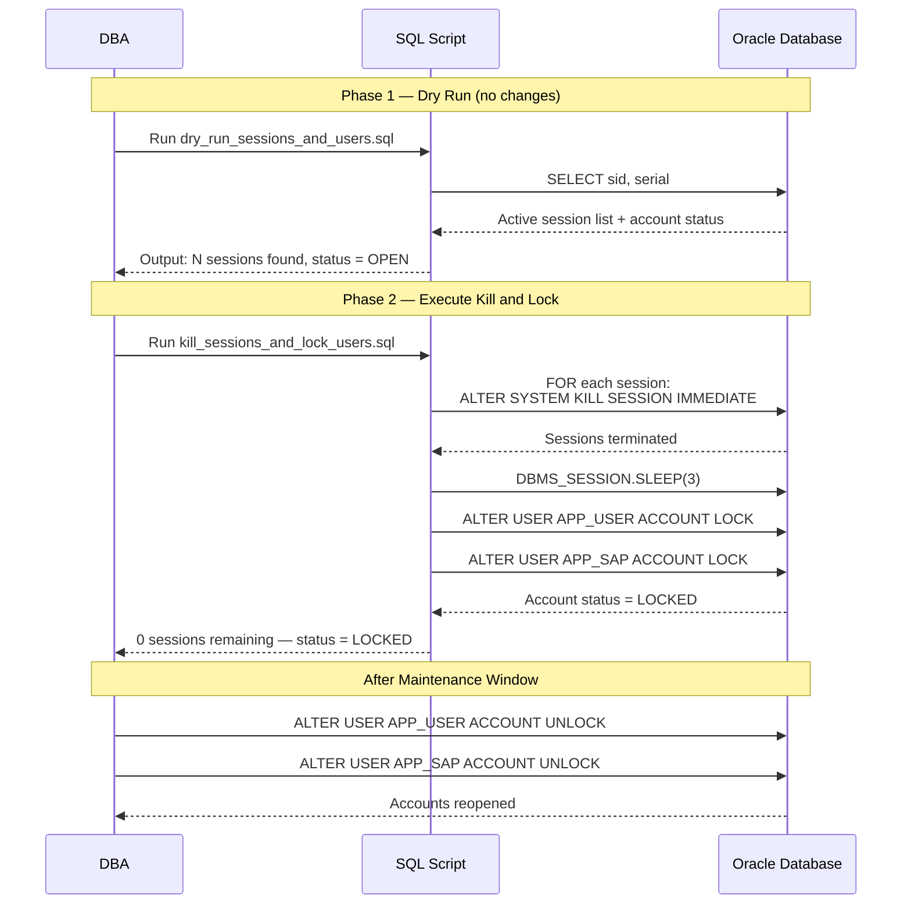

# Killing Active Sessions and Locking User Accounts in Oracle Database

In certain operational scenarios — such as emergency maintenance, scheduled downtime, application deployments, or security incidents — a DBA needs to forcibly terminate all active Oracle sessions belonging to specific users and immediately lock those user accounts to prevent new connections.

This guide covers a **two-script approach**:

1. **Dry-run script (SQL)** — previews active sessions and current account status without making any changes. Run this first to confirm what will be affected.
2. **Execution script (SQL)** — actually kills all active sessions and locks the target user accounts.
3. **Automation script (BAT / Shell)** — wraps the SQL script execution for scheduled or one-click automation on Windows Server or Oracle Linux.

---

## Workflow Overview



---

## Compatibility

### Oracle Database Versions

| Version | Supported | Notes |
|---------|-----------|-------|
| Oracle 11g (11.2) | Yes | Use `DBMS_LOCK.SLEEP` for wait |
| Oracle 12c (12.1, 12.2) | Yes | Use `DBMS_LOCK.SLEEP`; PDB-aware commands required for multitenant |
| Oracle 18c | Yes | Use `DBMS_SESSION.SLEEP` — `DBMS_LOCK.SLEEP` deprecated |
| Oracle 19c | Yes | Use `DBMS_SESSION.SLEEP` |
| Oracle 21c | Yes | Use `DBMS_SESSION.SLEEP` |
| Oracle 23c / 23 AI | Yes | Use `DBMS_SESSION.SLEEP` |
| Oracle 26 AI | Yes | Use `DBMS_SESSION.SLEEP` |

> **Version note:** `DBMS_LOCK.SLEEP` was deprecated starting Oracle 18c. Use `DBMS_SESSION.SLEEP` on Oracle 18c and above. Both accept the same parameter (seconds as `NUMBER`). See the [compatibility section](#sleep-procedure-version-compatibility) below.

### Operating System

| OS | Automation Script |
|----|-------------------|
| Windows Server 2012 / 2016 / 2019 / 2022 / 2025 | `.bat` batch script |
| Oracle Linux 6.10 – 9.7 | `.sh` shell script |
| Red Hat Enterprise Linux (RHEL) 6–9 | `.sh` shell script |

---

## Prerequisites

- Oracle Database user with `SYSDBA` privilege (to kill other sessions and lock accounts).
- Read access to `V$SESSION` and `DBA_USERS`.
- `ALTER SYSTEM` privilege (for killing sessions).
- `ALTER USER` privilege (for locking accounts).
- Log directory must exist and be writable before running the script.

---

## Variables Used in This Guide

Replace these placeholders with values matching your environment:

| Placeholder | Description | Example |
|-------------|-------------|---------|
| `APP_USER` | First target Oracle user | `MYAPP_USER` |
| `APP_SAP` | Second target Oracle user | `MYAPP_SAP` |
| `ORCL` | Oracle SID / Service name | `MYORCL` |
| `D:\oracle\scripts\` | Directory for SQL scripts (Windows) | `D:\dba\scripts\` |
| `D:\oracle\logs\` | Directory for log output (Windows) | `D:\dba\logs\` |
| `/opt/oracle/scripts/` | Directory for SQL scripts (Linux) | `/home/oracle/scripts/` |
| `/opt/oracle/logs/` | Directory for log output (Linux) | `/home/oracle/logs/` |
| `C:\app\oracle\product\19.0.0\dbhome_1` | Oracle Home path (Windows) | Your actual `ORACLE_HOME` |
| `/u01/app/oracle/product/19.0.0/dbhome_1` | Oracle Home path (Linux) | Your actual `ORACLE_HOME` |

---

## Execution Sequence



---

## Part 1 — Dry-Run SQL Script (Preview Only)

This script **does not kill any session or lock any account**. It only displays current active sessions and user account status. Use this to verify the scope before running the actual execution script.

### Full Script: `dry_run_sessions_and_users.sql`

```sql
-- ============================================================
-- Script : dry_run_sessions_and_users.sql
-- Purpose: Preview active sessions and account status
--          (NO changes are made — dry-run only)
-- Users  : APP_USER, APP_SAP
-- ============================================================

SET SERVEROUTPUT ON SIZE 1000000
SET LINESIZE 200
SET PAGESIZE 1000
SET TIMING ON
SET ECHO OFF
SET FEEDBACK OFF
SET VERIFY OFF
SET HEADING ON

SPOOL D:\oracle\logs\dry_run_sessions_log.txt

PROMPT ========================================
PROMPT DRY RUN: Session & Account Status Check
PROMPT ========================================
PROMPT Date/Time:
SELECT TO_CHAR(SYSDATE, 'DD-MON-YYYY HH24:MI:SS') AS current_time FROM DUAL;
PROMPT

-- Show all active sessions for APP_USER
PROMPT ========================================
PROMPT Active Sessions for APP_USER:
PROMPT ========================================
SELECT sid, serial#, username, status, osuser, machine, program,
       TO_CHAR(logon_time, 'DD-MON-YY HH24:MI:SS') AS logon_time
FROM v$session
WHERE username = 'APP_USER';

PROMPT
PROMPT Total APP_USER sessions:
SELECT COUNT(*) AS total FROM v$session WHERE username = 'APP_USER';

-- Show all active sessions for APP_SAP
PROMPT
PROMPT ========================================
PROMPT Active Sessions for APP_SAP:
PROMPT ========================================
SELECT sid, serial#, username, status, osuser, machine, program,
       TO_CHAR(logon_time, 'DD-MON-YY HH24:MI:SS') AS logon_time
FROM v$session
WHERE username = 'APP_SAP';

PROMPT
PROMPT Total APP_SAP sessions:
SELECT COUNT(*) AS total FROM v$session WHERE username = 'APP_SAP';

-- Simulate wait (no actual kill occurs)
PROMPT
PROMPT ========================================
PROMPT [DRY RUN] Simulating 3-second wait...
PROMPT ========================================
EXEC DBMS_SESSION.SLEEP(3);   -- Oracle 18c+; use DBMS_LOCK.SLEEP(3) on 11g/12c

-- Show "remaining" sessions (unchanged — no kill was performed)
PROMPT
PROMPT ========================================
PROMPT [DRY RUN] Session Count After Simulated Kill:
PROMPT ========================================
PROMPT APP_USER remaining:
SELECT COUNT(*) AS remaining FROM v$session WHERE username = 'APP_USER';

PROMPT
PROMPT APP_SAP remaining:
SELECT COUNT(*) AS remaining FROM v$session WHERE username = 'APP_SAP';

-- Show current account lock status (no lock was applied)
PROMPT
PROMPT ========================================
PROMPT Current Account Status (no lock applied):
PROMPT ========================================
SELECT username,
       account_status,
       TO_CHAR(lock_date, 'DD-MON-YYYY HH24:MI:SS') AS lock_date
FROM dba_users
WHERE username IN ('APP_USER', 'APP_SAP');

PROMPT
PROMPT ========================================
PROMPT DRY RUN Completed at:
SELECT TO_CHAR(SYSDATE, 'DD-MON-YYYY HH24:MI:SS') FROM DUAL;
PROMPT ========================================

SPOOL OFF
EXIT;
```

### Explanation of Each Block

| Block | Purpose |
|-------|---------|
| `SET` commands | Configure SQL*Plus output: wide lines, suppress noise, enable timing |
| `SPOOL` | Write all output to a log file for audit trail |
| `SELECT ... FROM v$session` | Display active sessions per user: SID, serial#, OS user, machine, program |
| `COUNT(*) FROM v$session` | Count active sessions before the simulated kill |
| `DBMS_SESSION.SLEEP(3)` | Wait 3 seconds (simulates the pause before kill in the real script) |
| `COUNT(*) after wait` | In dry-run, count is unchanged — confirms no kill occurred |
| `SELECT ... FROM dba_users` | Show current `account_status` and `lock_date` for target users |
| `SPOOL OFF` + `EXIT` | Close log file and exit SQL*Plus cleanly |

---

## Part 2 — Execution SQL Script (Actual Kill and Lock)

This script **actually kills all active sessions** and **locks the user accounts**. Run only after verifying the dry-run output.

### Full Script: `kill_sessions_and_lock_users.sql`

```sql
-- ============================================================
-- Script : kill_sessions_and_lock_users.sql
-- Purpose: Kill ALL active sessions and lock user accounts
-- Users  : APP_USER, APP_SAP
-- WARNING: This makes permanent changes. Run dry-run first.
-- ============================================================

SET SERVEROUTPUT ON SIZE 1000000
SET LINESIZE 200
SET PAGESIZE 1000
SET TIMING ON
SET ECHO OFF
SET FEEDBACK OFF
SET VERIFY OFF
SET HEADING ON

SPOOL D:\oracle\logs\kill_sessions_log.txt

PROMPT ========================================
PROMPT Kill Sessions and Lock Users
PROMPT ========================================
PROMPT Date/Time:
SELECT TO_CHAR(SYSDATE, 'DD-MON-YYYY HH24:MI:SS') AS current_time FROM DUAL;
PROMPT

-- Show sessions before kill
PROMPT ========================================
PROMPT Sessions BEFORE Kill - APP_USER:
PROMPT ========================================
SELECT sid, serial#, username, status, osuser, machine, program,
       TO_CHAR(logon_time, 'DD-MON-YY HH24:MI:SS') AS logon_time
FROM v$session
WHERE username = 'APP_USER';

PROMPT
PROMPT Sessions BEFORE Kill - APP_SAP:
SELECT sid, serial#, username, status, osuser, machine, program,
       TO_CHAR(logon_time, 'DD-MON-YY HH24:MI:SS') AS logon_time
FROM v$session
WHERE username = 'APP_SAP';

-- Kill all active sessions using dynamic PL/SQL
PROMPT
PROMPT ========================================
PROMPT Killing ALL Sessions...
PROMPT ========================================
BEGIN
    FOR s IN (
        SELECT sid, serial#
        FROM   v$session
        WHERE  username IN ('APP_USER', 'APP_SAP')
        AND    type = 'USER'
    ) LOOP
        BEGIN
            EXECUTE IMMEDIATE
                'ALTER SYSTEM KILL SESSION ''' || s.sid || ',' || s.serial# || ''' IMMEDIATE';
            DBMS_OUTPUT.PUT_LINE('Killed: SID=' || s.sid || ' SERIAL#=' || s.serial#);
        EXCEPTION
            WHEN OTHERS THEN
                DBMS_OUTPUT.PUT_LINE('Could not kill SID=' || s.sid ||
                    ' SERIAL#=' || s.serial# || ' — ' || SQLERRM);
        END;
    END LOOP;
END;
/

-- Wait for sessions to fully terminate
PROMPT
PROMPT Waiting 3 seconds for sessions to terminate...
BEGIN
    -- Oracle 18c and above
    DBMS_SESSION.SLEEP(3);
EXCEPTION
    WHEN OTHERS THEN
        -- Fallback for Oracle 11g / 12c
        DBMS_LOCK.SLEEP(3);
END;
/

-- Verify sessions after kill
PROMPT
PROMPT ========================================
PROMPT Sessions AFTER Kill:
PROMPT ========================================
PROMPT APP_USER remaining:
SELECT COUNT(*) AS remaining FROM v$session WHERE username = 'APP_USER';

PROMPT
PROMPT APP_SAP remaining:
SELECT COUNT(*) AS remaining FROM v$session WHERE username = 'APP_SAP';

-- Lock user accounts
PROMPT
PROMPT ========================================
PROMPT Locking User Accounts...
PROMPT ========================================
ALTER USER APP_USER ACCOUNT LOCK;
ALTER USER APP_SAP  ACCOUNT LOCK;

-- Verify lock status
PROMPT
PROMPT ========================================
PROMPT User Account Status After Lock:
PROMPT ========================================
SELECT username,
       account_status,
       TO_CHAR(lock_date, 'DD-MON-YYYY HH24:MI:SS') AS lock_date
FROM dba_users
WHERE username IN ('APP_USER', 'APP_SAP');

PROMPT
PROMPT ========================================
PROMPT Completed at:
SELECT TO_CHAR(SYSDATE, 'DD-MON-YYYY HH24:MI:SS') FROM DUAL;
PROMPT ========================================

SPOOL OFF
EXIT;
```

### Explanation of Each Block

| Block | Purpose |
|-------|---------|
| `FOR s IN (SELECT ... FROM v$session)` | Iterates over all active sessions for the target users |
| `type = 'USER'` | Excludes background Oracle processes (only kills user sessions) |
| `ALTER SYSTEM KILL SESSION 'sid,serial#' IMMEDIATE` | Immediately terminates the session; `IMMEDIATE` skips rollback wait |
| `EXCEPTION WHEN OTHERS` | Gracefully skips sessions that have already terminated by the time the loop reaches them |
| `DBMS_SESSION.SLEEP(3)` | Waits 3 seconds to allow killed sessions to fully clean up before the count verification |
| `ALTER USER ... ACCOUNT LOCK` | Locks the user account — new connections will be refused with `ORA-28000` |
| Final `SELECT ... FROM dba_users` | Confirms `account_status` changed to `LOCKED` |

---

## Part 3 — Windows Batch Script

The batch script sets up the Oracle environment and calls the SQL script automatically — no manual input required.

### Full Script: `kill_and_lock_users.bat`

```bat
@ECHO OFF
REM ============================================================
REM Script : kill_and_lock_users.bat
REM Purpose: Auto kill sessions and lock users (Windows Server)
REM NO USER INPUT REQUIRED
REM ============================================================

SETLOCAL

REM ── Oracle Environment Variables ──────────────────────────
SET ORACLE_SID=ORCL
SET ORACLE_HOME=C:\app\oracle\product\19.0.0\dbhome_1
SET SCRIPT_DIR=D:\oracle\scripts
SET LOG_DIR=D:\oracle\logs
SET PATH=%ORACLE_HOME%\bin;%PATH%
SET NLS_LANG=AMERICAN_AMERICA.AL32UTF8

REM ── Create directories if they do not exist ────────────────
IF NOT EXIST "%SCRIPT_DIR%" MKDIR "%SCRIPT_DIR%"
IF NOT EXIST "%LOG_DIR%"    MKDIR "%LOG_DIR%"

ECHO ============================================
ECHO Auto Kill Sessions and Lock Users
ECHO ============================================
ECHO Oracle SID  : %ORACLE_SID%
ECHO Oracle Home : %ORACLE_HOME%
ECHO Script Dir  : %SCRIPT_DIR%
ECHO Log Dir     : %LOG_DIR%
ECHO Start Time  : %DATE% %TIME%
ECHO ============================================
ECHO.

REM ── Execute SQL Script ─────────────────────────────────────
sqlplus -S / as sysdba @"%SCRIPT_DIR%\kill_sessions_and_lock_users.sql"

IF %ERRORLEVEL% NEQ 0 (
    ECHO.
    ECHO ERROR: SQL script execution failed!
    ECHO Check log: %LOG_DIR%\kill_sessions_log.txt
    EXIT /B 1
)

ECHO.
ECHO ============================================
ECHO Execution Completed Successfully
ECHO End Time  : %DATE% %TIME%
ECHO Log File  : %LOG_DIR%\kill_sessions_log.txt
ECHO ============================================

ENDLOCAL
EXIT /B 0
```

### Explanation of Each Section

| Section | Purpose |
|---------|---------|
| `@ECHO OFF` | Suppresses command echo — output is cleaner |
| `SETLOCAL` / `ENDLOCAL` | Isolates environment variable changes to this script only |
| `SET ORACLE_SID` | Tells sqlplus which database instance to connect to |
| `SET ORACLE_HOME` | Path to the Oracle software installation |
| `SET NLS_LANG` | Ensures consistent character encoding (`AL32UTF8 = UTF-8`) |
| `SET PATH=%ORACLE_HOME%\bin;%PATH%` | Adds sqlplus to the executable path |
| `IF NOT EXIST ... MKDIR` | Creates log/script directories automatically if missing |
| `sqlplus -S / as sysdba` | Connects as SYSDBA using OS authentication (`-S` = silent mode) |
| `IF %ERRORLEVEL% NEQ 0` | Catches failures from sqlplus and exits with error code `1` |
| `EXIT /B 0` / `EXIT /B 1` | Returns success/failure code to the calling process or Task Scheduler |

---

## Part 4 — Oracle Linux Shell Script Equivalent

For Oracle Linux 6.10–9.7, use the following shell script as the equivalent of the Windows `.bat` file.

### Full Script: `kill_and_lock_users.sh`

```bash
#!/bin/bash
# ============================================================
# Script : kill_and_lock_users.sh
# Purpose: Auto kill sessions and lock users (Oracle Linux)
# NO USER INPUT REQUIRED
# ============================================================

# ── Oracle Environment Variables ─────────────────────────────
export ORACLE_SID=ORCL
export ORACLE_BASE=/u01/app/oracle
export ORACLE_HOME=/u01/app/oracle/product/19.0.0/dbhome_1
export PATH=$ORACLE_HOME/bin:$PATH
export NLS_LANG=AMERICAN_AMERICA.AL32UTF8
export LD_LIBRARY_PATH=$ORACLE_HOME/lib:$LD_LIBRARY_PATH

SCRIPT_DIR=/opt/oracle/scripts
LOG_DIR=/opt/oracle/logs

# ── Create directories if they do not exist ──────────────────
mkdir -p "$SCRIPT_DIR"
mkdir -p "$LOG_DIR"

echo "============================================"
echo "Auto Kill Sessions and Lock Users"
echo "============================================"
echo "Oracle SID  : $ORACLE_SID"
echo "Oracle Home : $ORACLE_HOME"
echo "Script Dir  : $SCRIPT_DIR"
echo "Log Dir     : $LOG_DIR"
echo "Start Time  : $(date '+%d-%b-%Y %H:%M:%S')"
echo "============================================"
echo ""

# ── Execute SQL Script ───────────────────────────────────────
sqlplus -S / as sysdba @"${SCRIPT_DIR}/kill_sessions_and_lock_users.sql"

EXIT_CODE=$?
if [ $EXIT_CODE -ne 0 ]; then
    echo ""
    echo "ERROR: SQL script execution failed! Exit code: $EXIT_CODE"
    echo "Check log: ${LOG_DIR}/kill_sessions_log.txt"
    exit 1
fi

echo ""
echo "============================================"
echo "Execution Completed Successfully"
echo "End Time  : $(date '+%d-%b-%Y %H:%M:%S')"
echo "Log File  : ${LOG_DIR}/kill_sessions_log.txt"
echo "============================================"

exit 0
```

**Make the script executable:**

```bash
chmod +x /opt/oracle/scripts/kill_and_lock_users.sh
```

**Run the script:**

```bash
/opt/oracle/scripts/kill_and_lock_users.sh
```

Or as the oracle OS user:

```bash
su - oracle -c "/opt/oracle/scripts/kill_and_lock_users.sh"
```

---

## Sleep Procedure Version Compatibility

The `SLEEP` procedure changed between Oracle versions:

| Oracle Version | Package | Procedure Call |
|----------------|---------|----------------|
| 11g, 12c | `DBMS_LOCK` | `DBMS_LOCK.SLEEP(3);` |
| 18c and above | `DBMS_SESSION` | `DBMS_SESSION.SLEEP(3);` |

`DBMS_LOCK.SLEEP` still works on 18c+ but is deprecated and may be removed in future releases. The PL/SQL block below handles both versions automatically:

```sql
BEGIN
    DBMS_SESSION.SLEEP(3);
EXCEPTION
    WHEN OTHERS THEN
        DBMS_LOCK.SLEEP(3);
END;
/
```

Alternatively, use a cross-version compatible approach:

```sql
-- Works on all versions (11g to 26 AI)
EXECUTE IMMEDIATE 'BEGIN DBMS_SESSION.SLEEP(3); END;';
```

> On Oracle 11g, `DBMS_SESSION.SLEEP` does not exist — stick with `DBMS_LOCK.SLEEP(3)` for 11g environments.

---

## Oracle 12c Multitenant (CDB/PDB) Considerations

When running on a **CDB (Container Database)** with PDBs, killing sessions and locking users must be done in the correct container context.

**Check which container a session belongs to:**

```sql
SELECT sid, serial#, username, con_id, status
FROM   v$session
WHERE  username IN ('APP_USER', 'APP_SAP');
```

**Kill a session in a PDB (from CDB$ROOT):**

```sql
-- Include the container ID (con_id) in the kill command
ALTER SYSTEM KILL SESSION 'sid,serial#,@con_id' IMMEDIATE;
```

**Lock a user inside a specific PDB:**

```sql
-- Switch to the PDB first
ALTER SESSION SET CONTAINER = YOUR_PDB_NAME;

ALTER USER APP_USER ACCOUNT LOCK;
ALTER USER APP_SAP  ACCOUNT LOCK;
```

Or from CDB$ROOT with the common user prefix if the users are common users.

---

## Scheduling with Task Scheduler (Windows) and Cron (Linux)

### Windows Task Scheduler

To run automatically on a schedule, create a task:

```
Action : Start a program
Program: C:\Windows\System32\cmd.exe
Arguments: /C "D:\oracle\scripts\kill_and_lock_users.bat"
```

Or via command line:

```bat
schtasks /create /tn "OracleKillSessions" /tr "D:\oracle\scripts\kill_and_lock_users.bat" /sc daily /st 23:00 /ru SYSTEM
```

### Oracle Linux Cron

Edit the oracle user's crontab:

```bash
crontab -e -u oracle
```

Add a line to run nightly at 23:00:

```cron
0 23 * * * /opt/oracle/scripts/kill_and_lock_users.sh >> /opt/oracle/logs/cron_kill.log 2>&1
```

---

## Unlock Users After Maintenance

After maintenance is complete, unlock the user accounts:

```sql
ALTER USER APP_USER ACCOUNT UNLOCK;
ALTER USER APP_SAP  ACCOUNT UNLOCK;
```

Verify the accounts are open:

```sql
SELECT username, account_status, lock_date
FROM   dba_users
WHERE  username IN ('APP_USER', 'APP_SAP');
```

---

## Key SQL Queries Reference

### Check active sessions for specific users

```sql
SELECT sid, serial#, username, status, osuser, machine, program,
       TO_CHAR(logon_time, 'DD-MON-YYYY HH24:MI:SS') AS logon_time
FROM   v$session
WHERE  username IN ('APP_USER', 'APP_SAP')
AND    type = 'USER'
ORDER  BY username, logon_time;
```

### Check user account status

```sql
SELECT username, account_status,
       TO_CHAR(lock_date,   'DD-MON-YYYY HH24:MI:SS') AS lock_date,
       TO_CHAR(expiry_date, 'DD-MON-YYYY HH24:MI:SS') AS expiry_date,
       profile
FROM   dba_users
WHERE  username IN ('APP_USER', 'APP_SAP');
```

### Kill a specific session manually

```sql
ALTER SYSTEM KILL SESSION 'sid,serial#' IMMEDIATE;
```

### Kill all sessions for a user (single statement approach)

```sql
BEGIN
    FOR s IN (SELECT sid, serial# FROM v$session WHERE username = 'APP_USER' AND type = 'USER') LOOP
        BEGIN
            EXECUTE IMMEDIATE 'ALTER SYSTEM KILL SESSION ''' || s.sid || ',' || s.serial# || ''' IMMEDIATE';
        EXCEPTION WHEN OTHERS THEN NULL;
        END;
    END LOOP;
END;
/
```

---

## Warnings and Best Practices

> **Warning:** `ALTER SYSTEM KILL SESSION ... IMMEDIATE` terminates sessions without waiting for transaction rollback to complete. Any uncommitted transactions in the killed session will be rolled back by Oracle's background PMON process, which may take time depending on transaction size.

> **Warning:** `ALTER USER ... ACCOUNT LOCK` immediately prevents all new connections for that user, including application connection pools. Ensure the application is shut down or redirected before locking accounts to prevent cascading errors.

> **Best practice:** Always run the dry-run script first to review which sessions will be affected. Capture and retain the log file for audit purposes.

> **Best practice:** Place SQL scripts in a dedicated, access-controlled directory. Ensure log files are retained for at least 30 days for audit trail compliance.
