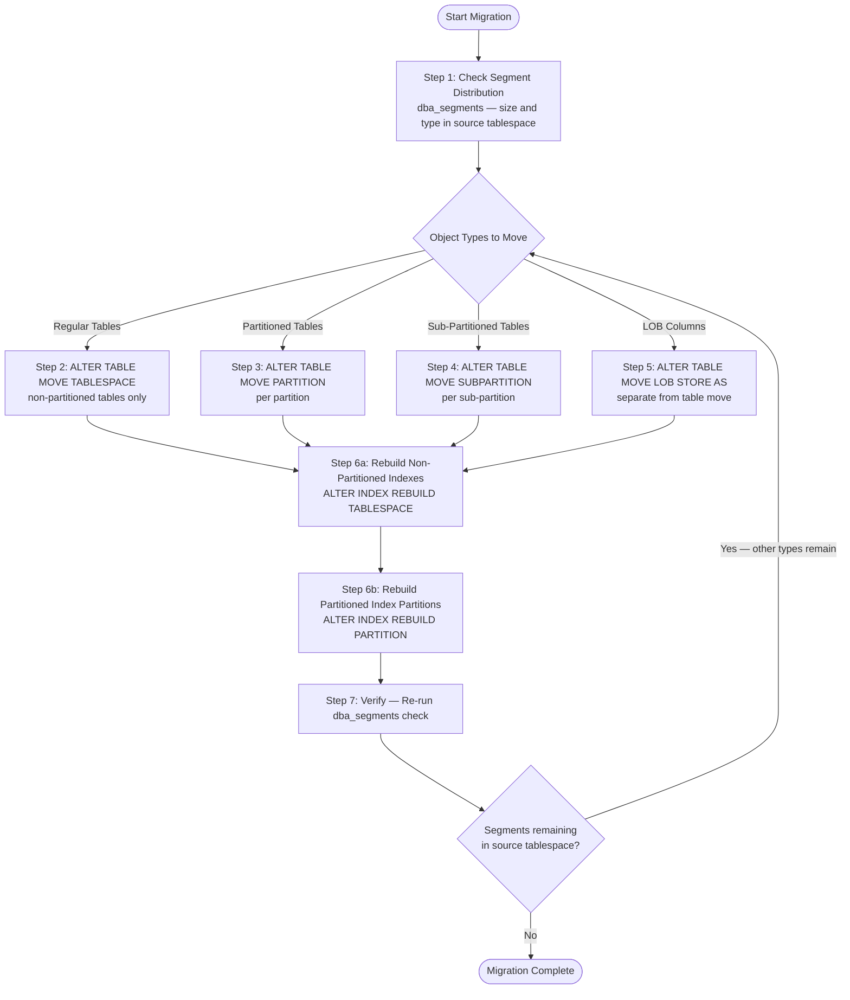

# How to Move Tablespace Objects in Oracle Database

In Oracle Database, data is physically stored in **tablespaces**, which are logical storage units mapped to one or more datafiles on disk. Over time, it may become necessary to move objects from one tablespace to another — for example, when migrating from the default `USERS` tablespace to a dedicated application tablespace for better storage management, performance isolation, or capacity planning.

This guide covers how to generate and execute the DDL statements required to move all object types — including regular tables, partitioned tables, sub-partitioned tables, LOB segments, and indexes — from a source tablespace to a target tablespace for a specific schema.

The approach used here is a **generate-then-execute** pattern: each query produces a list of `ALTER TABLE` or `ALTER INDEX` statements that you then copy and run as a batch.

---

## Migration Process Overview



---

## Prerequisites

- Access to Oracle Database as `SYS AS SYSDBA` or a user with `DBA` privilege.
- The target tablespace must already exist and have sufficient space.
- Tools: SQL\*Plus, SQL Developer, or any Oracle SQL client.
- Recommended: Perform during a maintenance window, as moving segments temporarily increases I/O and may lock affected objects briefly.

---

## Oracle Version and Edition Compatibility

### Version Compatibility

All queries and DDL statements in this guide are compatible with **Oracle 8i and above**. Recommended versions for production use:

| Version | Status |
|---------|--------|
| Oracle 8i | Minimum supported version for all features used |
| Oracle 9i | Supported |
| Oracle 10g / 11g | Fully supported |
| Oracle 12c (12.1) | Fully supported |
| Oracle 18c / 19c / 21c / 23c | Fully supported |

> Oracle 12c Release 2 (12.2) and above supports the `ONLINE` clause for table moves, keeping the table accessible during the operation. See the note in Step 2 for details.

---

### Edition Compatibility

#### Standard Edition 2 (SE2) — Oracle 12.1 and above

Oracle Standard Edition 2 does **not** include the Partitioning Option. Partitioned tables, partitioned indexes, and sub-partitions cannot be created in SE2.

| Step | Applicable in SE2? | Notes |
|------|--------------------|-------|
| Step 1 — Check segments | Yes | Works normally |
| Step 2 — Move regular tables | Yes | Primary use case for SE2 |
| Step 3 — Move partitioned tables | **No** | Partitioning not available in SE2; query returns no rows |
| Step 4 — Move sub-partitioned tables | **No** | Partitioning not available in SE2; query returns no rows |
| Step 5 — Move LOB segments | Yes | Works normally |
| Step 6a — Rebuild non-partitioned indexes | Yes | Works normally |
| Step 6b — Rebuild partitioned indexes | **No** | Partitioning not available in SE2; query returns no rows |
| Step 7 — Verify | Yes | Works normally |
| `ONLINE` move option | **No** | Requires Enterprise Edition (12.2+) |

For SE2 environments, only Steps 1, 2, 5, 6a, and 7 are relevant.

#### Enterprise Edition (EE)

All steps in this guide are fully applicable in Enterprise Edition.

| Feature | Available in EE? | Notes |
|---------|-----------------|-------|
| All steps (1–7) | Yes | Fully supported |
| Partitioning (Steps 3, 4, 6b) | Yes | Requires Partitioning Option license (included in most EE bundles) |
| `ONLINE` move (Step 2) | Yes | Available from Oracle 12.2+ EE only |

> **Licensing note:** In Enterprise Edition, the Partitioning Option is a separately licensed feature. Verify your license includes it before using partitioned objects. In practice, most EE installations include this option.

---

## Variables Used in This Guide

Replace the placeholders below with values matching your environment:

| Placeholder | Description | Example |
|-------------|-------------|---------|
| `YOUR_SCHEMA` | The schema that owns the objects to be moved | `APP_USER` |
| `SOURCE_TABLESPACE` | The current (source) tablespace | `USERS` |
| `TARGET_DATA_TBS` | The target tablespace for tables and LOBs | `APP_DATA` |
| `TARGET_INDEX_TBS` | The target tablespace for indexes | `APP_INDEX` |

---

## Step 1 — Check Current Segment Distribution

Before starting, check what is currently stored in the source tablespace to understand the scope of the migration.

```sql
SELECT s.owner,
       s.segment_type,
       COUNT(*) AS segment_count,
       ROUND(SUM(s.bytes)/1024/1024, 2) AS mb_used
FROM   dba_segments s
WHERE  s.tablespace_name = 'SOURCE_TABLESPACE'
GROUP  BY s.owner, s.segment_type
ORDER  BY s.owner, mb_used DESC;
```

**Notes:**

- This query groups all segments in the source tablespace by owner and type.
- Use it to identify how many objects exist per schema and how much space they occupy.
- Run this query again after the migration to verify all objects have been moved.

---

## Step 2 — Generate Move Statements for Regular (Non-Partitioned) Tables

This query generates `ALTER TABLE ... MOVE TABLESPACE` statements for all non-partitioned tables in the source tablespace.

```sql
SELECT 'ALTER TABLE YOUR_SCHEMA.' || table_name ||
       ' MOVE TABLESPACE TARGET_DATA_TBS;'
FROM   dba_tables
WHERE  owner = 'YOUR_SCHEMA'
AND    partitioned = 'NO'
AND    temporary = 'N'
AND    iot_type IS NULL
AND    tablespace_name = 'SOURCE_TABLESPACE'
ORDER  BY table_name;
```

**Filter conditions explained:**

| Filter | Description |
|--------|-------------|
| `partitioned = 'NO'` | Excludes partitioned tables (handled separately in Step 3) |
| `temporary = 'N'` | Excludes temporary tables, which cannot be moved |
| `iot_type IS NULL` | Excludes Index-Organized Tables (IOTs), which require different handling |
| `tablespace_name = 'SOURCE_TABLESPACE'` | Only includes tables currently in the source tablespace |

Copy the output and execute each generated statement. Example of a generated statement:

```sql
ALTER TABLE YOUR_SCHEMA.EMPLOYEES MOVE TABLESPACE TARGET_DATA_TBS;
```

> **Note:** Moving a table invalidates its indexes. After moving all tables, rebuild the indexes in Step 6.

> **Enterprise Edition 12.2+ only:** Add the `ONLINE` keyword to keep the table accessible during the move and avoid application downtime:
> ```sql
> ALTER TABLE YOUR_SCHEMA.EMPLOYEES MOVE TABLESPACE TARGET_DATA_TBS ONLINE;
> ```
> Without `ONLINE`, the table is locked with an exclusive lock for the entire duration of the move.

---

## Step 3 — Generate Move Statements for Partitioned Tables

This query generates `ALTER TABLE ... MOVE PARTITION` statements for partitioned tables.

```sql
SELECT 'ALTER TABLE YOUR_SCHEMA.' || table_name ||
       ' MOVE PARTITION ' || partition_name ||
       ' TABLESPACE TARGET_DATA_TBS;'
FROM   dba_tab_partitions
WHERE  table_owner = 'YOUR_SCHEMA'
AND    tablespace_name = 'SOURCE_TABLESPACE'
ORDER  BY table_name, partition_position;
```

**Notes:**

- Each partition of a partitioned table is moved individually.
- `partition_position` ordering ensures partitions are processed in their natural sequence.
- Example of a generated statement:

```sql
ALTER TABLE YOUR_SCHEMA.SALES MOVE PARTITION SALES_Q1_2024 TABLESPACE TARGET_DATA_TBS;
```

---

## Step 4 — Generate Move Statements for Sub-Partitioned Tables

This query generates `ALTER TABLE ... MOVE SUBPARTITION` statements for composite-partitioned tables (tables with sub-partitions).

```sql
SELECT 'ALTER TABLE YOUR_SCHEMA.' || table_name ||
       ' MOVE SUBPARTITION ' || subpartition_name ||
       ' TABLESPACE TARGET_DATA_TBS;'
FROM   dba_tab_subpartitions
WHERE  table_owner = 'YOUR_SCHEMA'
AND    tablespace_name = 'SOURCE_TABLESPACE'
ORDER  BY table_name, subpartition_position;
```

**Notes:**

- This query targets composite-partitioned tables (e.g., range-hash, range-list partitioning).
- If no rows are returned, the schema has no sub-partitioned tables in the source tablespace.
- Example of a generated statement:

```sql
ALTER TABLE YOUR_SCHEMA.ORDERS MOVE SUBPARTITION ORDERS_Q1_REGION_WEST TABLESPACE TARGET_DATA_TBS;
```

---

## Step 5 — Generate Move Statements for LOB Segments

Large Object (LOB) columns (`CLOB`, `BLOB`, `NCLOB`) are stored separately from the table data. This query generates statements to move them.

```sql
SELECT 'ALTER TABLE YOUR_SCHEMA.' || table_name ||
       ' MOVE LOB (' || column_name || ') STORE AS (TABLESPACE TARGET_DATA_TBS);'
FROM   dba_lobs
WHERE  owner = 'YOUR_SCHEMA'
AND    tablespace_name = 'SOURCE_TABLESPACE'
ORDER  BY table_name, column_name;
```

**Notes:**

- LOB segments are stored out-of-line and are **not** moved when you run `ALTER TABLE ... MOVE TABLESPACE`. They must be moved with this separate statement.
- This query targets `dba_lobs`, which covers LOB columns on **non-partitioned tables** and the default LOB definition for partitioned tables.
- For LOB columns on **partitioned tables**, the per-partition LOB segments are tracked in `dba_lob_partitions` and must be moved with `ALTER TABLE ... MODIFY PARTITION ... LOB (...) STORE AS (TABLESPACE ...)`.
- Example of a generated statement:

```sql
ALTER TABLE YOUR_SCHEMA.DOCUMENTS MOVE LOB (FILE_CONTENT) STORE AS (TABLESPACE TARGET_DATA_TBS);
```

---

## Step 6 — Generate Rebuild Statements for Indexes

Moving tables invalidates their associated indexes. Rebuilding must be handled in two separate queries because non-partitioned and partitioned indexes use different syntax.

Run this step **after** completing Steps 2–5.

### 6a — Non-Partitioned Indexes

```sql
SELECT 'ALTER INDEX YOUR_SCHEMA.' || i.index_name || ' REBUILD TABLESPACE TARGET_INDEX_TBS;'
FROM   dba_indexes i
WHERE  i.owner = 'YOUR_SCHEMA'
AND    i.partitioned = 'NO'
AND    i.status = 'UNUSABLE'
ORDER  BY i.index_name;
```

**Notes:**

- Filters by `status = 'UNUSABLE'` — this is the state Oracle sets on indexes after their underlying table is moved.
- `partitioned = 'NO'` ensures only non-partitioned indexes are included here.
- Example of a generated statement:

```sql
ALTER INDEX YOUR_SCHEMA.EMP_PK REBUILD TABLESPACE TARGET_INDEX_TBS;
```

### 6b — Partitioned Indexes (Local Indexes on Partitioned Tables)

```sql
SELECT 'ALTER INDEX YOUR_SCHEMA.' || ip.index_name ||
       ' REBUILD PARTITION ' || ip.partition_name ||
       ' TABLESPACE TARGET_INDEX_TBS;'
FROM   dba_ind_partitions ip
WHERE  ip.index_owner = 'YOUR_SCHEMA'
AND    ip.status = 'UNUSABLE'
ORDER  BY ip.index_name, ip.partition_position;
```

**Notes:**

- Partitioned indexes (local indexes) must be rebuilt **partition by partition** using `REBUILD PARTITION`.
- The syntax `ALTER INDEX ... REBUILD TABLESPACE ...` is **not valid** for partitioned indexes and will error.
- `dba_ind_partitions.status = 'UNUSABLE'` identifies which index partitions were invalidated by the table partition moves in Steps 3–4.
- Example of a generated statement:

```sql
ALTER INDEX YOUR_SCHEMA.SALES_IDX REBUILD PARTITION SALES_Q1_2024 TABLESPACE TARGET_INDEX_TBS;
```

> **Why not JOIN dba_tables?** `dba_tables.tablespace_name` is always `NULL` for partitioned tables in Oracle. Joining on that column and filtering by tablespace would silently miss all indexes on partitioned tables. Using `status = 'UNUSABLE'` is the reliable approach.

---

## Step 7 — Verify Remaining Segments

After executing all generated statements, re-run the segment check from Step 1 to confirm all objects have been moved out of the source tablespace.

```sql
SELECT s.owner,
       s.segment_type,
       COUNT(*) AS segment_count,
       ROUND(SUM(s.bytes)/1024/1024, 2) AS mb_used
FROM   dba_segments s
WHERE  s.tablespace_name = 'SOURCE_TABLESPACE'
GROUP  BY s.owner, s.segment_type
ORDER  BY s.owner, mb_used DESC;
```

If the query returns no rows (or no rows for `YOUR_SCHEMA`), all objects have been successfully moved.

---

## Troubleshooting

### ORA-01502: Index Is in Unusable State

**Symptom:** Application queries fail with `ORA-01502` after the tablespace migration.

**Cause:** Moving a table with `ALTER TABLE ... MOVE TABLESPACE` automatically marks all associated indexes as `UNUSABLE`. If Step 6 is skipped or incomplete, queries that use those indexes will fail.

**Solution:** Run Step 6a and 6b to rebuild all unusable indexes. To identify all unusable indexes for a schema:

```sql
SELECT index_name, status, partitioned
FROM   dba_indexes
WHERE  owner = 'YOUR_SCHEMA'
AND    status = 'UNUSABLE';
```

For partitioned indexes with unusable partitions:

```sql
SELECT index_name, partition_name, status
FROM   dba_ind_partitions
WHERE  index_owner = 'YOUR_SCHEMA'
AND    status = 'UNUSABLE';
```

---

### ORA-14086: A Partitioned Index May Not Be Rebuilt as a Whole

**Symptom:** `ALTER INDEX idx_name REBUILD TABLESPACE ...` fails with `ORA-14086`.

**Cause:** The index is a local partitioned index. Oracle does not allow rebuilding a partitioned index in a single statement.

**Solution:** Use `REBUILD PARTITION` syntax from Step 6b instead:

```sql
ALTER INDEX YOUR_SCHEMA.IDX_NAME REBUILD PARTITION PARTITION_NAME TABLESPACE TARGET_INDEX_TBS;
```

---

### ORA-01536: Space Quota Exceeded

**Symptom:** `ALTER TABLE ... MOVE TABLESPACE` fails with `ORA-01536`.

**Cause:** The schema owner does not have sufficient quota on the target tablespace.

**Solution:** Grant unlimited quota or a specific quota on the target tablespace:

```sql
-- Grant unlimited quota
ALTER USER YOUR_SCHEMA QUOTA UNLIMITED ON TARGET_DATA_TBS;

-- Or grant a specific size
ALTER USER YOUR_SCHEMA QUOTA 10G ON TARGET_DATA_TBS;
```

---

### ORA-01647: Tablespace Is Read Only

**Symptom:** Move statement fails with `ORA-01647`.

**Cause:** The target tablespace is in READ ONLY mode.

**Solution:** Set the target tablespace to READ WRITE before proceeding:

```sql
ALTER TABLESPACE TARGET_DATA_TBS READ WRITE;
```

---

### ORA-00054: Resource Busy

**Symptom:** `ALTER TABLE ... MOVE TABLESPACE` fails with `ORA-00054: resource busy and acquire with NOWAIT specified`.

**Cause:** Active transactions or sessions are holding locks on the table being moved.

**Solution:**

1. Identify and terminate blocking sessions:

```sql
SELECT sid, serial#, username, status, sql_id
FROM   v$session
WHERE  status = 'ACTIVE'
AND    username = 'YOUR_SCHEMA';
```

2. If safe to do so, kill the blocking session:

```sql
ALTER SYSTEM KILL SESSION 'sid,serial#' IMMEDIATE;
```

3. On Enterprise Edition 12.2+, use `ONLINE` to avoid locking:

```sql
ALTER TABLE YOUR_SCHEMA.TABLE_NAME MOVE TABLESPACE TARGET_DATA_TBS ONLINE;
```

---

### LOB Segments Remain in Source Tablespace After Table Move

**Symptom:** After running Step 2, the verification in Step 7 still shows `LOBSEGMENT` or `LOBINDEX` entries in the source tablespace.

**Cause:** `ALTER TABLE ... MOVE TABLESPACE` does **not** move LOB segments. LOBs are stored out-of-line and must be moved separately.

**Solution:** Run Step 5 to move LOB segments. Also note that each LOB segment has a corresponding LOB index (`LOBINDEX`) which is automatically moved along with the LOB segment when using the `MOVE LOB ... STORE AS` syntax.

---

### Source Tablespace Still Shows Segments After Full Migration

**Symptom:** Step 7 still returns rows even after completing all steps.

**Cause:** Several segment types are not covered by Steps 2–6:

| Remaining Segment Type | Cause | Action |
|------------------------|-------|--------|
| `LOBINDEX` | LOB index not moved — should be moved automatically with LOB segment | Re-run Step 5 |
| `TABLE PARTITION` | Partition not in `dba_tab_partitions` filter (already at target) | Verify query result |
| `INDEX PARTITION` | Partitioned index not rebuilt | Re-run Step 6b |
| `CLUSTER` | Clustered tables are not handled by these queries | Move manually |
| `MATERIALIZED VIEW` | MV or MV log segments require separate handling | Move MV and MV logs separately |

To identify exactly what remains:

```sql
SELECT owner, segment_name, segment_type, tablespace_name,
       ROUND(bytes/1024/1024, 2) AS mb
FROM   dba_segments
WHERE  tablespace_name = 'SOURCE_TABLESPACE'
AND    owner = 'YOUR_SCHEMA'
ORDER  BY segment_type, segment_name;
```

---

### Queries Are Slow After Migration

**Symptom:** Application performance degrades after the tablespace move, even though indexes were rebuilt.

**Cause:** Oracle optimizer statistics become stale after a table move. The optimizer may choose inefficient execution plans based on outdated statistics.

**Solution:** Gather fresh statistics for the schema after completing all steps:

```sql
BEGIN
    DBMS_STATS.GATHER_SCHEMA_STATS(
        ownname          => 'YOUR_SCHEMA',
        options          => 'GATHER',
        estimate_percent => DBMS_STATS.AUTO_SAMPLE_SIZE,
        degree           => DBMS_STATS.AUTO_DEGREE
    );
END;
/
```

---

## Command Summary

```sql
-- 1. Check current segment distribution in source tablespace
SELECT s.owner, s.segment_type, COUNT(*) AS segment_count,
       ROUND(SUM(s.bytes)/1024/1024, 2) AS mb_used
FROM   dba_segments s
WHERE  s.tablespace_name = 'SOURCE_TABLESPACE'
GROUP  BY s.owner, s.segment_type
ORDER  BY s.owner, mb_used DESC;

-- 2. Generate: move regular (non-partitioned) tables
SELECT 'ALTER TABLE YOUR_SCHEMA.' || table_name ||
       ' MOVE TABLESPACE TARGET_DATA_TBS;'
FROM   dba_tables
WHERE  owner = 'YOUR_SCHEMA'
AND    partitioned = 'NO'
AND    temporary = 'N'
AND    iot_type IS NULL
AND    tablespace_name = 'SOURCE_TABLESPACE'
ORDER  BY table_name;

-- 3. Generate: move partitioned tables (per partition)
SELECT 'ALTER TABLE YOUR_SCHEMA.' || table_name ||
       ' MOVE PARTITION ' || partition_name ||
       ' TABLESPACE TARGET_DATA_TBS;'
FROM   dba_tab_partitions
WHERE  table_owner = 'YOUR_SCHEMA'
AND    tablespace_name = 'SOURCE_TABLESPACE'
ORDER  BY table_name, partition_position;

-- 4. Generate: move sub-partitioned tables (per subpartition)
SELECT 'ALTER TABLE YOUR_SCHEMA.' || table_name ||
       ' MOVE SUBPARTITION ' || subpartition_name ||
       ' TABLESPACE TARGET_DATA_TBS;'
FROM   dba_tab_subpartitions
WHERE  table_owner = 'YOUR_SCHEMA'
AND    tablespace_name = 'SOURCE_TABLESPACE'
ORDER  BY table_name, subpartition_position;

-- 5. Generate: move LOB segments
SELECT 'ALTER TABLE YOUR_SCHEMA.' || table_name ||
       ' MOVE LOB (' || column_name || ') STORE AS (TABLESPACE TARGET_DATA_TBS);'
FROM   dba_lobs
WHERE  owner = 'YOUR_SCHEMA'
AND    tablespace_name = 'SOURCE_TABLESPACE'
ORDER  BY table_name, column_name;

-- 6a. Generate: rebuild non-partitioned indexes (run after steps 2–5)
SELECT 'ALTER INDEX YOUR_SCHEMA.' || i.index_name || ' REBUILD TABLESPACE TARGET_INDEX_TBS;'
FROM   dba_indexes i
WHERE  i.owner = 'YOUR_SCHEMA'
AND    i.partitioned = 'NO'
AND    i.status = 'UNUSABLE'
ORDER  BY i.index_name;

-- 6b. Generate: rebuild partitioned indexes per partition (run after steps 2–5)
SELECT 'ALTER INDEX YOUR_SCHEMA.' || ip.index_name ||
       ' REBUILD PARTITION ' || ip.partition_name ||
       ' TABLESPACE TARGET_INDEX_TBS;'
FROM   dba_ind_partitions ip
WHERE  ip.index_owner = 'YOUR_SCHEMA'
AND    ip.status = 'UNUSABLE'
ORDER  BY ip.index_name, ip.partition_position;

-- 7. Verify: confirm no remaining segments in source tablespace
SELECT s.owner, s.segment_type, COUNT(*) AS segment_count,
       ROUND(SUM(s.bytes)/1024/1024, 2) AS mb_used
FROM   dba_segments s
WHERE  s.tablespace_name = 'SOURCE_TABLESPACE'
GROUP  BY s.owner, s.segment_type
ORDER  BY s.owner, mb_used DESC;
```
