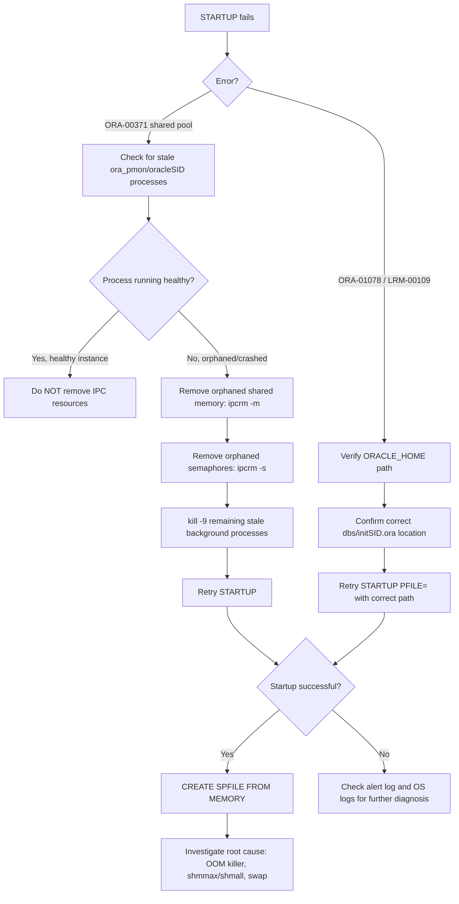

# Fixing ORA-00371 (Not Enough Shared Pool Memory) and ORA-01078 During Database Startup

## Environment

- Oracle Database 11g Release 2 (11.2.0.1.0), 64-bit
- Oracle Linux 6
- Database SID: `ORCLDB`
- Server hostname: `dbserver01`
- Connected as `oracle` OS user via `sqlplus / as sysdba`

## Symptom

A normal `STARTUP` fails with:

```
SQL> startup
ORA-00371: not enough shared pool memory, should be atleast 340577484 bytes
```

Attempting to work around it by starting up with an explicit PFILE also fails:

```
SQL> STARTUP PFILE='/u01/app/oracle/product/11.2.0/dbhome_1/dbs/initORCLDB.ora';
LRM-00109: could not open parameter file '/u01/app/oracle/product/11.2.0/dbhome_1/dbs/initORCLDB.ora'
ORA-01078: failure in processing system parameters
```

## Troubleshooting Flow



## Root Cause Analysis

Two distinct problems are stacked on top of each other here:

1. **ORA-00371 — stale/leftover shared memory segments.**
   This error typically happens when a previous instance crashed or was killed uncleanly (e.g. `kill -9`, OOM killer, server reboot without a clean shutdown) and left behind orphaned SysV shared memory segments (SGA) and/or semaphores in the OS. The kernel still considers that memory "in use" by the old instance, so when a new instance tries to allocate the shared pool, it cannot get a large enough contiguous chunk. The reported byte count (`340577484 bytes`) is the size that Oracle expected to allocate for the shared pool component of the SGA and could not.

2. **ORA-01078 / LRM-00109 — wrong PFILE path.**
   The `STARTUP PFILE=...` command pointed to `/u01/app/oracle/product/11.2.0/dbhome_1/dbs/initORCLDB.ora`, but the actual Oracle Home on this server is `/u01/app/oracle/product/11g/dbhome_1/` (note `11g` vs `11.2.0` in the path — these are two different directory names, and only one of them is the real `$ORACLE_HOME`). Because the file did not exist at the path given, `LRM-00109: could not open parameter file` was raised, which in turn caused `ORA-01078: failure in processing system parameters`. This was a path/typo issue, not a corrupted or missing parameter file — the correct file existed at `/u01/app/oracle/product/11g/dbhome_1/dbs/initORCLDB.ora` and worked once referenced correctly.

## Resolution Steps

### Step 1 — Confirm the instance is not actually running

Before removing any IPC resources, verify no live Oracle background processes are attached to them:

```bash
ps -ef | grep -E "ora_pmon_ORCLDB|oracleORCLDB" | grep -v grep
```

If this returns processes that are genuinely stuck (not a live, healthy instance), proceed to clean up. Do **not** remove shared memory/semaphores if a healthy instance is currently using them — this will crash a running database.

### Step 2 — Remove orphaned shared memory segments and semaphores

```bash
for id in $(ipcs -m | grep oracle | awk '{print $2}'); do ipcrm -m $id 2>/dev/null; done
for id in $(ipcs -s | grep oracle | awk '{print $2}'); do ipcrm -s $id 2>/dev/null; done
```

- `ipcs -m` lists shared memory segments, `ipcs -s` lists semaphore arrays.
- Filtering by `oracle` targets segments owned by the `oracle` OS user.
- `ipcrm` releases the segment/semaphore back to the OS.
- `2>/dev/null` suppresses errors for segments that are still legitimately attached (which `ipcrm` will refuse to remove) or already gone.

### Step 3 — Kill any remaining stale Oracle processes

```bash
kill -9 $(ps -ef | grep -E "ora_pmon_ORCLDB|oracleORCLDB" | grep -v grep | awk '{print $2}') 2>/dev/null
```

This ensures no zombie background processes (`pmon`, `smon`, etc.) are still holding references to the old SGA.

### Step 4 — Start the instance using the correct PFILE path

```bash
sqlplus / as sysdba <<EOF
STARTUP PFILE='/u01/app/oracle/product/11g/dbhome_1/dbs/initORCLDB.ora';
EOF
```

Output confirming success:

```
ORACLE instance started.

Total System Global Area  217157632 bytes
Fixed Size                  2211928 bytes
Variable Size             159387560 bytes
Database Buffers           50331648 bytes
Redo Buffers                5226496 bytes
Database mounted.
Database opened.
```

### Step 5 — Regenerate the SPFILE from the running instance

Since startup succeeded using a PFILE (text init file) rather than an SPFILE, it's good practice to recreate a binary SPFILE from the current in-memory parameters so future startups (and tools that expect an SPFILE, such as Grid Infrastructure/`srvctl`) work correctly:

```bash
sqlplus / as sysdba <<EOF
CREATE SPFILE='/u01/app/oracle/product/11g/dbhome_1/dbs/spfileORCLDB.ora' FROM MEMORY;
EOF
```

## Additional Recommendations / What Else Should Be Checked

1. **Investigate why the previous instance died uncleanly.** Orphaned IPC segments don't happen after a graceful `SHUTDOWN IMMEDIATE`/`SHUTDOWN NORMAL`. Check:
   - `$ORACLE_BASE/diag/rdbms/orcldb/ORCLDB/trace/alert_ORCLDB.log` for the alert log entries right before the crash.
   - OS logs (`/var/log/messages`) for OOM killer activity (`grep -i "oom" /var/log/messages`) — ORA-00371 combined with orphaned shared memory is a classic symptom of the Linux OOM killer terminating Oracle background processes because the server ran out of physical RAM/swap.
   - `dmesg` for kernel-level memory pressure events around the same timestamp.

2. **Verify `/etc/sysctl.conf` kernel parameters** (`kernel.shmmax`, `kernel.shmall`, `kernel.sem`) are sized appropriately for the SGA. If `shmmax`/`shmall` are too small relative to the configured SGA, Oracle may fail to allocate a contiguous shared memory segment even with no orphaned segments present — this presents similarly to ORA-00371.

3. **Check swap space usage** at the time of the crash (`free -m`, or historical data via `sar` if available). If the OS had no free memory or swap and Oracle attempted to grow the SGA (e.g. via Automatic Memory Management), Linux may deny the allocation or trigger the OOM killer.

4. **Confirm `$ORACLE_HOME` and `$ORACLE_SID` environment variables are correct** for the `oracle` OS user (`echo $ORACLE_HOME`, `echo $ORACLE_SID`, or check `/etc/oratab`) to avoid path mismatches like the one that caused the ORA-01078/LRM-00109 error here. A quick sanity check:

   ```bash
   cat /etc/oratab | grep ORCLDB
   ```

5. **Validate the SPFILE/PFILE contents** after recreation. Since the instance started with default/derived memory parameters (Total SGA ~207 MB, which is quite small), review `sga_target`, `sga_max_size`, `memory_target`, and `shared_pool_size` in the new SPFILE to ensure they reflect an intentional, appropriately sized configuration for the workload — not just whatever values happened to be in memory at CREATE SPFILE time.

6. **Set up monitoring/alerting** for OOM events and for unclean Oracle shutdowns going forward, so this class of issue can be caught and addressed proactively rather than discovered when the database fails to start.

7. **Confirm which parameter file `oracle` actually reads by default.** On startup with no `PFILE=`/`SPFILE=` clause, Oracle searches for `spfile$ORACLE_SID.ora`, then `spfile.ora`, then `init$ORACLE_SID.ora`, in `$ORACLE_HOME/dbs`. Since the original ORA-00371 happened on a plain `startup` (implying an SPFILE was found and read successfully), the shared pool sizing error was purely a memory allocation problem, not a missing-file problem — confirming the two errors seen in this session are unrelated root causes that happened to occur back-to-back.

## Summary

| Error | Cause | Fix |
|---|---|---|
| ORA-00371 | Orphaned SysV shared memory/semaphores from a previous unclean shutdown blocking new SGA allocation | Clean up orphaned IPC resources with `ipcrm`, kill stale processes, retry startup |
| ORA-01078 / LRM-00109 | Incorrect PFILE path (`11.2.0` instead of the actual `11g` Oracle Home directory) | Use the correct `$ORACLE_HOME` path when specifying `PFILE=` |
