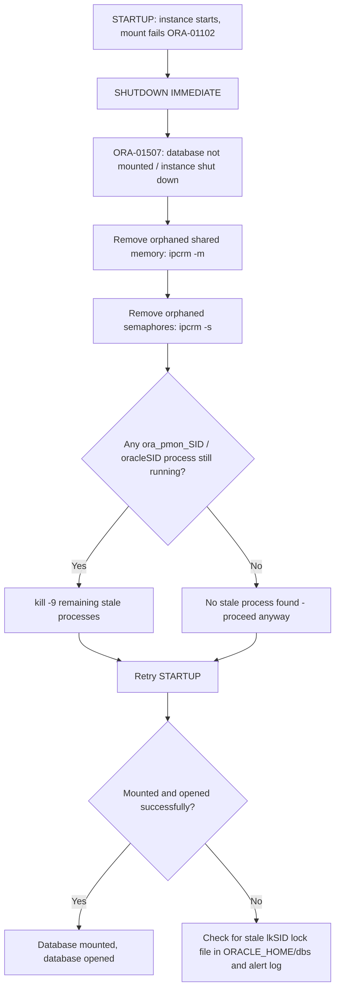

# Fixing ORA-01102 (Cannot Mount Database in EXCLUSIVE Mode) During Startup

## Environment

- Oracle Database 11g Release 2 (11.2.0.1.0), 64-bit
- Oracle Linux 6
- Database SID: `ORCLDB`
- Server hostname: `dbserver01`
- Connected as `oracle` OS user via `sqlplus / as sysdba`

## Symptom

The instance starts (SGA allocated) but fails while mounting the control file:

```
SQL> STARTUP
ORACLE instance started.

Total System Global Area  217157632 bytes
Fixed Size                  2211928 bytes
Variable Size             159387560 bytes
Database Buffers           50331648 bytes
Redo Buffers                5226496 bytes
ORA-01102: cannot mount database in EXCLUSIVE mode
```

Attempting to shut down afterward reports the database was never mounted:

```
SQL> shutdown immediate
ORA-01507: database not mounted

ORACLE instance shut down.
```

## Troubleshooting Flow



## Root Cause Analysis

`ORA-01102: cannot mount database in EXCLUSIVE mode` means the instance, while attempting to mount the control file in exclusive mode (the default for a single-instance, non-RAC database), detected that a lock on the database resources is already held. This is not a memory sizing error like ORA-00371 — it is a **locking/session-residue** error, and it commonly happens when:

1. **A previous instance crashed or was killed uncleanly** (e.g. `kill -9`, server issue, prior forced shutdown) and left behind:
   - Orphaned SysV shared memory segments and semaphores still associated with the old instance's SGA, and/or
   - A stale instance lock file `lk<SID>` (e.g. `lkORCLDB`) under `$ORACLE_HOME/dbs`, which Oracle uses on Linux/Unix to enforce the single-exclusive-instance rule.
2. **A zombie background process** (`ora_pmon_ORCLDB`, `ora_smon_ORCLDB`, etc.) is technically gone from `ps -ef` but the kernel had not yet fully released the IPC resources it held, so the new instance sees them as "still in use" and refuses to take an exclusive mount lock.

In this session, the same remediation pattern used for the [ORA-00371 shared pool case](ora-00371-shared-pool-startup-failure.md) resolved the issue: clearing orphaned shared memory/semaphores and confirming no stale background process was holding the lock, then retrying `STARTUP`. Note that the `ps -ef` check here returned **no matching processes**, confirming the blocking resource was leftover IPC state (shared memory/semaphores) rather than a live zombie process — the `ipcrm` cleanup step alone was what freed the exclusive mount lock.

## Resolution Steps

### Step 1 — Attempt shutdown to leave a clean baseline

```sql
SQL> shutdown immediate
ORA-01507: database not mounted

ORACLE instance shut down.
```

This is expected/harmless — the instance was only started (SGA allocated), never mounted, so `ORA-01507` simply confirms there is no mounted database to shut down; the instance itself still shuts down cleanly.

### Step 2 — Remove orphaned shared memory segments and semaphores

```bash
for id in $(ipcs -m | grep oracle | awk '{print $2}'); do ipcrm -m $id 2>/dev/null; done
for id in $(ipcs -s | grep oracle | awk '{print $2}'); do ipcrm -s $id 2>/dev/null; done
```

### Step 3 — Confirm no stale background processes remain

```bash
ps -ef | grep -E "ora_pmon_ORCLDB|oracleORCLDB" | grep -v grep
```

In this case the command returned nothing, meaning there was no live or zombie process left — the lock condition was entirely due to leftover IPC resources cleared in Step 2. If this command *does* return process IDs, kill them before retrying:

```bash
kill -9 $(ps -ef | grep -E "ora_pmon_ORCLDB|oracleORCLDB" | grep -v grep | awk '{print $2}') 2>/dev/null
```

### Step 4 — Retry startup

```sql
SQL> STARTUP
ORACLE instance started.

Total System Global Area  217157632 bytes
Fixed Size                  2211928 bytes
Variable Size             159387560 bytes
Database Buffers           50331648 bytes
Redo Buffers                5226496 bytes
Database mounted.
Database opened.
```

The database mounted and opened successfully after clearing the stale IPC resources.

## Additional Recommendations / What Else Should Be Checked

1. **Check for a stale lock file.** If clearing shared memory/semaphores does not resolve ORA-01102, check for a leftover instance lock file and remove it only after confirming no instance is genuinely running:

   ```bash
   ls -l $ORACLE_HOME/dbs/lk*
   ```

   Only delete `lk<SID>` manually as a last resort, and only when certain no live instance holds it — deleting it while an instance is actually running can cause severe corruption from two instances mounting the same files concurrently.

2. **Rule out an actual second instance.** ORA-01102 is the exact same error a RAC/second-instance startup produces when a single-instance database is already mounted elsewhere. Before clearing anything, verify via `ps -ef | grep pmon` (and, if applicable, on any other node/server sharing the same storage) that no other process anywhere is already holding the mount.

3. **Check the alert log for the precise moment of failure:**

   ```bash
   tail -100 $ORACLE_BASE/diag/rdbms/orcldb/ORCLDB/trace/alert_ORCLDB.log
   ```

   Look for entries around the failed `STARTUP` — Oracle usually logs additional detail (e.g. which resource/lock it could not acquire) beyond what is shown in `sqlplus`.

4. **Investigate why the previous instance did not shut down cleanly**, same as with ORA-00371 — check for OOM killer activity (`grep -i oom /var/log/messages`), unexpected server reboots, or an operator-issued `kill -9` on background processes. Recurring ORA-01102/ORA-00371 incidents on the same server are a strong signal of an underlying OS memory or process-management issue rather than a one-off fluke.

5. **Avoid using `kill -9` on Oracle background processes as a routine shutdown method.** A graceful `SHUTDOWN IMMEDIATE` (or `SHUTDOWN ABORT` as a last resort, followed by a clean `STARTUP`) leaves IPC resources and lock files in a consistent state and avoids the cleanup steps described in this document altogether.

6. **Document and time-stamp each incident.** This is now the second startup incident on this server in this general timeframe (see [ora-00371-shared-pool-startup-failure.md](ora-00371-shared-pool-startup-failure.md)) with the identical `ipcrm` remediation pattern working both times — if it recurs a third time, escalate to a root-cause investigation of the OS/host stability rather than continuing to apply the same workaround.

## Summary

| Error | Cause | Fix |
|---|---|---|
| ORA-01102 | Orphaned SysV shared memory/semaphores (or stale lock file) from a previous unclean shutdown blocking the exclusive mount lock | Clean up orphaned IPC resources with `ipcrm`, confirm no stale background process is running, retry `STARTUP` |
| ORA-01507 | Expected side effect of `SHUTDOWN IMMEDIATE` when the instance was only started but never mounted | No action needed — instance shuts down cleanly regardless |
