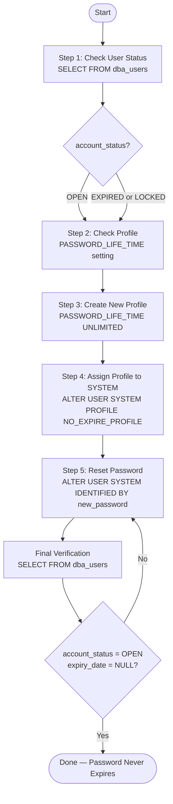

# How to Change the SYSTEM User Profile in Oracle Database to Never Expire Password

By default, Oracle Database enforces a password expiration policy through the `PASSWORD_LIFE_TIME` setting in the user profile. Once the password exceeds that limit, the user cannot log in until the password is reset. This guide walks through the steps to disable password expiration for the `SYSTEM` user.

---

## Prerequisites

- Access to Oracle Database as `SYS AS SYSDBA` or a user with `DBA` privilege.
- Tools: SQL\*Plus, SQL Developer, or any other Oracle SQL tool.

---

## Process Overview



---

## Step 1 — Check User Status

Verify whether the `SYSTEM` account is expired or not.

```sql
SELECT username, account_status, expiry_date, profile
FROM dba_users
WHERE username = 'SYSTEM';
```

**Column description:**

| Column | Description |
|---|---|
| `username` | Oracle username |
| `account_status` | Account status, e.g. `OPEN`, `EXPIRED`, or `LOCKED` |
| `expiry_date` | The date when the password will or has already expired |
| `profile` | The profile currently assigned to the user |

If `account_status` shows `EXPIRED` or `EXPIRED & LOCKED`, the password has expired and must be addressed immediately.

---

## Step 2 — Check the Current Profile

View the profile configuration currently applied to the `SYSTEM` user, specifically the `PASSWORD_LIFE_TIME` setting.

```sql
SELECT resource_name, limit
FROM dba_profiles
WHERE profile = (
    SELECT profile
    FROM dba_users
    WHERE username = 'SYSTEM'
)
AND resource_name = 'PASSWORD_LIFE_TIME';
```

**Notes:**

- `PASSWORD_LIFE_TIME` defines how many days a password remains valid before expiring.
- A value of `180` means the password expires after 180 days.
- A value of `UNLIMITED` means the password never expires.

---

## Step 3 — Create a New Profile

Log in as `SYS AS SYSDBA`, then create a new profile with `PASSWORD_LIFE_TIME` set to `UNLIMITED`.

```sql
CREATE PROFILE NO_EXPIRE_PROFILE LIMIT
    PASSWORD_LIFE_TIME UNLIMITED;
```

**Notes:**

- `CREATE PROFILE` creates a new security profile in Oracle.
- `NO_EXPIRE_PROFILE` is the name of the new profile (can be changed as needed).
- `PASSWORD_LIFE_TIME UNLIMITED` means passwords under this profile will never expire.

> **Note:** This command must be run by a user with the `CREATE PROFILE` privilege, such as `SYS AS SYSDBA`.

---

## Step 4 — Assign the Profile to the SYSTEM User

Apply the newly created profile to the `SYSTEM` user.

```sql
ALTER USER SYSTEM PROFILE NO_EXPIRE_PROFILE;
```

**Notes:**

- `ALTER USER` modifies the properties of an existing Oracle user.
- This changes the active profile of `SYSTEM` from the old one (usually `DEFAULT`) to `NO_EXPIRE_PROFILE`.
- Once applied, the old profile's password policy no longer applies to `SYSTEM`.

---

## Step 5 — Reset the Password

Reset the `SYSTEM` user password. The new password can be the same as the old one.

```sql
ALTER USER SYSTEM IDENTIFIED BY new_password;
```

**Notes:**

- This step is required if the account status is `EXPIRED`, as Oracle requires a password update to restore the status to `OPEN`.
- Replace `new_password` with the desired password.
- The old password can be reused if preferred.

> **Warning:** Make sure the password meets Oracle's password policy (minimum length, combination of letters and numbers, etc.) to avoid the `ORA-28003` error.

---

## Final Verification

After completing all steps, verify the changes have been applied correctly.

```sql
SELECT username, account_status, expiry_date, profile
FROM dba_users
WHERE username = 'SYSTEM';
```

Expected result:

- `account_status` changes to `OPEN`
- `expiry_date` is empty or `NULL`
- `profile` shows `NO_EXPIRE_PROFILE`

---

## Command Summary

```sql
-- 1. Check user status
SELECT username, account_status, expiry_date, profile
FROM dba_users
WHERE username = 'SYSTEM';

-- 2. Check the current profile
SELECT resource_name, limit
FROM dba_profiles
WHERE profile = (SELECT profile FROM dba_users WHERE username = 'SYSTEM')
AND resource_name = 'PASSWORD_LIFE_TIME';

-- 3. Create a new profile
CREATE PROFILE NO_EXPIRE_PROFILE LIMIT
    PASSWORD_LIFE_TIME UNLIMITED;

-- 4. Assign the profile to SYSTEM
ALTER USER SYSTEM PROFILE NO_EXPIRE_PROFILE;

-- 5. Reset the password
ALTER USER SYSTEM IDENTIFIED BY new_password;
```
