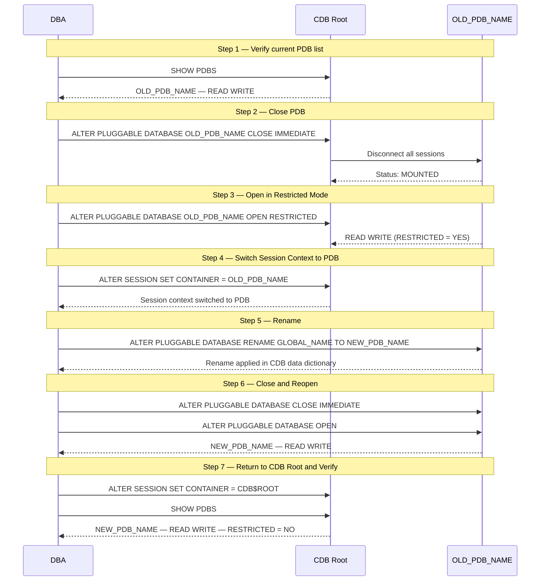

# How to Rename a Pluggable Database (PDB) in Oracle 19c

In Oracle Multitenant architecture, a **Pluggable Database (PDB)** is a portable collection of schemas, schema objects, and non-schema objects that appears to an Oracle Net client as a non-CDB. There are cases where a PDB needs to be renamed — for example, when a database is cloned from another environment (e.g., QC/QA → Production) and the PDB name must reflect its new role.

Renaming a PDB requires the database to be opened in **restricted mode** first, so that only users with `RESTRICTED SESSION` privilege can connect. This ensures no active user sessions interfere during the rename process.

This guide walks through the complete steps to safely rename a PDB in Oracle Database 19c using SQL\*Plus.

---

## Prerequisites

- Access to Oracle Database as `SYS AS SYSDBA`.
- The target PDB must exist and be accessible from the CDB root.
- Tools: SQL\*Plus.
- Ensure no critical applications are actively using the PDB before proceeding.

---

## Rename Process Overview



---

## Step 1 — Connect to the Database and Check Current PDBs

Connect to the CDB (Container Database) as `SYSDBA` and verify the existing PDBs.

```sql
sqlplus / as sysdba
```

Then list all available PDBs:

```sql
SHOW PDBS;
```

**Expected output:**

```
CON_ID CON_NAME                       OPEN MODE  RESTRICTED
------ ------------------------------ ---------- ----------
     2 PDB$SEED                       READ ONLY  NO
     3 OLD_PDB_NAME                   READ WRITE NO
```

**Column description:**

| Column | Description |
|--------|-------------|
| `CON_ID` | Container ID of the PDB |
| `CON_NAME` | Name of the PDB |
| `OPEN MODE` | Current open mode: `READ WRITE`, `READ ONLY`, or `MOUNTED` |
| `RESTRICTED` | Whether the PDB is in restricted mode (`YES`/`NO`) |

Identify the PDB name you want to rename (e.g., `OLD_PDB_NAME`).

---

## Step 2 — Close the PDB

Before renaming, the PDB must be closed first. Run the following command from the **CDB root** context:

```sql
ALTER PLUGGABLE DATABASE OLD_PDB_NAME CLOSE IMMEDIATE;
```

**Notes:**

- `CLOSE IMMEDIATE` disconnects all active sessions to the PDB immediately.
- This command must be executed from the CDB root, not from within the PDB itself.

> **Warning:** Closing the PDB will disconnect all active connections. Inform users or application teams before running this step.

---

## Step 3 — Open the PDB in Restricted Mode

Open the PDB in restricted mode. Only users with the `RESTRICTED SESSION` privilege can connect in this mode.

```sql
ALTER PLUGGABLE DATABASE OLD_PDB_NAME OPEN RESTRICTED;
```

**Notes:**

- Restricted mode is required to perform the rename operation.
- Regular application users will not be able to connect while the PDB is in this mode.

---

## Step 4 — Switch Context to the PDB

Switch the current session from the CDB root into the target PDB context:

```sql
ALTER SESSION SET CONTAINER=OLD_PDB_NAME;
```

**Notes:**

- All subsequent commands will be executed within the PDB context after this step.
- Verify that the session switched successfully before proceeding.

---

## Step 5 — Rename the PDB

Rename the PDB using the `RENAME GLOBAL_NAME TO` clause:

```sql
ALTER PLUGGABLE DATABASE RENAME GLOBAL_NAME TO NEW_PDB_NAME;
```

**Notes:**

- `RENAME GLOBAL_NAME TO` changes the global name (identifier) of the PDB.
- The new name (`NEW_PDB_NAME`) must follow Oracle naming conventions: alphanumeric characters and underscores, no spaces, max 128 characters.
- This operation updates the PDB's metadata in the CDB data dictionary.

---

## Step 6 — Close and Reopen the PDB

After renaming, close the PDB to apply the changes, then reopen it normally:

```sql
ALTER PLUGGABLE DATABASE CLOSE IMMEDIATE;
```

```sql
ALTER PLUGGABLE DATABASE OPEN;
```

**Notes:**

- The close-reopen cycle is necessary to fully apply the rename and clear restricted mode.
- After `OPEN`, the PDB is accessible to all users again.

---

## Step 7 — Return to CDB Root and Verify

Switch the session back to the CDB root:

```sql
ALTER SESSION SET CONTAINER=CDB$ROOT;
```

Then verify the rename was successful:

```sql
SHOW PDBS;
```

**Expected output:**

```
CON_ID CON_NAME                       OPEN MODE  RESTRICTED
------ ------------------------------ ---------- ----------
     2 PDB$SEED                       READ ONLY  NO
     3 NEW_PDB_NAME                   READ WRITE NO
```

The PDB should now appear with the new name and be in `READ WRITE` mode with `RESTRICTED = NO`.

---

## Version Compatibility

| Feature | 11g | 12c | 18c | 19c | 21c | 23ai–26 AI |
|---------|-----|-----|-----|-----|-----|-----------|
| Pluggable Database (PDB) / CDB Multitenant architecture | **No** | Yes | Yes | Yes | Yes | Yes |
| `ALTER PLUGGABLE DATABASE ... CLOSE/OPEN RESTRICTED` | **N/A** | Yes | Yes | Yes | Yes | Yes |
| `ALTER SESSION SET CONTAINER` | **N/A** | Yes | Yes | Yes | Yes | Yes |
| `ALTER PLUGGABLE DATABASE RENAME GLOBAL_NAME TO` | **N/A** | Yes | Yes | Yes | Yes | Yes |

> **This entire procedure does not apply to Oracle 11g.** The Multitenant architecture (CDB/PDB) was introduced in Oracle 12c — Oracle 11g is a non-CDB, single-tenant database and has no concept of a Pluggable Database to rename. There is no alternate 11g script for this task, since the underlying feature simply does not exist on that version.

**No script differences across supported versions:** The exact same command sequence (`CLOSE IMMEDIATE` → `OPEN RESTRICTED` → `ALTER SESSION SET CONTAINER` → `RENAME GLOBAL_NAME TO` → `CLOSE`/`OPEN`) works identically and unchanged on **Oracle 12c, 18c, 19c, 21c, and 23ai–26 AI** — this guide is written against 19c, but it can be used as-is on any of those versions with no syntax adjustments.

---

## Common Errors

### ORA-00940: Invalid ALTER Command

**Cause:** Typo in the `PLUGGABLE` keyword (e.g., `PLUGGBLE` instead of `PLUGGABLE`).

```sql
-- Wrong (typo)
ALTER PLUGGBLE DATABASE OLD_PDB_NAME CLOSE IMMEDIATE;

-- Correct
ALTER PLUGGABLE DATABASE OLD_PDB_NAME CLOSE IMMEDIATE;
```

---

### ORA-02231: Missing or Invalid Option to ALTER DATABASE

**Cause:** Typo in the `RENAME GLOBAL_NAME TO` clause (e.g., `GLOBA_NAME TP` instead of `GLOBAL_NAME TO`).

```sql
-- Wrong (typo)
ALTER PLUGGABLE DATABASE RENAME GLOBA_NAME TP NEW_PDB_NAME;

-- Correct
ALTER PLUGGABLE DATABASE RENAME GLOBAL_NAME TO NEW_PDB_NAME;
```

---

## Command Summary

```sql
-- 1. Check current PDBs
SHOW PDBS;

-- 2. Close the PDB (from CDB root)
ALTER PLUGGABLE DATABASE OLD_PDB_NAME CLOSE IMMEDIATE;

-- 3. Open the PDB in restricted mode
ALTER PLUGGABLE DATABASE OLD_PDB_NAME OPEN RESTRICTED;

-- 4. Switch to the PDB context
ALTER SESSION SET CONTAINER=OLD_PDB_NAME;

-- 5. Rename the PDB
ALTER PLUGGABLE DATABASE RENAME GLOBAL_NAME TO NEW_PDB_NAME;

-- 6. Close the PDB
ALTER PLUGGABLE DATABASE CLOSE IMMEDIATE;

-- 7. Reopen the PDB
ALTER PLUGGABLE DATABASE OPEN;

-- 8. Return to CDB root
ALTER SESSION SET CONTAINER=CDB$ROOT;

-- 9. Verify the rename
SHOW PDBS;
```
