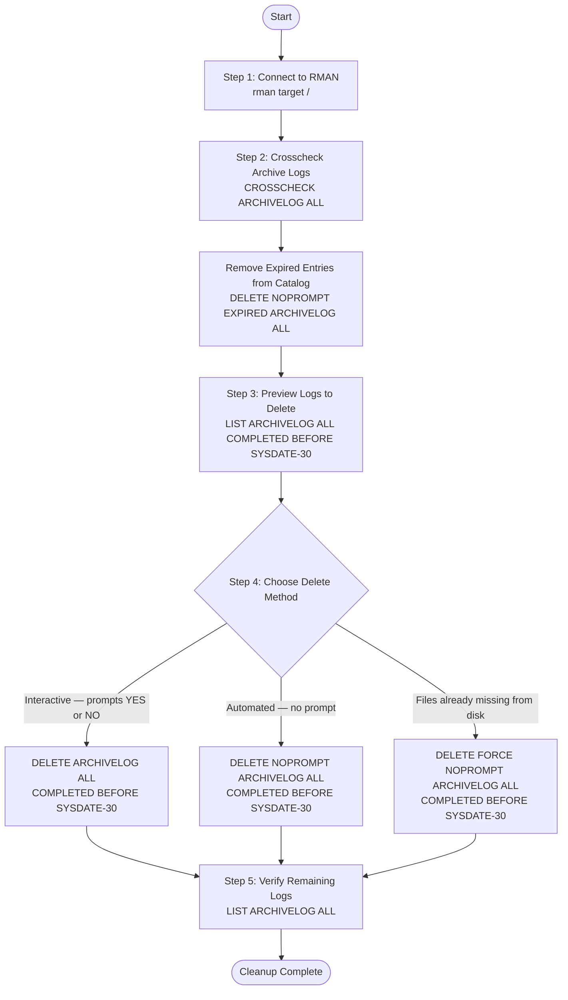

# How to Delete Archive Log Files from RMAN and Storage via RMAN

Archive logs are generated continuously by Oracle Database in ARCHIVELOG mode. Over time, they consume significant disk space. This guide covers how to safely delete archive logs older than 1 month using RMAN, including best practices with crosscheck and verification steps.

---

## Prerequisites

- Access to the Oracle server as the `oracle` OS user or equivalent.
- RMAN connected to the target database.
- Ensure archive logs have already been backed up before deleting.

---

## Cleanup Process Overview



---

## Step 1 — Connect to RMAN

Open a command prompt or terminal, then connect to RMAN targeting the local database.

```bash
rman target /
```

**Example output:**

```
Recovery Manager: Release 19.0.0.0.0 - Production on Mon May 5 09:00:00 2025
Version 19.3.0.0.0

Copyright (c) 1982, 2019, Oracle and/or its affiliates.  All rights reserved.

connected to target database: ORCL (DBID=1234567890)
```

---

## Step 2 — Crosscheck First (Best Practice)

Before deleting, run a crosscheck to synchronize the RMAN catalog with the actual files on disk. This flags any archive logs that are recorded in RMAN but no longer physically exist on disk as `EXPIRED`.

```sql
CROSSCHECK ARCHIVELOG ALL;
```

**Example output:**

```
using target database control file instead of recovery catalog
allocated channel: ORA_DISK_1
channel ORA_DISK_1: SID=25 device type=DISK

validation succeeded for archived log
archive log filename=/arch/1_100_987654321.dbf recid=100 stamp=987654321
validation succeeded for archived log
archive log filename=/arch/1_101_987654321.dbf recid=101 stamp=987654322
...
validation failed for archived log
archive log filename=/arch/1_55_987600000.dbf recid=55 stamp=987600000
Crosschecked 120 objects
```

Then delete any expired (missing from disk) archive logs from the RMAN catalog:

```sql
DELETE NOPROMPT EXPIRED ARCHIVELOG ALL;
```

**Example output:**

```
List of Archived Log Copies for database with db_unique_name ORCL
=====================================================================

Key     Thrd Seq     S Low Time
------- ---- ------- - ---------
55      1    55      X 01-FEB-25

deleted archived log
archive log filename=/arch/1_55_987600000.dbf recid=55 stamp=987600000
Deleted 1 expired archived log
```

---

## Step 3 — Verify Archive Logs Before Deleting

List archive logs older than 1 month (30 days) before actually deleting them. This step does **not** delete anything — it only shows what will be affected.

```sql
LIST ARCHIVELOG ALL COMPLETED BEFORE 'SYSDATE-30';
```

**Example output:**

```
List of Archived Log Copies for database with db_unique_name ORCL
=====================================================================

Key     Thrd Seq     S Low Time        Next Time       Path
------- ---- ------- - --------------- --------------- ----------------------------------------
1       1    1       A 01-APR-25       01-APR-25       /arch/1_1_987654321.dbf
2       1    2       A 01-APR-25       01-APR-25       /arch/1_2_987654321.dbf
3       1    3       A 02-APR-25       02-APR-25       /arch/1_3_987654321.dbf
...
```

> **Note:** Column `S` shows the status — `A` = Available, `X` = Expired, `D` = Deleted.

---

## Step 4 — Delete Archive Logs Older than 1 Month

There are three ways to delete archive logs. Choose based on your situation.

### Option 1 — Standard Delete (with confirmation prompt)

```sql
DELETE ARCHIVELOG ALL COMPLETED BEFORE 'SYSDATE-30';
```

RMAN will display the list and ask for confirmation:

```
Do you really want to delete the above objects (enter YES or NO)? YES
```

---

### Option 2 — Delete Without Prompt (recommended for scripts)

```sql
DELETE NOPROMPT ARCHIVELOG ALL COMPLETED BEFORE 'SYSDATE-30';
```

**Example output:**

```
List of Archived Log Copies for database with db_unique_name ORCL
=====================================================================

Key     Thrd Seq     S Low Time
------- ---- ------- - ---------
1       1    1       A 01-APR-25
2       1    2       A 01-APR-25
3       1    3       A 02-APR-25

deleted archived log
archive log filename=/arch/1_1_987654321.dbf recid=1 stamp=987654321
deleted archived log
archive log filename=/arch/1_2_987654321.dbf recid=2 stamp=987654322
deleted archived log
archive log filename=/arch/1_3_987654321.dbf recid=3 stamp=987654323
...
Deleted 35 objects
```

---

### Option 3 — Force Delete (skip files already missing from disk)

Use this when some archive log files have been manually deleted from disk but still exist in the RMAN catalog.

```sql
DELETE FORCE NOPROMPT ARCHIVELOG ALL COMPLETED BEFORE 'SYSDATE-30';
```

**Example output:**

```
deleted archived log
archive log filename=/arch/1_1_987654321.dbf recid=1 stamp=987654321
archived log file not found, skipped
archive log filename=/arch/1_2_987654321.dbf recid=2 stamp=987654322
deleted archived log
archive log filename=/arch/1_3_987654321.dbf recid=3 stamp=987654323
Deleted 34 objects
```

> `FORCE` allows RMAN to remove catalog entries even if the physical file is already missing on disk, preventing errors during deletion.

---

## Step 5 — Verify Remaining Archive Logs

After deletion, list all remaining archive logs to confirm the cleanup was successful.

```sql
LIST ARCHIVELOG ALL;
```

**Example output:**

```
List of Archived Log Copies for database with db_unique_name ORCL
=====================================================================

Key     Thrd Seq     S Low Time        Next Time       Path
------- ---- ------- - --------------- --------------- ----------------------------------------
101     1    101     A 05-MAY-25       05-MAY-25       /arch/1_101_987654321.dbf
102     1    102     A 05-MAY-25       05-MAY-25       /arch/1_102_987654321.dbf
103     1    103     A 05-MAY-25       05-MAY-25       /arch/1_103_987654321.dbf
```

Only archive logs from the past 30 days should remain.

---

## Full Command Sequence (Best Practice)

```sql
-- Step 1: Connect to RMAN
rman target /

-- Step 2: Sync RMAN catalog with disk
CROSSCHECK ARCHIVELOG ALL;

-- Step 3: Remove expired entries from catalog
DELETE NOPROMPT EXPIRED ARCHIVELOG ALL;

-- Step 4: Preview what will be deleted (no actual deletion)
LIST ARCHIVELOG ALL COMPLETED BEFORE 'SYSDATE-30';

-- Step 5: Delete archive logs older than 30 days
DELETE NOPROMPT ARCHIVELOG ALL COMPLETED BEFORE 'SYSDATE-30';

-- Step 6: Verify remaining archive logs
LIST ARCHIVELOG ALL;
```

---

## Version Compatibility

| Feature | 11g | 12c | 18c | 19c | 21c | 23ai–26 AI |
|---------|-----|-----|-----|-----|-----|-----------|
| `CROSSCHECK ARCHIVELOG ALL` | Yes | Yes | Yes | Yes | Yes | Yes |
| `LIST ARCHIVELOG ALL COMPLETED BEFORE` | Yes | Yes | Yes | Yes | Yes | Yes |
| `DELETE ARCHIVELOG` / `DELETE NOPROMPT` / `DELETE FORCE` | Yes | Yes | Yes | Yes | Yes | Yes |
| `DELETE NOPROMPT EXPIRED ARCHIVELOG` | Yes | Yes | Yes | Yes | Yes | Yes |

> **No script differences by version.** These are foundational RMAN commands that have existed since Oracle 9i/10g and remain unchanged through 26 AI — the same `CROSSCHECK` / `LIST` / `DELETE` sequence in this guide works as-is on **every version from 11g through 26 AI**. In a 12c+ CDB, run RMAN connected to the target database (root or PDB context) as needed — archive log management is CDB-wide by default, and no command syntax changes.

---

## Important Notes

- Always run `CROSSCHECK` before `DELETE` to ensure RMAN is in sync with actual disk state.
- Always verify that archive logs have been **backed up** before deleting — deleting unbackedup archive logs may prevent point-in-time recovery.
- Use `LIST` before `DELETE` to preview what will be removed.
- `SYSDATE-30` = 30 days ago. Adjust the number to match the retention period needed (e.g. `SYSDATE-7` for 7 days, `SYSDATE-90` for 90 days).
- `DELETE FORCE` is useful when files were manually removed from disk outside of RMAN, leaving orphan catalog entries.
