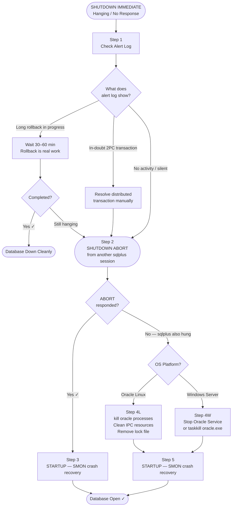
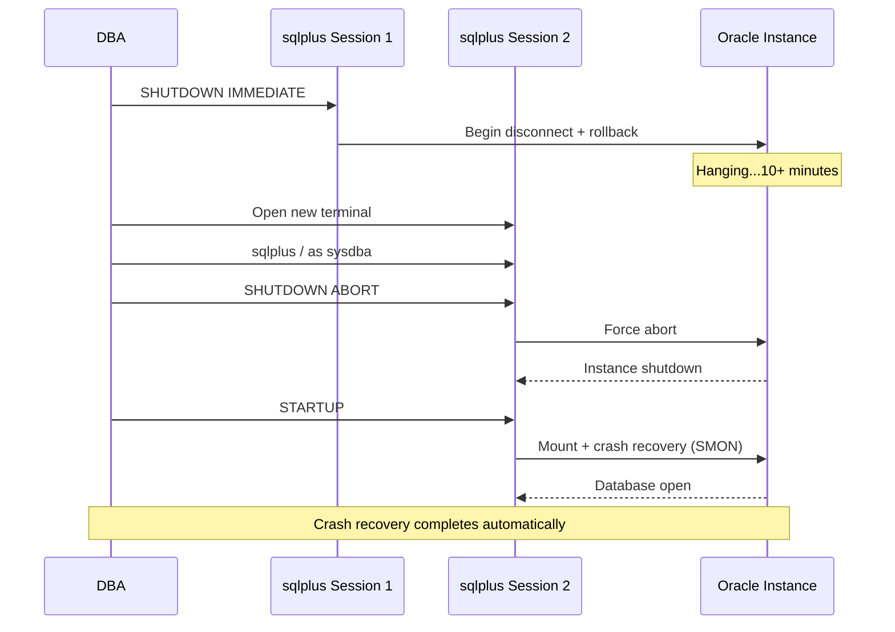
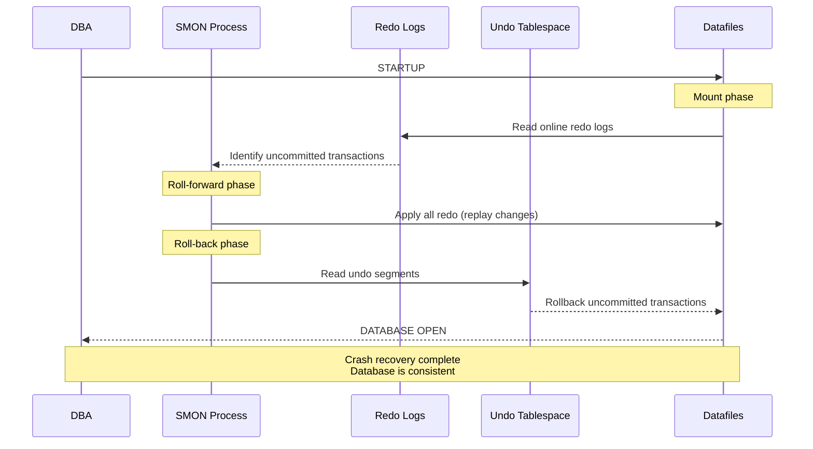
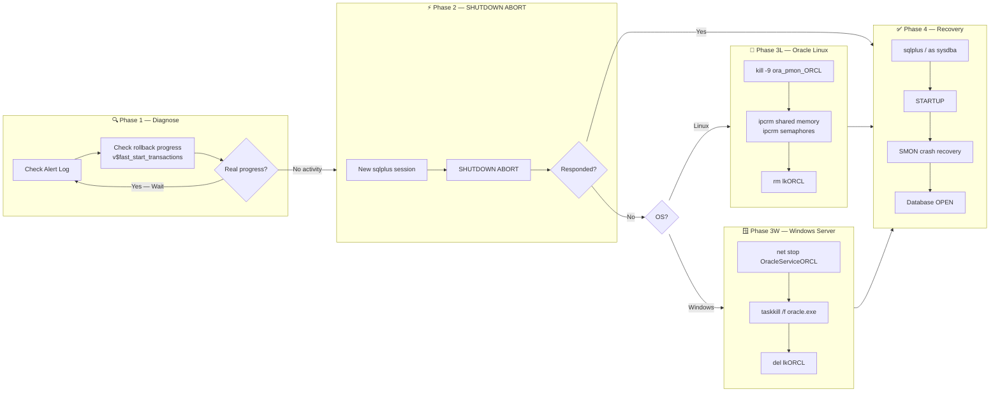

# Handling Oracle Database SHUTDOWN IMMEDIATE Hang

`SHUTDOWN IMMEDIATE` is the most commonly used shutdown method in Oracle Database. It disconnects all active sessions, rolls back uncommitted transactions, and closes the database cleanly. However, in certain conditions, the command can appear to hang indefinitely — leaving the DBA with no visible progress and no response.

This guide explains **why it happens**, **how to diagnose it**, and **step-by-step resolution procedures** for both Oracle Linux and Windows Server — with escalation levels from the safest approach to a forced OS-level termination.

---

## Why SHUTDOWN IMMEDIATE Can Hang

| Cause | Description |
|-------|-------------|
| Long rollback | A large uncommitted transaction is being rolled back by Oracle — this is progress, just slow |
| Distributed transaction (2PC) | An in-doubt two-phase commit transaction is blocking shutdown |
| Stuck session | A session is not responding to Oracle's internal disconnect signal |
| Archive log generation | LGWR or ARCH is waiting on I/O before shutdown can proceed |
| Background process stuck | An Oracle background process (e.g., `DBW0`, `LGWR`) is blocked on an I/O operation |
| Network connection | A remote session appears active but the network is broken — timeout not yet reached |

---

## Overall Decision Flowchart



---

## Phase 1 — Diagnose Before Taking Action

**Never rush to kill the database.** A slow `SHUTDOWN IMMEDIATE` may just be rolling back a large transaction — killing it prematurely means repeating the rollback on the next startup.

### 1.1 — Check the Alert Log (Oracle Linux)

```bash
tail -200 $ORACLE_BASE/diag/rdbms/orcl/ORCL/trace/alert_ORCL.log
```

Or find the alert log path dynamically:

```bash
find $ORACLE_BASE/diag -name "alert_*.log" 2>/dev/null | head -5
```

### 1.1 — Check the Alert Log (Windows Server)

```cmd
type C:\app\oracle\diag\rdbms\orcl\ORCL\trace\alert_ORCL.log | more
```

Or use PowerShell:

```powershell
Get-Content "C:\app\oracle\diag\rdbms\orcl\ORCL\trace\alert_ORCL.log" -Tail 200
```

### 1.2 — Interpret Alert Log Messages

| Message in Alert Log | Meaning | Action |
|----------------------|---------|--------|
| `Active call for process ... user ...` | Session being killed | Wait |
| `All dispatchers and shared servers shutdown` | Progress is happening | Wait |
| `Beginning crash recovery of 1 threads` | Rollback in progress | **Wait — do not interrupt** |
| `SMON: enabling tx recovery` | Transaction recovery | Wait |
| `Waiting for smon to disable tx recovery` | Normal shutdown step | Wait |
| `(silent — no new lines for 10+ minutes)` | Truly hung | Escalate |

### 1.3 — Check for Rollback Progress (from a separate sqlplus session)

Open a **new sqlplus session** (do not interrupt the one running SHUTDOWN IMMEDIATE):

```sql
-- Check if any undo is being applied (indicates rollback in progress)
SELECT usn, state, undoblocksdone, undoblockstotal,
       ROUND((undoblocksdone / NULLIF(undoblockstotal,0)) * 100, 1) AS pct_done
FROM   v$fast_start_transactions
WHERE  undoblockstotal > 0;
```

If rows are returned with `pct_done` increasing — **rollback is happening, just wait**.

```sql
-- Check blocking or long-running sessions
SELECT sid, serial#, username, status, seconds_in_wait, wait_class, event
FROM   v$session
WHERE  type = 'USER'
AND    status = 'ACTIVE'
ORDER  BY seconds_in_wait DESC;
```

---

## Phase 2 — Escalate to SHUTDOWN ABORT

If there is truly no progress after **30–60 minutes**, open a **new sqlplus session** and run:

```sql
SHUTDOWN ABORT
```

`SHUTDOWN ABORT` works like pulling the power plug — it immediately terminates the instance without rolling back transactions. On the next startup, SMON will perform **crash recovery** automatically.



**Important:** After `SHUTDOWN ABORT`, the database is **not corrupted**. Oracle's crash recovery is designed for exactly this scenario. The database will be fully consistent after SMON completes recovery on next startup.

---

## Phase 3L — Force Kill on Oracle Linux

Use this phase only if `SHUTDOWN ABORT` in a new sqlplus session **also does not respond**.

### Step L1 — Identify Oracle Processes

```bash
# List all Oracle background processes for the instance
ps -ef | grep ora_ | grep -v grep

# Or list by instance name (e.g., ORCL)
ps -ef | grep ora_pmon_ORCL | grep -v grep
```

### Step L2 — Kill the PMON Process (Cascades to All Oracle Processes)

```bash
# Get the PID of pmon
PMON_PID=$(ps -ef | grep ora_pmon_ORCL | grep -v grep | awk '{print $2}')
echo "PMON PID: $PMON_PID"

# Kill pmon — Oracle will cascade-kill related processes
kill -9 $PMON_PID
```

Wait 5–10 seconds, then verify all Oracle processes are gone:

```bash
ps -ef | grep ora_ | grep -v grep
```

If processes remain, kill them all:

```bash
kill -9 $(ps -ef | grep "[o]ra_.*_ORCL" | awk '{print $2}')
```

### Step L3 — Clean Up IPC (Shared Memory and Semaphores)

Oracle uses System V IPC resources (shared memory segments and semaphores). These must be released after a forced kill, otherwise the next startup will fail.

```bash
# Check shared memory segments owned by oracle
ipcs -m | grep oracle

# Check semaphores owned by oracle
ipcs -s | grep oracle
```

Remove them:

```bash
# Remove shared memory segments
for id in $(ipcs -m | awk '/oracle/{print $2}'); do
    ipcrm -m $id
    echo "Removed shared memory: $id"
done

# Remove semaphores
for id in $(ipcs -s | awk '/oracle/{print $2}'); do
    ipcrm -s $id
    echo "Removed semaphore: $id"
done
```

Or use Oracle's `oradism` tool (available in 11g+):

```bash
$ORACLE_HOME/bin/oradism
```

### Step L4 — Remove the Instance Lock File

Oracle creates a lock file to prevent multiple instances from opening the same database. After a forced kill, this file may not be cleaned up automatically.

```bash
# Check for lock file
ls -la $ORACLE_HOME/dbs/lk*

# Remove it (replace ORCL with your SID)
rm -f $ORACLE_HOME/dbs/lkORCL
```

### Step L5 — Start the Database

```bash
sqlplus / as sysdba
```

```sql
STARTUP
```

Oracle will automatically perform crash recovery. Monitor progress in the alert log:

```bash
tail -f $ORACLE_BASE/diag/rdbms/orcl/ORCL/trace/alert_ORCL.log
```

---

## Phase 3W — Force Stop on Windows Server

Use this phase only if `SHUTDOWN ABORT` in a new sqlplus session also does not respond.

### Step W1 — Try Stopping the Oracle Service via Command Line

```cmd
net stop OracleServiceORCL /y
```

Or using `sc`:

```cmd
sc stop OracleServiceORCL
```

Check service status:

```cmd
sc query OracleServiceORCL
```

### Step W2 — Force Kill oracle.exe Processes

If the service stop command hangs or returns an error:

```cmd
taskkill /f /im oracle.exe
```

Verify processes are gone:

```cmd
tasklist | findstr oracle
```

If TNS Listener is also stuck:

```cmd
taskkill /f /im tnslsnr.exe
```

### Step W3 — Remove Lock File (if any)

On Windows, Oracle may create a lock file in the database directory:

```cmd
dir C:\app\oracle\product\19.0.0\dbhome_1\database\lk*
del C:\app\oracle\product\19.0.0\dbhome_1\database\lkORCL
```

### Step W4 — Start the Oracle Service and Database

```cmd
net start OracleServiceORCL
```

Then connect and open:

```cmd
sqlplus / as sysdba
```

```sql
STARTUP
```

---

## Phase 4 — Crash Recovery After Forced Shutdown

After any `SHUTDOWN ABORT` or forced process kill, Oracle will automatically perform **crash recovery** on the next `STARTUP`. No manual intervention is required.



**Crash recovery timeline** depends on the amount of uncommitted data. Monitor with:

```sql
-- Check recovery progress after STARTUP (run before DB fully opens if needed)
SELECT * FROM v$fast_start_transactions;
```

Or monitor the alert log:

```bash
# Oracle Linux
tail -f $ORACLE_BASE/diag/rdbms/orcl/ORCL/trace/alert_ORCL.log

# Windows PowerShell
Get-Content "C:\app\oracle\diag\rdbms\orcl\ORCL\trace\alert_ORCL.log" -Wait -Tail 50
```

---

## Complete Resolution Flow — Side by Side



---

## Quick Reference — Commands by Platform

### Oracle Linux

```bash
# 1. Check alert log
tail -200 $ORACLE_BASE/diag/rdbms/orcl/ORCL/trace/alert_ORCL.log

# 2. SHUTDOWN ABORT (new session)
sqlplus / as sysdba <<EOF
SHUTDOWN ABORT
EXIT
EOF

# 3. Kill oracle processes (if step 2 fails)
kill -9 $(ps -ef | grep ora_pmon_ORCL | grep -v grep | awk '{print $2}')

# 4. Clean IPC resources
for id in $(ipcs -m | awk '/oracle/{print $2}'); do ipcrm -m $id; done
for id in $(ipcs -s | awk '/oracle/{print $2}'); do ipcrm -s $id; done

# 5. Remove lock file
rm -f $ORACLE_HOME/dbs/lkORCL

# 6. Startup
sqlplus / as sysdba <<EOF
STARTUP
EXIT
EOF
```

### Windows Server

```cmd
REM 1. Check alert log (PowerShell)
powershell Get-Content "C:\app\oracle\diag\rdbms\orcl\ORCL\trace\alert_ORCL.log" -Tail 200

REM 2. SHUTDOWN ABORT (new sqlplus)
echo SHUTDOWN ABORT | sqlplus -S / as sysdba

REM 3. Stop Oracle service (if step 2 fails)
net stop OracleServiceORCL /y

REM 4. Force kill if service won't stop
taskkill /f /im oracle.exe

REM 5. Remove lock file
del C:\app\oracle\product\19.0.0\dbhome_1\database\lkORCL

REM 6. Start service and open database
net start OracleServiceORCL
echo STARTUP | sqlplus -S / as sysdba
```

---

## Version Compatibility Notes

| Step | Oracle 11g | Oracle 12c | Oracle 18c–19c | Oracle 21c–26 AI |
|------|-----------|-----------|----------------|-----------------|
| `SHUTDOWN ABORT` | Yes | Yes | Yes | Yes |
| `SHUTDOWN ABORT` in PDB | N/A | CDB only | CDB only | CDB only |
| `v$fast_start_transactions` | Yes | Yes | Yes | Yes |
| IPC cleanup (Linux) | Yes | Yes | Yes | Yes |
| `oradism` tool | Yes | Yes | Yes | Yes |
| `net stop OracleService*` (Windows) | Yes | Yes | Yes | Yes |

> **Oracle 12c+ Multitenant:** `SHUTDOWN ABORT` on a PDB closes only that PDB, not the entire instance. To abort the whole CDB instance, connect to `CDB$ROOT` as SYSDBA and run `SHUTDOWN ABORT`.

---

## Prevention Tips

| Practice | Why It Helps |
|----------|-------------|
| Use `SHUTDOWN TRANSACTIONAL` before `IMMEDIATE` during planned maintenance | Allows existing transactions to complete before disconnect, reducing rollback time |
| Monitor long-running transactions regularly | Catch and manage runaway transactions before shutdown time |
| Keep undo tablespace adequately sized | Prevents slow rollback due to undo segment chaining |
| Use `FAST_START_MTTR_TARGET` parameter | Limits crash recovery time by controlling checkpoint frequency |
| Archive log I/O tuning | Ensures ARCH is not a bottleneck when shutdown triggers final archiving |
| Schedule shutdowns during low-activity periods | Fewer active sessions and transactions mean faster, cleaner shutdown |

---

## Warning

> **Do not remove IPC resources or kill oracle processes without first attempting `SHUTDOWN ABORT`.** Forced OS-level termination bypasses Oracle's internal cleanup and should only be used as a last resort when all SQL-level options are exhausted.

> **After any `SHUTDOWN ABORT` or forced kill, always let SMON complete crash recovery before opening the database to users.** Do not interrupt the `STARTUP` command. If recovery is taking too long, monitor the alert log rather than cancelling the startup.
