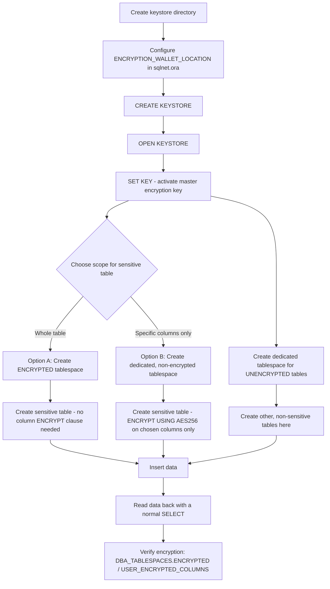

# Transparent Data Encryption (TDE) on a Dedicated Tablespace — Full Table vs Specific Columns (Oracle 19c)

## Environment

- Oracle Database 19c Enterprise Edition — TDE requires the Advanced Security Option
- Applies to single-instance databases
- Covers commands for both Oracle Linux and Windows Server
- Connected as `oracle` OS user (Linux) or the Oracle service account (Windows) via `sqlplus / as sysdba`

## What Is Transparent Data Encryption (TDE)?

Transparent Data Encryption (TDE) is an Oracle Database feature that encrypts data **at rest** — meaning the data is protected while it sits in the datafiles on disk (and in backups made from those datafiles). It is called "transparent" because encryption and decryption happen automatically inside the database engine: an authorized session runs a normal `SELECT`/`INSERT`/`UPDATE` statement exactly as it always has, and Oracle handles converting between the encrypted on-disk form and the readable value behind the scenes. No query needs to know a column or tablespace is encrypted, and no application code needs to change.

TDE works using a two-tier key structure:

1. **Master encryption key** — generated once and stored outside the database, in a file called a **keystore** (also referred to as a **wallet**). This key never appears inside the database itself.
2. **Data encryption key** — a second key, generated per table/tablespace, which is itself encrypted using the master key and stored inside the database's data dictionary.

This separation is intentional: even if someone obtains a copy of the database's datafiles or backups, the data is unreadable without also having access to the keystore holding the master key. The keystore must be open (unlocked with its password, or via an auto-login mechanism) and a master key must be active before any encrypted column or tablespace can be read or written.

TDE supports two levels of granularity, both covered in this guide:

| Level | What it protects |
|---|---|
| **Column-level encryption** | Specific named columns in a table (e.g., only `salary` and `bank_account`) |
| **Tablespace-level encryption** | Every block stored in a tablespace — every table and every column placed in it, automatically |

## Goal of This Guide

This guide implements a layout where:

- **Encrypted data lives only in one dedicated tablespace**, physically separated from everything else in the database.
- **All other tables (unencrypted data) live in a separate, regular tablespace**, untouched by TDE.
- Within the dedicated encrypted-data tablespace, **two implementation options** are available depending on how much of a given table is sensitive:
  - **Option A** — encrypt the *entire table* automatically by placing it in a tablespace that is itself encrypted.
  - **Option B** — encrypt only *specific columns* of a table, while still keeping that table physically separated (in its own dedicated tablespace) from the rest of the database's unencrypted tables.
- The guide also shows exactly how to **read the encrypted data back** — confirming that an authorized session sees the real values with no special syntax, and how to verify at the database level that the data is genuinely encrypted at rest.

### Procedure Flow



## Prerequisites

- SYSDBA privileges
- A filesystem directory to hold the keystore files, with OS permissions restricted to the Oracle owner only
- Sufficient disk space for the new tablespaces' datafiles
- Decide tablespace names and datafile paths up front — this guide uses:
  - `APP_DATA` — regular tablespace for all unencrypted/non-sensitive tables
  - `PAYROLL_DATA_ENC` — encrypted tablespace, used by Option A
  - `PAYROLL_DATA` — regular (non-encrypted) dedicated tablespace, used by Option B for column-level encryption
- **Back up the keystore directory as part of your regular backup strategy from day one** — losing the master key with no backup makes all TDE-encrypted data permanently unreadable, even if the database files themselves are intact

## Part 1 — Set Up the TDE Keystore (One-Time Setup)

Both encryption options in this guide require the keystore to be open with an active master key. Complete this once before creating any encrypted object.

### Step 1 — Create the keystore directory

**Linux**

```bash
mkdir -p /u01/app/oracle/admin/ORCLDB/wallet
chown oracle:oinstall /u01/app/oracle/admin/ORCLDB/wallet
chmod 700 /u01/app/oracle/admin/ORCLDB/wallet
```

**Windows**

```powershell
New-Item -ItemType Directory -Path "D:\oracle\admin\ORCLDB\wallet" -Force
icacls "D:\oracle\admin\ORCLDB\wallet" /inheritance:r /grant:r "NT AUTHORITY\SYSTEM:(OI)(CI)F" "Administrators:(OI)(CI)F"
```

### Step 2 — Point the database at the keystore (`sqlnet.ora`)

**Linux** — `$ORACLE_HOME/network/admin/sqlnet.ora`:

```
ENCRYPTION_WALLET_LOCATION =
  (SOURCE =
    (METHOD = FILE)
    (METHOD_DATA =
      (DIRECTORY = /u01/app/oracle/admin/ORCLDB/wallet)
    )
  )
```

**Windows** — `%ORACLE_HOME%\network\admin\sqlnet.ora`:

```
ENCRYPTION_WALLET_LOCATION =
  (SOURCE =
    (METHOD = FILE)
    (METHOD_DATA =
      (DIRECTORY = D:\oracle\admin\ORCLDB\wallet)
    )
  )
```

### Step 3 — Create and open the keystore, then activate a master key

```sql
sqlplus / as sysdba

ADMINISTER KEY MANAGEMENT CREATE KEYSTORE '/u01/app/oracle/admin/ORCLDB/wallet'
  IDENTIFIED BY "YourStrongWalletPwd#1";

ADMINISTER KEY MANAGEMENT SET KEYSTORE OPEN
  IDENTIFIED BY "YourStrongWalletPwd#1";

ADMINISTER KEY MANAGEMENT SET KEY
  IDENTIFIED BY "YourStrongWalletPwd#1"
  WITH BACKUP;
```

(Windows: identical SQL syntax — only the directory referenced by `sqlnet.ora` differs.)

`WITH BACKUP` triggers an automatic backup of the keystore file at this point — always include it when setting or rotating the master key.

### Step 4 (recommended) — Create an auto-login keystore

An auto-login keystore opens automatically on every instance startup, avoiding a manual `SET KEYSTORE OPEN` after every restart:

```sql
ADMINISTER KEY MANAGEMENT CREATE AUTO_LOGIN KEYSTORE
  FROM KEYSTORE '/u01/app/oracle/admin/ORCLDB/wallet'
  IDENTIFIED BY "YourStrongWalletPwd#1";
```

### Step 5 — Verify the keystore is ready

```sql
SELECT wrl_type, wrl_parameter, status, wallet_type
FROM v$encryption_wallet;
```

Expected result:

```
WRL_TYPE   WRL_PARAMETER                                   STATUS          WALLET_TYPE
---------- ----------------------------------------------- --------------- ------------
FILE       /u01/app/oracle/admin/ORCLDB/wallet/             OPEN            PASSWORD
```

`STATUS` must show `OPEN` (not `CLOSED` or `OPEN_NO_MASTER_KEY`) before proceeding.

## Part 2 — Create the Tablespace Layout

The layout keeps encrypted and unencrypted data physically separated at the tablespace level, regardless of which encryption option (A or B) is used for a given sensitive table.

### Step 1 — Create the regular tablespace for unencrypted/non-sensitive tables

**Linux**

```sql
CREATE TABLESPACE app_data
  DATAFILE '/u01/app/oracle/oradata/ORCLDB/app_data01.dbf'
  SIZE 200M AUTOEXTEND ON NEXT 100M MAXSIZE 5G;
```

**Windows**

```sql
CREATE TABLESPACE app_data
  DATAFILE 'D:\oracle\oradata\ORCLDB\app_data01.dbf'
  SIZE 200M AUTOEXTEND ON NEXT 100M MAXSIZE 5G;
```

Any table that does not need protection is created here, e.g.:

```sql
CREATE TABLE department (
    department_id   NUMBER PRIMARY KEY,
    department_name VARCHAR2(100)
)
TABLESPACE app_data;
```

This tablespace has no relation to TDE at all — it stores ordinary data exactly as any Oracle database would without encryption in the picture.

### Step 2 — Create the tablespace(s) that will hold the encrypted data

Which tablespace you create here depends on which of the two options below you choose for the sensitive table. Both are shown so you can pick per table.

## Option A — Encrypt the Entire Table (Tablespace-Level Encryption)

Use this when **every column** in the sensitive table should be protected, or when you want new columns added later to be automatically covered without remembering to tag them individually.

### Step 1 — Create the encrypted tablespace

**Linux**

```sql
CREATE TABLESPACE payroll_data_enc
  DATAFILE '/u01/app/oracle/oradata/ORCLDB/payroll_data_enc01.dbf'
  SIZE 100M AUTOEXTEND ON NEXT 50M MAXSIZE 2G
  ENCRYPTION USING 'AES256'
  ENCRYPT;
```

**Windows**

```sql
CREATE TABLESPACE payroll_data_enc
  DATAFILE 'D:\oracle\oradata\ORCLDB\payroll_data_enc01.dbf'
  SIZE 100M AUTOEXTEND ON NEXT 50M MAXSIZE 2G
  ENCRYPTION USING 'AES256'
  ENCRYPT;
```

The trailing `ENCRYPT` keyword (separate from `ENCRYPTION USING 'AES256'`) is what actually activates encryption for the tablespace — omitting it creates a normal, unencrypted tablespace even though an algorithm was specified.

### Step 2 — Create the table — no column-level clause needed

```sql
CREATE TABLE employee_payroll (
    employee_id     NUMBER PRIMARY KEY,
    employee_name   VARCHAR2(100),
    position        VARCHAR2(100),
    salary          NUMBER(15,2),
    bank_account    VARCHAR2(30)
)
TABLESPACE payroll_data_enc;
```

Every column — including `employee_name` and `position`, which weren't singled out — is physically encrypted at rest simply because the table lives in `payroll_data_enc`. Any future `ALTER TABLE ... ADD COLUMN` is automatically covered too.

### Step 3 — Insert sample data

```sql
INSERT INTO employee_payroll VALUES (1001, 'John Smith', 'Software Engineer', 12500000, '1234567890');
INSERT INTO employee_payroll VALUES (1002, 'Jane Doe', 'System Analyst', 15000000, '9876543210');
COMMIT;
```

### Step 4 — Read the encrypted data back

```sql
SELECT employee_id, employee_name, position, salary, bank_account
FROM employee_payroll;
```

```
EMPLOYEE_ID EMPLOYEE_NAME  POSITION            SALARY     BANK_ACCOUNT
----------- -------------- ------------------- ---------- ------------
       1001 John Smith     Software Engineer   12500000   1234567890
       1002 Jane Doe       System Analyst      15000000   9876543210
```

No special syntax is used to "decrypt" — this is a completely ordinary `SELECT`. As long as the keystore is open and the session has `SELECT` privilege on the table, Oracle decrypts every block transparently while returning the result.

### Step 5 — Verify the tablespace is genuinely encrypted at rest

```sql
SELECT tablespace_name, encrypted
FROM dba_tablespaces
WHERE tablespace_name = 'PAYROLL_DATA_ENC';
```

```
TABLESPACE_NAME      ENCRYPTED
-------------------- ---------
PAYROLL_DATA_ENC      YES
```

```sql
SELECT tablespace_name, encryptionalg, status
FROM v$encrypted_tablespaces;
```

## Option B — Encrypt Only Specific Columns (Column-Level Encryption)

Use this when only 1–2 columns in the sensitive table need protection, while the rest of the table's columns can remain in plaintext. This table still gets its **own dedicated tablespace**, separated from `app_data` above — the tablespace itself is not encrypted, only the named columns inside it are.

### Step 1 — Create the dedicated (non-encrypted) tablespace

**Linux**

```sql
CREATE TABLESPACE payroll_data
  DATAFILE '/u01/app/oracle/oradata/ORCLDB/payroll_data01.dbf'
  SIZE 100M AUTOEXTEND ON NEXT 50M MAXSIZE 2G;
```

**Windows**

```sql
CREATE TABLESPACE payroll_data
  DATAFILE 'D:\oracle\oradata\ORCLDB\payroll_data01.dbf'
  SIZE 100M AUTOEXTEND ON NEXT 50M MAXSIZE 2G;
```

This tablespace exists to keep this table's data physically separate from `app_data`'s unencrypted tables, but it does **not** need the `ENCRYPTION`/`ENCRYPT` clauses — encryption here happens at the column level instead.

### Step 2 — Create the table with `ENCRYPT` on only the sensitive columns

```sql
CREATE TABLE employee_payroll (
    employee_id     NUMBER PRIMARY KEY,
    employee_name   VARCHAR2(100),
    position        VARCHAR2(100),
    salary          NUMBER(15,2)
                    ENCRYPT USING 'AES256',
    bank_account    VARCHAR2(30)
                    ENCRYPT USING 'AES256'
)
TABLESPACE payroll_data;
```

Only `salary` and `bank_account` are encrypted at the block level. `employee_name` and `position` are stored in plaintext blocks within the same tablespace/datafile — but that datafile itself is still separate from `app_data`, so this table's storage never mixes with unrelated application tables.

### Step 3 — Insert sample data

```sql
INSERT INTO employee_payroll VALUES (1001, 'John Smith', 'Software Engineer', 12500000, '1234567890');
INSERT INTO employee_payroll VALUES (1002, 'Jane Doe', 'System Analyst', 15000000, '9876543210');
COMMIT;
```

### Step 4 — Read the encrypted data back

```sql
SELECT employee_id, employee_name, position, salary, bank_account
FROM employee_payroll;
```

```
EMPLOYEE_ID EMPLOYEE_NAME  POSITION            SALARY     BANK_ACCOUNT
----------- -------------- ------------------- ---------- ------------
       1001 John Smith     Software Engineer   12500000   1234567890
       1002 Jane Doe       System Analyst      15000000   9876543210
```

Same as Option A — a plain `SELECT` returns real values transparently to any session with the right privilege and an open keystore.

### Step 5 — Verify which columns are genuinely encrypted at rest

```sql
SELECT table_name, column_name, encryption_alg
FROM user_encrypted_columns
WHERE table_name = 'EMPLOYEE_PAYROLL';
```

```
TABLE_NAME         COLUMN_NAME     ENCRYPTION_ALG
------------------ --------------- ---------------
EMPLOYEE_PAYROLL    SALARY          AES 256 bits
EMPLOYEE_PAYROLL    BANK_ACCOUNT    AES 256 bits
```

Confirm the tablespace itself is correctly *not* marked encrypted (expected for Option B):

```sql
SELECT tablespace_name, encrypted
FROM dba_tablespaces
WHERE tablespace_name = 'PAYROLL_DATA';
```

```
TABLESPACE_NAME      ENCRYPTED
-------------------- ---------
PAYROLL_DATA          NO
```

## Confirming Data Is Actually Protected at Rest

Reading the value back through SQL always shows plaintext (that's the whole point of "transparent"). To directly confirm the data is unreadable outside the database, you can search the raw datafile for a known plaintext value while the tablespace is offline (or the instance is shut down):

**Linux**

```bash
grep -a "1234567890" /u01/app/oracle/oradata/ORCLDB/payroll_data_enc01.dbf
grep -a "1234567890" /u01/app/oracle/oradata/ORCLDB/payroll_data01.dbf
```

**Windows**

```powershell
Select-String -Path "D:\oracle\oradata\ORCLDB\payroll_data_enc01.dbf" -Pattern "1234567890"
Select-String -Path "D:\oracle\oradata\ORCLDB\payroll_data01.dbf" -Pattern "1234567890"
```

For Option A's datafile, no match should be found anywhere (the entire table is encrypted). For Option B's datafile, no match should be found for `bank_account`'s value specifically, even though other, non-encrypted values from the same table (like `employee_name`) would be found in plaintext if searched for.

## Retrofitting Encryption onto an Existing, Already-Populated Table

If a sensitive table already exists without encryption and needs to be brought into this layout:

**For Option B (encrypt specific columns in place):**

```sql
ALTER TABLE employee_payroll
  MODIFY (salary ENCRYPT USING 'AES256');

ALTER TABLE employee_payroll
  MODIFY (bank_account ENCRYPT USING 'AES256');
```

**For Option A (move an existing table into an encrypted tablespace):**

```sql
ALTER TABLE employee_payroll MOVE TABLESPACE payroll_data_enc;

-- Indexes are invalidated by MOVE and must be rebuilt
ALTER INDEX employee_payroll_pk REBUILD;
```

Both operations rewrite existing data in place and can take noticeable time/I/O on a large, populated table. Monitor progress with:

```sql
SELECT sid, opname, sofar, totalwork, elapsed_seconds
FROM v$session_longops
WHERE opname LIKE '%ALTER TABLE%' OR opname LIKE '%MOVE%';
```

Run these during a planned maintenance window.

## Choosing Between Option A and Option B

| Situation | Choose |
|---|---|
| Most or all columns in the table are sensitive | Option A |
| New sensitive columns may be added later and should be automatically protected | Option A |
| Only 1–2 specific columns are sensitive; the rest can remain plaintext | Option B |
| Efficient range scans (`BETWEEN`, `>`, `<`) are needed on the non-sensitive columns | Option B (encrypted values don't preserve sort order, so only the encrypted columns themselves lose range-scan efficiency) |

Both options can be used in the same database at the same time — different tables can use different options depending on their own sensitivity profile, as long as each sensitive table still ends up in its own dedicated tablespace, separate from `app_data`.

## Quick Reference

| Task | Option A (Tablespace) | Option B (Column) |
|---|---|---|
| Create tablespace | `CREATE TABLESPACE ... ENCRYPTION USING 'AES256' ENCRYPT;` | `CREATE TABLESPACE ...;` (no encryption clause) |
| Create table | `CREATE TABLE ... TABLESPACE <enc_tbs>;` (no column clause) | `CREATE TABLE ... (col ENCRYPT USING 'AES256') TABLESPACE <tbs>;` |
| Add encryption to an existing table | `ALTER TABLE ... MOVE TABLESPACE <enc_tbs>;` then rebuild indexes | `ALTER TABLE ... MODIFY (col ENCRYPT USING 'AES256');` |
| Verify encryption | `SELECT * FROM dba_tablespaces WHERE encrypted = 'YES';` | `SELECT * FROM user_encrypted_columns;` |
| Read the data | Ordinary `SELECT` — decryption is automatic | Ordinary `SELECT` — decryption is automatic |
| Scope | Whole tablespace (every table/column placed in it) | Only the named columns |

## Important Considerations

1. **Reading encrypted data never requires special syntax.** Any authorized session issues the exact same `SELECT` it always would. The only requirement is that the keystore is open and a master key is active — if it isn't, the query fails with `ORA-28365` rather than returning garbled data.

2. **The keystore is the single point of failure for all TDE-encrypted data, under either option.** If the keystore (and its backups) is lost, all data encrypted with the master key it contained is permanently unrecoverable. Back it up immediately after creation and after every key rotation, and store the backup separately from the database backups.

3. **Physical separation by tablespace is useful regardless of the encryption option chosen.** Keeping sensitive tables in their own tablespace(s) — separate from `app_data` — makes backup, storage sizing, and access review scoped cleanly to just the sensitive data, independent of whether that tablespace itself is encrypted (Option A) or just holds a table with some encrypted columns (Option B).

4. **Moving data into a newly encrypted tablespace, or retrofitting column encryption onto an existing populated table, rewrites all the affected data.** Always test the timing on a copy of production-sized data before scheduling the real maintenance window.

5. **Backups of an encrypted tablespace (Option A) remain encrypted automatically** when restored elsewhere, as long as the destination has the same master key available.

## Troubleshooting

| Symptom | Likely Cause | Fix |
|---|---|---|
| `ORA-28365: wallet is not open` | Keystore not open, or no master key set | Run `ADMINISTER KEY MANAGEMENT SET KEYSTORE OPEN ...;` and confirm `v$encryption_wallet.status = OPEN` |
| Tablespace created but `dba_tablespaces.encrypted = NO` | The `ENCRYPT` keyword was omitted (only `ENCRYPTION USING 'AES256'` was specified, without the trailing `ENCRYPT`) | Drop and recreate the tablespace with the full clause: `ENCRYPTION USING 'AES256' ENCRYPT` |
| `ALTER TABLE ... MODIFY (col ENCRYPT ...)` runs for a long time / locks the table | Expected for large populated tables — every row is rewritten | Schedule during a maintenance window; monitor via `v$session_longops` |
| Indexes report `UNUSABLE` after `ALTER TABLE ... MOVE TABLESPACE` | Expected Oracle behavior — `MOVE` invalidates indexes on the table | Run `ALTER INDEX ... REBUILD;` for each affected index immediately after the move |
| Query on the table is slower after column-level encryption (Option B) on a column used in `WHERE` range conditions | Encrypted values don't preserve sort order, degrading range-scan efficiency on that specific column | Avoid range predicates on encrypted columns where possible, or reconsider whether the whole table should use Option A instead |
| Reading the datafile directly (grep/Select-String sanity check) still shows a plaintext value from an Option B table | The value found belongs to a non-encrypted column (e.g., `employee_name`) — this is expected and correct behavior for column-level encryption | Confirm you searched for the value of the actual encrypted column (`salary`/`bank_account`), not another column in the same row |

## Version Compatibility

| Feature | Minimum Version | Notes |
|---|---|---|
| TDE Column-level encryption (Option B) | 10g R2 | `ADMINISTER KEY MANAGEMENT` syntax requires 11g R2+ |
| TDE Tablespace-level encryption (Option A) | 11g R1 | `CREATE TABLESPACE ... ENCRYPTION ... ENCRYPT` syntax unchanged since introduction |
| `ALTER TABLE ... MOVE TABLESPACE` | 8i (basic `MOVE`); `ONLINE` variant requires Enterprise Edition 12.2+ | `ONLINE` avoids locking the table during the move |
| `v$encrypted_tablespaces` view | 11g R1 | Introduced alongside tablespace-level TDE |
| 12c – 19c | Full support | This guide was validated against 19c Enterprise Edition; on CDB/PDB multitenant architectures (12c+), the keystore can be configured `united` (shared at the CDB root) or `isolated` (per-PDB) — either works with the options in this guide |
| 21c – 23ai – 26 AI | Full support | No changes observed to the tablespace/column encryption syntax used in this guide |

**Summary: both options are fully supported on Oracle 19c Enterprise Edition (and 11g R1/10g R2 through 26 AI respectively for tablespace/column-level), require zero application changes, and can be mixed per-table within the same database** based on each table's own sensitivity profile — while keeping encrypted data physically separated from unencrypted data at the tablespace level throughout.
